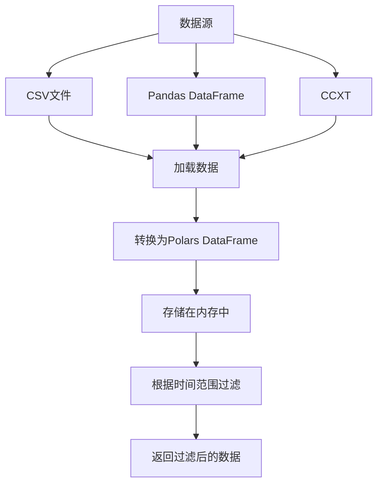
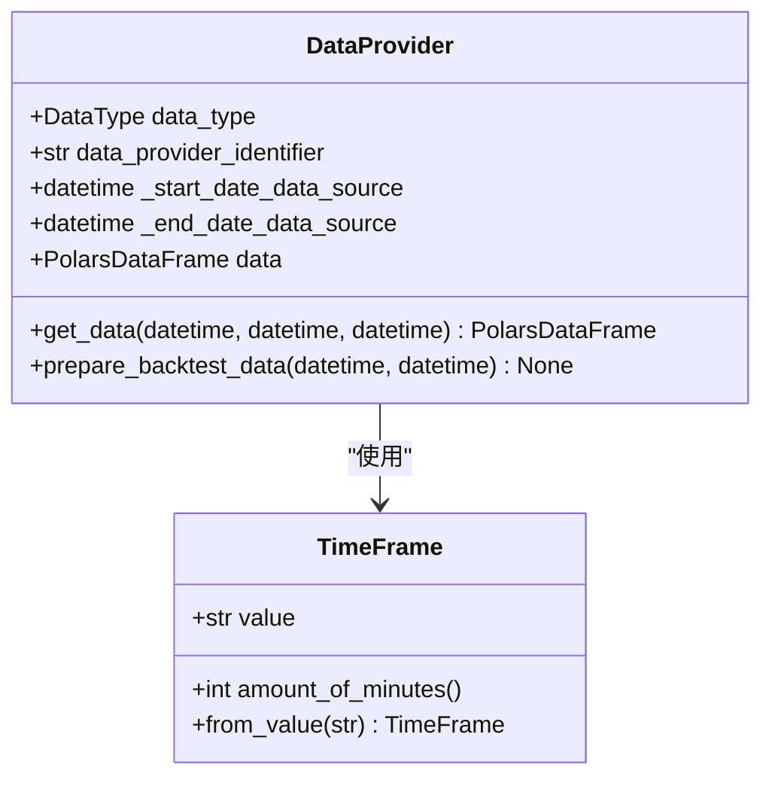
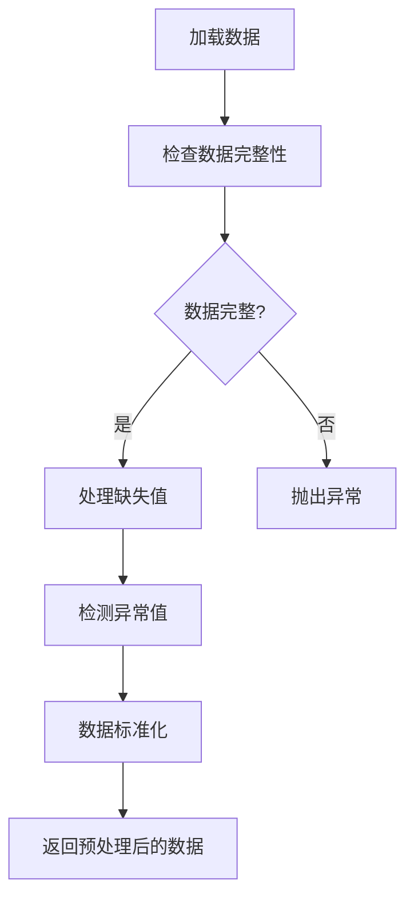
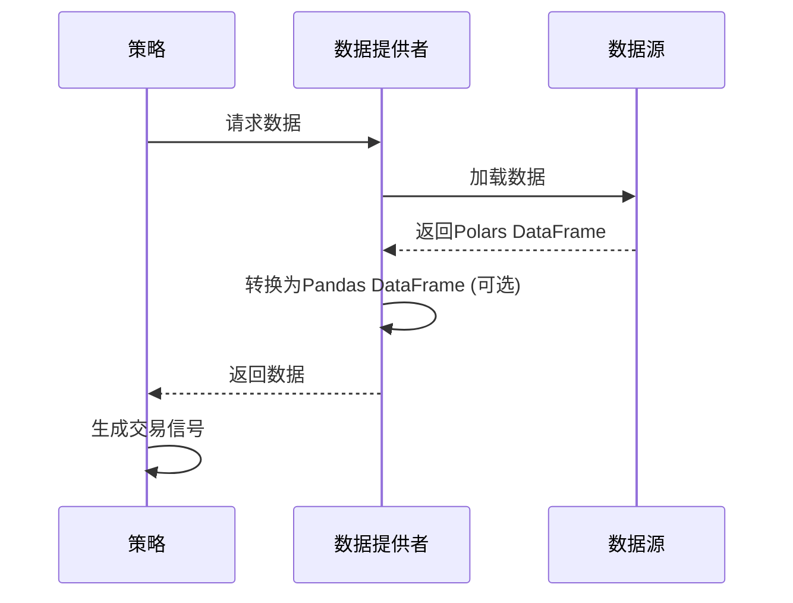

# 数据转换

<cite>
**本文档引用的文件**   
- [polars.py](file://investing_algorithm_framework/domain/utils/polars.py)
- [pandas.py](file://investing_algorithm_framework/infrastructure/data_providers/pandas.py)
- [csv.py](file://investing_algorithm_framework/infrastructure/data_providers/csv.py)
- [dates.py](file://investing_algorithm_framework/domain/utils/dates.py)
- [simple_trading_bot_example.py](file://examples/simple_trading_bot_example.py)
- [data_provider_service.py](file://investing_algorithm_framework/services/data_providers/data_provider_service.py)
</cite>

## 目录
1. [引言](#引言)
2. [Polars库在时间序列数据处理中的应用](#polars库在时间序列数据处理中的应用)
3. [数据加载与过滤](#数据加载与过滤)
4. [数据聚合与转换](#数据聚合与转换)
5. [数据重采样功能](#数据重采样功能)
6. [数据对齐机制](#数据对齐机制)
7. [数据清洗与预处理](#数据清洗与预处理)
8. [向量化操作与性能优化](#向量化操作与性能优化)
9. [复杂数据转换场景](#复杂数据转换场景)
10. [结论](#结论)

## 引言
本框架提供了一套完整的数据转换功能，专注于使用Polars库进行高效的时间序列数据处理。框架支持从多种数据源加载OHLCV（开盘价、最高价、最低价、收盘价、成交量）数据，并提供了丰富的数据处理功能，包括数据加载、过滤、聚合、转换、重采样和对齐等。这些功能为量化交易策略的开发和回测提供了坚实的基础。

## Polars库在时间序列数据处理中的应用
框架选择Polars库作为主要的数据处理引擎，因为它在处理时间序列数据方面具有显著优势。Polars基于Rust构建，具有高度优化的后端，支持多线程执行和高效的内存管理，使其在处理大型数据集时比Pandas更快。框架中的所有数据处理操作都优先使用Polars DataFrame，以确保最佳性能。

**Section sources**
- [polars.py](file://investing_algorithm_framework/domain/utils/polars.py#L1-L53)
- [pandas.py](file://investing_algorithm_framework/infrastructure/data_providers/pandas.py#L1-L600)

## 数据加载与过滤
框架提供了多种数据源适配器，包括CSV文件、Pandas DataFrame和CCXT（加密货币交易平台）等，用于加载OHLCV数据。数据加载后，会自动转换为Polars DataFrame并存储在内存中。数据过滤功能允许用户根据特定的时间范围或日期获取数据，支持灵活的数据查询。

**Diagram sources**
- [csv.py](file://investing_algorithm_framework/infrastructure/data_providers/csv.py#L390-L436)
- [pandas.py](file://investing_algorithm_framework/infrastructure/data_providers/pandas.py#L418-L473)

## 数据聚合与转换
框架支持对时间序列数据进行各种聚合操作，如计算移动平均线、相对强弱指数（RSI）等技术指标。数据转换功能允许用户对数据进行各种数学运算和逻辑操作，以生成新的特征或信号。这些操作通常在策略的`generate_buy_signals`和`generate_sell_signals`方法中实现。

**Section sources**
- [simple_trading_bot_example.py](file://examples/simple_trading_bot_example.py#L90-L128)
- [data_provider_service.py](file://investing_algorithm_framework/services/data_providers/data_provider_service.py#L536-L565)

## 数据重采样功能
框架支持将高频数据转换为低频数据，例如将1小时数据转换为1天数据。这一功能通过`TimeFrame`类实现，该类定义了不同的时间框架（如"1m"、"5m"、"1h"、"1d"）。数据重采样功能对于多时间框架分析和策略开发至关重要。

**Diagram sources**
- [pandas.py](file://investing_algorithm_framework/infrastructure/data_providers/pandas.py#L31-L32)
- [domain/time_frame.py](file://investing_algorithm_framework/domain/models/time_frame.py)

## 数据对齐机制
为了确保不同数据源的时间戳一致性，框架实现了数据对齐机制。所有时间序列数据的时间戳都被设置为UTC时区，并以毫秒为单位。此外，框架提供了`sync_timezones`函数，用于同步不同数据源的时区，确保数据的一致性和准确性。

**Section sources**
- [dates.py](file://investing_algorithm_framework/domain/utils/dates.py#L34-L57)
- [pandas.py](file://investing_algorithm_framework/infrastructure/data_providers/pandas.py#L462-L466)

## 数据清洗与预处理
框架提供了数据清洗和预处理功能，包括处理缺失值、检测异常值和数据标准化。在数据加载过程中，框架会检查数据的完整性，确保所有必需的列都存在。对于缺失的数据点，框架会记录缺失的日期，并在回测时进行相应的处理。

**Diagram sources**
- [csv.py](file://investing_algorithm_framework/infrastructure/data_providers/csv.py#L409-L420)
- [pandas.py](file://investing_algorithm_framework/infrastructure/data_providers/pandas.py#L452-L461)

## 向量化操作与性能优化
框架支持向量化操作，允许在单个操作中对整个数据集进行计算，从而提高性能。向量化操作在回测中尤为重要，因为它可以显著减少计算时间。框架通过`run_vector_backtest`方法实现了向量化回测，支持多个资产的同时回测。

**Section sources**
- [app.py](file://investing_algorithm_framework/app/app.py#L1080-L1217)
- [backtest_service.py](file://investing_algorithm_framework/services/backtesting/backtest_service.py#L114-L125)

## 复杂数据转换场景
框架支持复杂的数据转换场景，如多资产数据合并和特征工程管道。通过`DataSource`类，用户可以定义多个数据源，并在策略中合并这些数据源进行分析。特征工程管道允许用户按顺序应用多个数据转换操作，以生成复杂的交易信号。

**Diagram sources**
- [simple_trading_bot_example.py](file://examples/simple_trading_bot_example.py#L130-L218)
- [data_provider_service.py](file://investing_algorithm_framework/services/data_providers/data_provider_service.py#L536-L565)

## 结论
本框架通过集成Polars库，提供了一套高效、灵活的数据转换功能，特别适用于时间序列数据的处理。从数据加载、过滤、聚合到重采样、对齐和清洗，框架覆盖了量化交易策略开发的各个方面。向量化操作和性能优化技术确保了框架在处理大规模数据时的高效性。这些功能共同为开发复杂的量化交易策略提供了强大的支持。