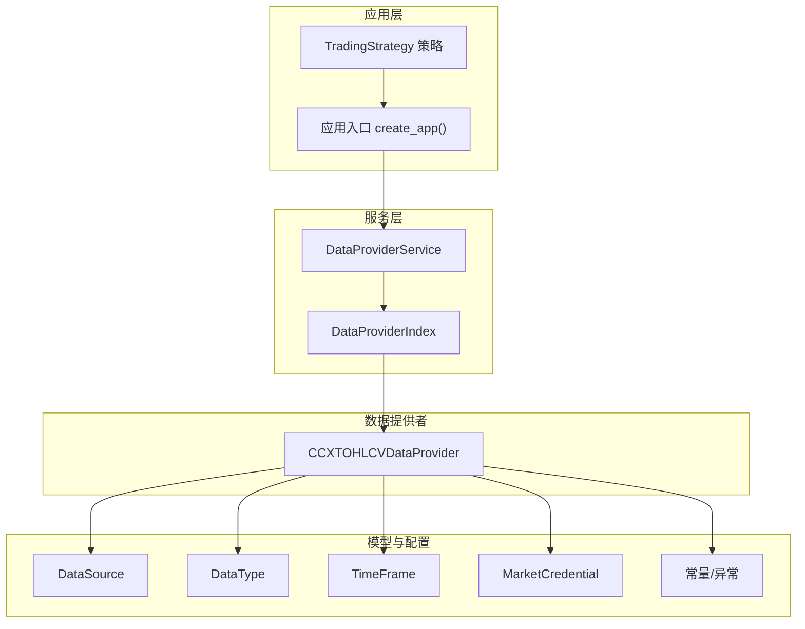
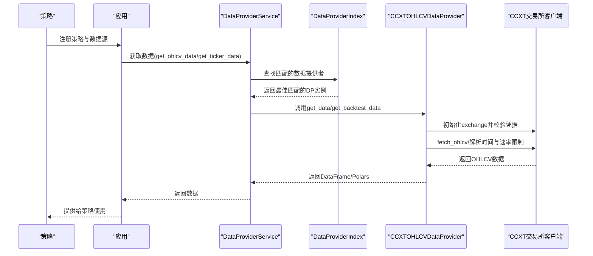
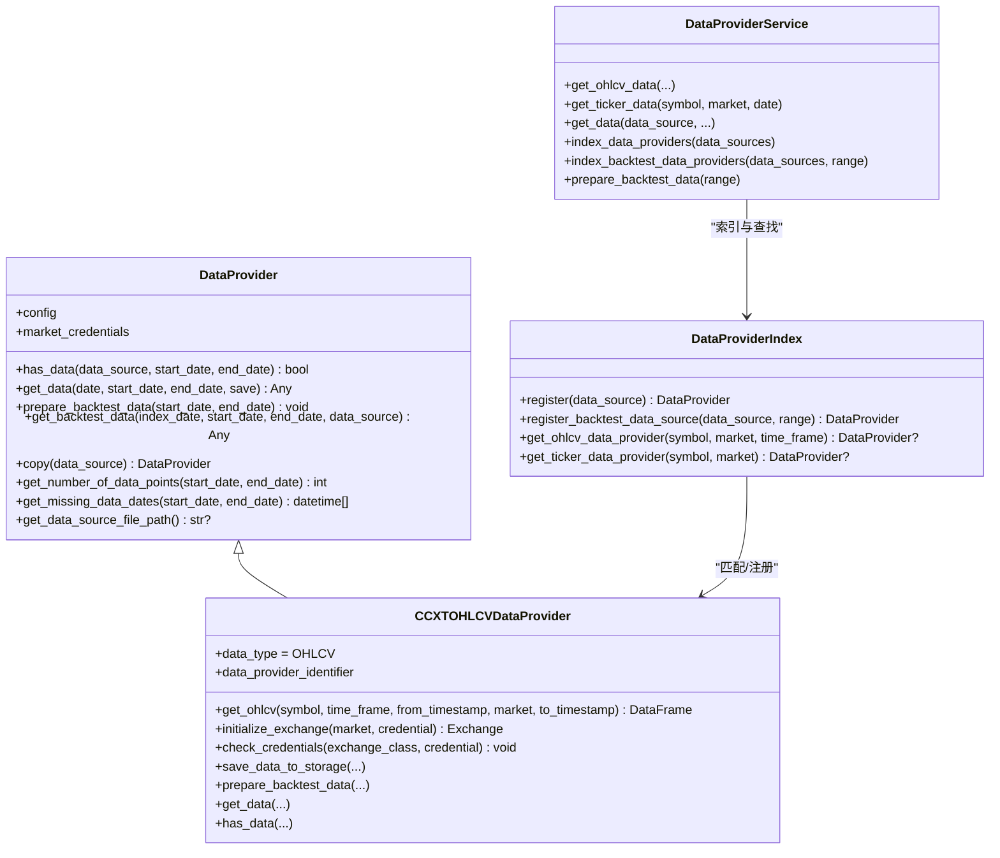
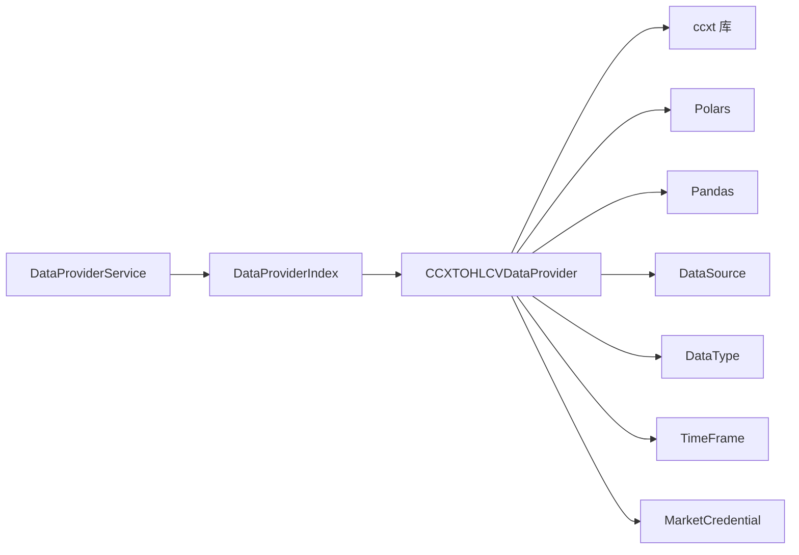
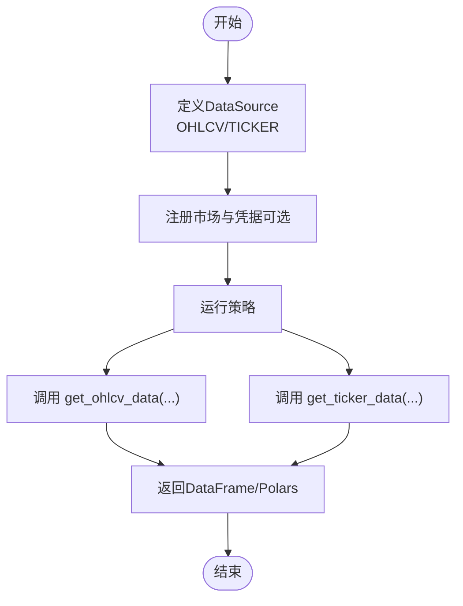

# CCXT数据提供者

<cite>
**本文引用的文件**
- [investing_algorithm_framework/infrastructure/data_providers/ccxt.py](file://investing_algorithm_framework/infrastructure/data_providers/ccxt.py)
- [investing_algorithm_framework/services/data_providers/data_provider_service.py](file://investing_algorithm_framework/services/data_providers/data_provider_service.py)
- [investing_algorithm_framework/domain/data_provider.py](file://investing_algorithm_framework/domain/data_provider.py)
- [investing_algorithm_framework/domain/models/data/data_type.py](file://investing_algorithm_framework/domain/models/data/data_type.py)
- [investing_algorithm_framework/domain/models/data/data_source.py](file://investing_algorithm_framework/domain/models/data/data_source.py)
- [investing_algorithm_framework/domain/models/time_frame.py](file://investing_algorithm_framework/domain/models/time_frame.py)
- [investing_algorithm_framework/domain/constants.py](file://investing_algorithm_framework/domain/constants.py)
- [investing_algorithm_framework/domain/exceptions.py](file://investing_algorithm_framework/domain/exceptions.py)
- [investing_algorithm_framework/domain/models/market/market_credential.py](file://investing_algorithm_framework/domain/models/market/market_credential.py)
- [examples/simple_trading_bot_example.py](file://examples/simple_trading_bot_example.py)
- [examples/bitvavo_trading_bot.py](file://examples/bitvavo_trading_bot.py)
</cite>

## 目录
1. [简介](#简介)
2. [项目结构](#项目结构)
3. [核心组件](#核心组件)
4. [架构总览](#架构总览)
5. [组件详解](#组件详解)
6. [依赖关系分析](#依赖关系分析)
7. [性能与资源特性](#性能与资源特性)
8. [故障排查指南](#故障排查指南)
9. [结论](#结论)
10. [附录：使用示例与最佳实践](#附录使用示例与最佳实践)

## 简介
本文件系统性地介绍如何在本项目中通过CCXT库集成主流加密货币交易所（如Bitvavo、Binance），实现OHLCV与TICKER等数据类型的实时与历史获取。内容涵盖：
- 配置参数（API密钥、交易所名称、时间框架、速率限制）
- 安全存储方式（环境变量与MarketCredential）
- 数据类型与时间框架映射
- 错误处理策略（网络异常、API限流、认证失败）
- 使用示例（策略中配置与调用）

## 项目结构
围绕CCXT数据提供者的关键模块如下：
- 基础抽象层：DataProvider接口定义
- 具体实现：CCXTOHLCVDataProvider（OHLCV）
- 服务层：DataProviderService与DataProviderIndex（索引与调度）
- 模型层：DataSource、DataType、TimeFrame、MarketCredential
- 常量与异常：统一的时间格式、异常类型
- 示例：策略中如何注册数据源并获取数据

图表来源
- [investing_algorithm_framework/services/data_providers/data_provider_service.py](file://investing_algorithm_framework/services/data_providers/data_provider_service.py#L1-L200)
- [investing_algorithm_framework/infrastructure/data_providers/ccxt.py](file://investing_algorithm_framework/infrastructure/data_providers/ccxt.py#L1-L200)
- [investing_algorithm_framework/domain/data_provider.py](file://investing_algorithm_framework/domain/data_provider.py#L1-L120)
- [investing_algorithm_framework/domain/models/data/data_source.py](file://investing_algorithm_framework/domain/models/data/data_source.py#L1-L120)
- [investing_algorithm_framework/domain/models/data/data_type.py](file://investing_algorithm_framework/domain/models/data/data_type.py#L1-L47)
- [investing_algorithm_framework/domain/models/time_frame.py](file://investing_algorithm_framework/domain/models/time_frame.py#L1-L80)
- [investing_algorithm_framework/domain/models/market/market_credential.py](file://investing_algorithm_framework/domain/models/market/market_credential.py#L1-L88)
- [investing_algorithm_framework/domain/constants.py](file://investing_algorithm_framework/domain/constants.py#L1-L53)
- [investing_algorithm_framework/domain/exceptions.py](file://investing_algorithm_framework/domain/exceptions.py#L1-L113)

章节来源
- [investing_algorithm_framework/services/data_providers/data_provider_service.py](file://investing_algorithm_framework/services/data_providers/data_provider_service.py#L1-L200)
- [investing_algorithm_framework/infrastructure/data_providers/ccxt.py](file://investing_algorithm_framework/infrastructure/data_providers/ccxt.py#L1-L200)

## 核心组件
- 抽象基类 DataProvider：定义has_data/get_data/prepare_backtest_data等接口，并提供MarketCredential注入与配置传递能力。
- CCXTOHLCVDataProvider：基于CCXT实现OHLCV数据拉取、缓存、回测窗口预计算、CSV持久化。
- DataProviderService：统一调度数据提供者，支持OHLCV/TICKER查询、回测数据准备、向量化回测。
- DataProviderIndex：按DataSource快速匹配最优数据提供者，支持OHLCV/TICKER索引。
- DataSource/DataType/TimeFrame：标准化数据源描述、数据类型与时间框架。
- MarketCredential：封装交易所API密钥与密文，支持从环境变量读取。
- 常量与异常：统一时间格式、异常类型（OperationalException、NetworkError等）。

章节来源
- [investing_algorithm_framework/domain/data_provider.py](file://investing_algorithm_framework/domain/data_provider.py#L1-L200)
- [investing_algorithm_framework/infrastructure/data_providers/ccxt.py](file://investing_algorithm_framework/infrastructure/data_providers/ccxt.py#L1-L120)
- [investing_algorithm_framework/services/data_providers/data_provider_service.py](file://investing_algorithm_framework/services/data_providers/data_provider_service.py#L1-L120)
- [investing_algorithm_framework/domain/models/data/data_source.py](file://investing_algorithm_framework/domain/models/data/data_source.py#L1-L120)
- [investing_algorithm_framework/domain/models/data/data_type.py](file://investing_algorithm_framework/domain/models/data/data_type.py#L1-L47)
- [investing_algorithm_framework/domain/models/time_frame.py](file://investing_algorithm_framework/domain/models/time_frame.py#L1-L80)
- [investing_algorithm_framework/domain/models/market/market_credential.py](file://investing_algorithm_framework/domain/models/market/market_credential.py#L1-L88)
- [investing_algorithm_framework/domain/constants.py](file://investing_algorithm_framework/domain/constants.py#L1-L53)
- [investing_algorithm_framework/domain/exceptions.py](file://investing_algorithm_framework/domain/exceptions.py#L1-L113)

## 架构总览
下图展示了从策略到数据提供者再到CCXT的调用链路与关键交互点。

图表来源
- [investing_algorithm_framework/services/data_providers/data_provider_service.py](file://investing_algorithm_framework/services/data_providers/data_provider_service.py#L334-L566)
- [investing_algorithm_framework/infrastructure/data_providers/ccxt.py](file://investing_algorithm_framework/infrastructure/data_providers/ccxt.py#L525-L622)
- [investing_algorithm_framework/domain/data_provider.py](file://investing_algorithm_framework/domain/data_provider.py#L172-L285)

## 组件详解

### CCXTOHLCVDataProvider（OHLCV数据提供者）
- 支持功能
  - OHLCV数据获取：按symbol、market、time_frame、时间范围分页拉取，自动sleep遵守rateLimit。
  - 回测准备：根据window_size与time_frame预计算滑动窗口，检查缺失日期并缓存。
  - 存储与加载：支持将OHLCV写入CSV文件，回测时优先从本地CSV加载。
  - 凭据校验：通过exchange.requiredCredentials校验是否需要apiKey/secret。
- 关键方法与流程
  - has_data：先查本地CSV，再通过CCXT探测市场与交易对是否存在。
  - get_data：参数校验、本地缓存命中、CCXT拉取、保存到CSV、返回Polars或pandas。
  - get_ohlcv：初始化exchange、校验权限、循环fetch_ohlcv、解析时间戳、遵守rateLimit。
  - prepare_backtest_data：准备回测所需数据，构建滑动窗口缓存，统计缺失日期。
  - initialize_exchange/check_credentials：动态选择交易所类，注入apiKey/secret并校验。
- 时间框架映射
  - TimeFrame枚举提供分钟数映射，用于计算window_size与回测区间。
- 数据类型支持
  - DataType.OHLCV为默认数据类型；TICKER通过DataProviderService的get_ticker_data路径间接支持（当OHLCV可用时可推断）。

图表来源
- [investing_algorithm_framework/domain/data_provider.py](file://investing_algorithm_framework/domain/data_provider.py#L12-L335)
- [investing_algorithm_framework/infrastructure/data_providers/ccxt.py](file://investing_algorithm_framework/infrastructure/data_providers/ccxt.py#L1-L200)
- [investing_algorithm_framework/services/data_providers/data_provider_service.py](file://investing_algorithm_framework/services/data_providers/data_provider_service.py#L1-L200)

章节来源
- [investing_algorithm_framework/infrastructure/data_providers/ccxt.py](file://investing_algorithm_framework/infrastructure/data_providers/ccxt.py#L1-L200)
- [investing_algorithm_framework/domain/models/time_frame.py](file://investing_algorithm_framework/domain/models/time_frame.py#L1-L154)

### DataProviderService 与 DataProviderIndex
- DataProviderIndex
  - 维护OHLCV/TICKER索引，按symbol/market/time_frame快速定位最佳提供者。
  - 支持多Provider匹配后按priority排序选择。
- DataProviderService
  - 对外提供get_ohlcv_data/get_ticker_data/get_data等统一入口。
  - 在回测模式下，调用数据提供者的get_backtest_data；非回测模式调用get_data。
  - 将全局配置注入到数据提供者（config）。

章节来源
- [investing_algorithm_framework/services/data_providers/data_provider_service.py](file://investing_algorithm_framework/services/data_providers/data_provider_service.py#L1-L200)
- [investing_algorithm_framework/services/data_providers/data_provider_service.py](file://investing_algorithm_framework/services/data_providers/data_provider_service.py#L334-L566)

### DataSource、DataType、TimeFrame
- DataSource：标准化数据源描述，包含identifier、data_type、symbol、time_frame、market、window_size、时间范围等。
- DataType：OHLCV/TICKER/CUSTOM等枚举。
- TimeFrame：提供字符串到枚举的转换与分钟数映射，用于计算window_size与回测区间。

章节来源
- [investing_algorithm_framework/domain/models/data/data_source.py](file://investing_algorithm_framework/domain/models/data/data_source.py#L1-L223)
- [investing_algorithm_framework/domain/models/data/data_type.py](file://investing_algorithm_framework/domain/models/data/data_type.py#L1-L47)
- [investing_algorithm_framework/domain/models/time_frame.py](file://investing_algorithm_framework/domain/models/time_frame.py#L1-L154)

### MarketCredential 与安全存储
- MarketCredential封装market、api_key、secret_key，并支持从环境变量读取。
- CCXT相关组件在初始化exchange前会调用check_credentials，确保必要字段存在。
- 环境变量命名规范：<MARKET>_API_KEY、<MARKET>_SECRET_KEY。

章节来源
- [investing_algorithm_framework/domain/models/market/market_credential.py](file://investing_algorithm_framework/domain/models/market/market_credential.py#L1-L88)
- [investing_algorithm_framework/infrastructure/data_providers/ccxt.py](file://investing_algorithm_framework/infrastructure/data_providers/ccxt.py#L632-L711)

## 依赖关系分析
- CCXT数据提供者依赖
  - CCXT库：fetch_ohlcv、parse_timeframe、rateLimit、requiredCredentials等。
  - Polars/Pandas：数据结构与转换。
  - 项目内模型：DataSource、DataType、TimeFrame、MarketCredential。
- 服务层依赖
  - DataProviderService依赖DataProviderIndex进行快速匹配。
  - DataProviderService将全局配置注入到数据提供者。
- 错误与异常
  - NetworkError：网络异常时抛出。
  - OperationalException：配置错误、权限不足、时间范围非法等。

图表来源
- [investing_algorithm_framework/infrastructure/data_providers/ccxt.py](file://investing_algorithm_framework/infrastructure/data_providers/ccxt.py#L1-L120)
- [investing_algorithm_framework/services/data_providers/data_provider_service.py](file://investing_algorithm_framework/services/data_providers/data_provider_service.py#L1-L120)

章节来源
- [investing_algorithm_framework/infrastructure/data_providers/ccxt.py](file://investing_algorithm_framework/infrastructure/data_providers/ccxt.py#L1-L120)
- [investing_algorithm_framework/services/data_providers/data_provider_service.py](file://investing_algorithm_framework/services/data_providers/data_provider_service.py#L1-L120)

## 性能与资源特性
- 速率限制与节流
  - CCXT提供rateLimit，CCXTOHLCVDataProvider在每次请求后sleep(rateLimit/1000)以遵守限流。
- 数据缓存与回测优化
  - 回测准备阶段预计算滑动窗口，减少重复计算。
  - 缺失日期检测，便于评估数据完整性。
- 内存与I/O
  - 默认使用Polars DataFrame，支持pandas转换开关。
  - 可选将OHLCV写入CSV，加速回测启动与离线复用。

章节来源
- [investing_algorithm_framework/infrastructure/data_providers/ccxt.py](file://investing_algorithm_framework/infrastructure/data_providers/ccxt.py#L575-L622)
- [investing_algorithm_framework/infrastructure/data_providers/ccxt.py](file://investing_algorithm_framework/infrastructure/data_providers/ccxt.py#L259-L274)

## 故障排查指南
- 网络异常
  - 现象：抓取OHLCV时抛出NetworkError。
  - 处理：检查网络连接、代理设置；重试或降低并发。
- 认证失败
  - 现象：初始化exchange时报错，提示缺少apiKey/secret。
  - 处理：确认MarketCredential已正确添加；环境变量名符合<MARKET>_API_KEY/_SECRET_KEY规范。
- 交易所不支持
  - 现象：exchange.requiredCredentials要求特定权限但未满足。
  - 处理：确认账户权限、API设置；或更换支持相应功能的交易所。
- 时间范围非法
  - 现象：起始时间晚于结束时间或缺少必要参数。
  - 处理：修正时间范围或补齐window_size/start_date/end_date。
- 数据缺失
  - 现象：回测期间出现缺失日期。
  - 处理：检查本地CSV是否存在、时间格式是否一致；必要时重新下载并保存。

章节来源
- [investing_algorithm_framework/infrastructure/data_providers/ccxt.py](file://investing_algorithm_framework/infrastructure/data_providers/ccxt.py#L575-L622)
- [investing_algorithm_framework/domain/exceptions.py](file://investing_algorithm_framework/domain/exceptions.py#L1-L113)
- [investing_algorithm_framework/domain/constants.py](file://investing_algorithm_framework/domain/constants.py#L1-L53)

## 结论
本项目的CCXT数据提供者通过清晰的抽象与完善的索引机制，实现了对OHLCV与TICKER数据的统一接入。其具备以下优势：
- 易于扩展：新增交易所只需遵循CCXT接口即可无缝接入。
- 安全可控：凭据通过MarketCredential与环境变量管理，避免硬编码。
- 回测友好：本地CSV缓存、滑动窗口预计算、缺失日期检测提升回测效率与稳定性。
建议在生产环境中结合速率限制、重试与降级策略进一步增强鲁棒性。

## 附录：使用示例与最佳实践

### 配置与注册
- 在策略中定义DataSource（OHLCV/TICKER），指定market、symbol、time_frame、window_size等。
- 通过应用入口注册策略与市场（market/trading_symbol），并在需要时添加MarketCredential（API密钥/密文）。
- 示例参考：
  - [simple_trading_bot_example.py](file://examples/simple_trading_bot_example.py#L1-L254)
  - [bitvavo_trading_bot.py](file://examples/bitvavo_trading_bot.py#L1-L45)

### 获取OHLCV与TICKER
- 使用DataProviderService.get_ohlcv_data或get_ticker_data，内部自动选择最佳数据提供者并返回DataFrame。
- 回测模式下，get_backtest_data会从已准备好的缓存中抽取对应窗口。

图表来源
- [investing_algorithm_framework/services/data_providers/data_provider_service.py](file://investing_algorithm_framework/services/data_providers/data_provider_service.py#L334-L566)
- [examples/simple_trading_bot_example.py](file://examples/simple_trading_bot_example.py#L1-L254)
- [examples/bitvavo_trading_bot.py](file://examples/bitvavo_trading_bot.py#L1-L45)

### 最佳实践
- 优先使用环境变量存储API密钥，避免提交到版本控制。
- 合理设置window_size与time_frame，确保回测准备阶段能覆盖所需窗口。
- 开启CSV缓存以加速回测；定期清理过期文件。
- 遇到网络波动时启用指数退避重试与超时控制。
- 对于公开数据（如Bitvavo），可不配置API密钥；若需实盘或高级功能，请补齐凭据。