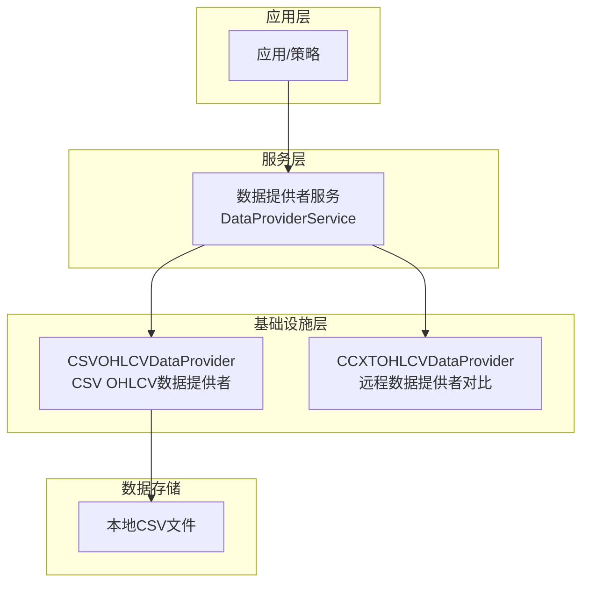
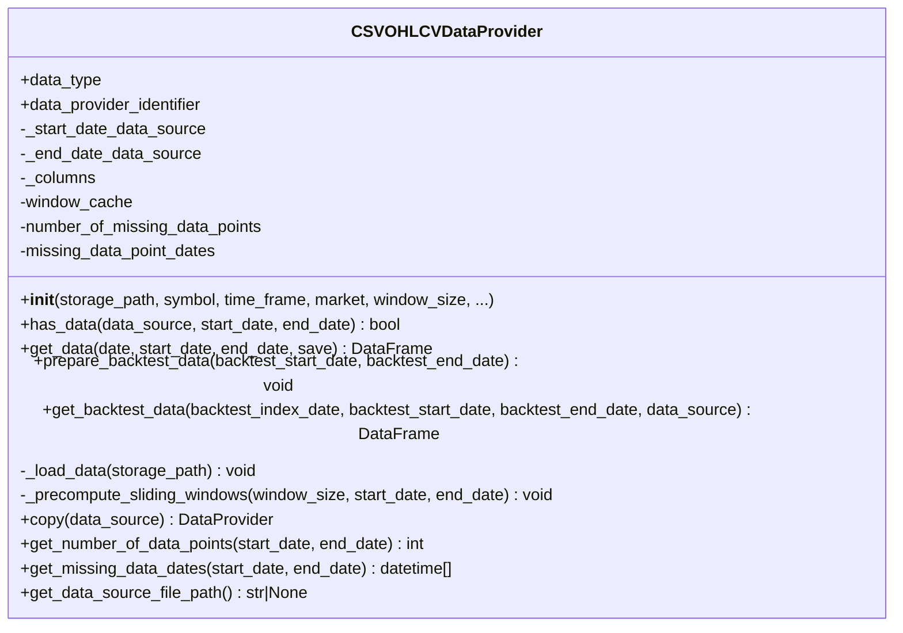
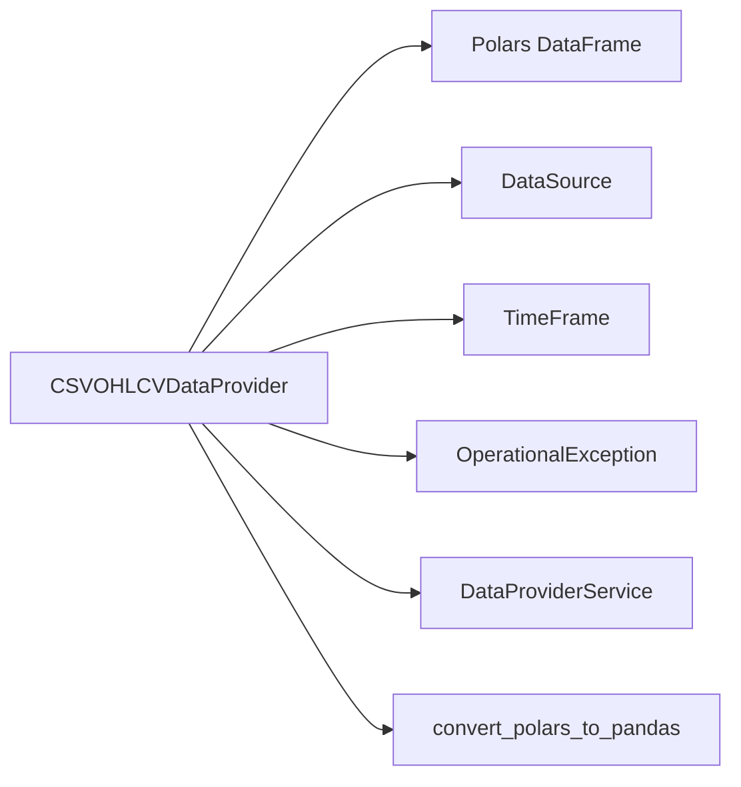
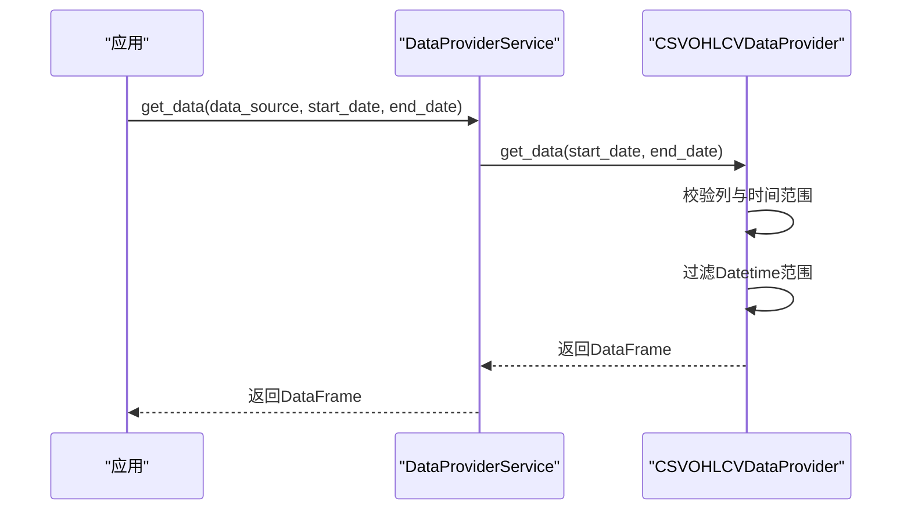
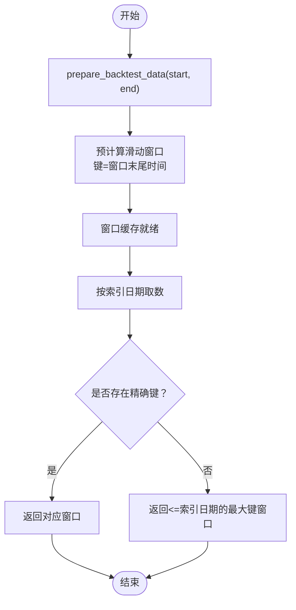

# CSV数据提供者

<cite>
**本文引用的文件**
- [csv.py](file://investing_algorithm_framework/infrastructure/data_providers/csv.py)
- [test_csv_ohlcv_data_provider.py](file://tests/infrastructure/data_providers/test_csv_ohlcv_data_provider.py)
- [data_provider_service.py](file://investing_algorithm_framework/services/data_providers/data_provider_service.py)
- [__init__.py（基础设施数据提供者）](file://investing_algorithm_framework/infrastructure/data_providers/__init__.py)
- [OHLCV_BTC-EUR_BITVAVO_1d_2021-01-01-00-00_2023-12-31-00-00.csv](file://examples/tutorial/data/OHLCV_BTC-EUR_BITVAVO_1d_2021-01-01-00-00_2023-12-31-00-00.csv)
- [OHLCV_BTC-EUR_BITVAVO_1d_2023-01-01-00-00_2025-06-30-00-00.csv](file://examples/tutorial/data/OHLCV_BTC-EUR_BITVAVO_1d_2023-01-01-00-00_2025-06-30-00-00.csv)
- [ccxt.py](file://investing_algorithm_framework/infrastructure/data_providers/ccxt.py)
- [domain/utils/csv.py](file://investing_algorithm_framework/domain/utils/csv.py)
</cite>

## 目录
1. [简介](#简介)
2. [项目结构](#项目结构)
3. [核心组件](#核心组件)
4. [架构总览](#架构总览)
5. [详细组件分析](#详细组件分析)
6. [依赖关系分析](#依赖关系分析)
7. [性能考量](#性能考量)
8. [故障排查指南](#故障排查指南)
9. [结论](#结论)
10. [附录](#附录)

## 简介
本文件面向使用本地CSV文件作为历史市场数据源的用户，系统性说明CSV数据提供者的实现与使用方式。内容涵盖：
- 文件路径与命名约定
- CSV文件结构与解析逻辑
- 数据缓存与回测窗口预计算
- 时间序列对齐与回测数据获取
- 错误处理与不完整数据处理
- 示例CSV文件与配置要点

## 项目结构
CSV数据提供者位于基础设施层，负责从本地CSV文件加载OHLCV数据，并为上层服务提供统一接口。典型调用链路如下：
- 应用通过数据提供者服务获取数据
- 数据提供者服务根据数据源标识选择具体数据提供者
- CSV数据提供者读取本地CSV文件，进行解析与过滤
- 回测场景下，预计算滑动窗口并按索引日期返回对应窗口数据

图表来源
- [data_provider_service.py](file://investing_algorithm_framework/services/data_providers/data_provider_service.py#L370-L404)
- [csv.py](file://investing_algorithm_framework/infrastructure/data_providers/csv.py#L1-L120)
- [__init__.py（基础设施数据提供者）](file://investing_algorithm_framework/infrastructure/data_providers/__init__.py#L1-L36)

章节来源
- [data_provider_service.py](file://investing_algorithm_framework/services/data_providers/data_provider_service.py#L360-L404)
- [__init__.py（基础设施数据提供者）](file://investing_algorithm_framework/infrastructure/data_providers/__init__.py#L1-L36)

## 核心组件
- CSVOHLCVDataProvider：从本地CSV文件加载OHLCV数据，支持按时间范围查询、窗口大小控制、回测窗口预计算与快速检索。
- DataProviderService：统一调度数据提供者，按数据源参数查找并调用对应提供者。
- 测试用例：覆盖列校验、has_data、按起止日期取数、回测窗口预计算与取数等关键行为。

章节来源
- [csv.py](file://investing_algorithm_framework/infrastructure/data_providers/csv.py#L1-L120)
- [test_csv_ohlcv_data_provider.py](file://tests/infrastructure/data_providers/test_csv_ohlcv_data_provider.py#L1-L120)

## 架构总览
CSVOHLCVDataProvider继承自通用数据提供者基类，内部以Polars DataFrame承载数据，具备以下关键能力：
- 列校验与时间列解析（UTC毫秒时间戳）
- 按起止日期过滤
- 窗口大小控制与滑动窗口预计算
- 回测模式下的窗口缓存与索引日期对齐
- 可选转换为Pandas DataFrame

图表来源
- [csv.py](file://investing_algorithm_framework/infrastructure/data_providers/csv.py#L1-L120)
- [csv.py](file://investing_algorithm_framework/infrastructure/data_providers/csv.py#L120-L220)
- [csv.py](file://investing_algorithm_framework/infrastructure/data_providers/csv.py#L220-L360)
- [csv.py](file://investing_algorithm_framework/infrastructure/data_providers/csv.py#L360-L569)

## 详细组件分析

### CSV文件结构与解析
- 必备列：Datetime、Open、High、Low、Close、Volume
- 时间格式：UTC时区，毫秒级时间戳
- 解析流程：
  - 使用Polars读取CSV
  - 校验列名是否包含全部必需列
  - 将Datetime列解析为UTC时间戳（毫秒）

章节来源
- [csv.py](file://investing_algorithm_framework/infrastructure/data_providers/csv.py#L390-L460)
- [test_csv_ohlcv_data_provider.py](file://tests/infrastructure/data_providers/test_csv_ohlcv_data_provider.py#L33-L74)

### 文件路径与命名约定
- 存储路径：通过构造函数传入storage_path，指向单个CSV文件
- 命名约定（用于远程下载器/扫描器参考）：
  - 文件名格式：OHLCV_{SYMBOL}_{MARKET}_{TIME_FRAME}_{START_DATE}_{END_DATE}.csv
  - START_DATE/END_DATE格式：YYYY-MM-DD-HH-MM 或 YYYYMMDDHH（取决于配置）
- 注意：CSVOHLCVDataProvider直接读取指定文件，不进行目录扫描；如需批量管理，请结合其他工具或在应用侧组织文件路径。

章节来源
- [ccxt.py](file://investing_algorithm_framework/infrastructure/data_providers/ccxt.py#L762-L794)
- [ccxt.py](file://investing_algorithm_framework/infrastructure/data_providers/ccxt.py#L902-L925)

### 数据查询与时间范围过滤
- 支持三种调用方式：
  - 仅传入end_date：自动推导起始日期为end_date - window_size * time_frame
  - 仅传入start_date：自动推导结束日期为start_date + window_size * time_frame
  - 同时传入start_date与end_date：严格按范围过滤
- 当请求超出数据源时间范围时，返回空DataFrame

章节来源
- [csv.py](file://investing_algorithm_framework/infrastructure/data_providers/csv.py#L125-L206)
- [test_csv_ohlcv_data_provider.py](file://tests/infrastructure/data_providers/test_csv_ohlcv_data_provider.py#L146-L231)

### 回测窗口预计算与对齐
- prepare_backtest_data：
  - 计算所需前置窗口长度（window_size × time_frame）
  - 预计算从backtest_start_date到backtest_end_date的所有滑动窗口，键为窗口末尾时间
  - 统计缺失数据点并记录缺失时间列表
- get_backtest_data：
  - 若存在精确键则直接返回
  - 否则返回小于等于索引日期的最大键对应的窗口
  - 支持将结果转换为Pandas DataFrame

章节来源
- [csv.py](file://investing_algorithm_framework/infrastructure/data_providers/csv.py#L208-L360)
- [test_csv_ohlcv_data_provider.py](file://tests/infrastructure/data_providers/test_csv_ohlcv_data_provider.py#L276-L380)

### 缓存机制与性能
- 内存缓存：Polars DataFrame常驻内存，避免重复I/O
- 窗口缓存：回测模式下按窗口末尾时间键缓存窗口数据，O(1)近似查询
- 时间对齐：回测时以固定分钟间隔推进，确保策略执行时间框架一致

章节来源
- [csv.py](file://investing_algorithm_framework/infrastructure/data_providers/csv.py#L60-L120)
- [csv.py](file://investing_algorithm_framework/infrastructure/data_providers/csv.py#L438-L485)

### 错误处理与不完整数据
- 列缺失：若CSV缺少必需列，抛出操作异常
- 越界访问：当请求时间超出数据源范围时返回空DataFrame
- 缺失数据统计：可统计指定区间内缺失的数据点数量与日期列表

章节来源
- [csv.py](file://investing_algorithm_framework/infrastructure/data_providers/csv.py#L390-L460)
- [csv.py](file://investing_algorithm_framework/infrastructure/data_providers/csv.py#L513-L569)
- [test_csv_ohlcv_data_provider.py](file://tests/infrastructure/data_providers/test_csv_ohlcv_data_provider.py#L60-L74)

### 示例CSV文件结构
- 示例文件展示了标准列与UTC时间戳格式
- 可直接作为CSVOHLCVDataProvider的输入

章节来源
- [OHLCV_BTC-EUR_BITVAVO_1d_2021-01-01-00-00_2023-12-31-00-00.csv](file://examples/tutorial/data/OHLCV_BTC-EUR_BITVAVO_1d_2021-01-01-00-00_2023-12-31-00-00.csv#L1-L20)
- [OHLCV_BTC-EUR_BITVAVO_1d_2023-01-01-00-00_2025-06-30-00-00.csv](file://examples/tutorial/data/OHLCV_BTC-EUR_BITVAVO_1d_2023-01-01-00-00_2025-06-30-00-00.csv#L1-L20)

### 配置与使用要点
- 构造参数：
  - storage_path：CSV文件绝对或相对路径
  - symbol：交易对标识（如BTC/EUR）
  - time_frame：时间框架字符串（如1h、2h、1d）
  - market：市场标识（如binance、bitvavo）
  - window_size：窗口大小（整数），用于回测与窗口计算
  - pandas：是否返回Pandas DataFrame
- 数据提供者注册与获取：
  - 通过DataProviderService按DataSource参数获取对应数据提供者
  - 可通过copy方法基于DataSource生成新的数据提供者实例

章节来源
- [csv.py](file://investing_algorithm_framework/infrastructure/data_providers/csv.py#L33-L72)
- [data_provider_service.py](file://investing_algorithm_framework/services/data_providers/data_provider_service.py#L370-L404)
- [__init__.py（基础设施数据提供者）](file://investing_algorithm_framework/infrastructure/data_providers/__init__.py#L1-L36)

## 依赖关系分析
- 外部库：Polars（高性能数据结构与查询）
- 内部依赖：
  - DataProvider基类（定义统一接口）
  - DataSource、TimeFrame、OperationalException等模型与异常
  - 可选Pandas转换工具

图表来源
- [csv.py](file://investing_algorithm_framework/infrastructure/data_providers/csv.py#L1-L120)
- [data_provider_service.py](file://investing_algorithm_framework/services/data_providers/data_provider_service.py#L370-L404)

章节来源
- [csv.py](file://investing_algorithm_framework/infrastructure/data_providers/csv.py#L1-L120)
- [data_provider_service.py](file://investing_algorithm_framework/services/data_providers/data_provider_service.py#L360-L404)

## 性能考量
- I/O优化：CSV一次性读入内存，后续查询为内存过滤，避免重复磁盘访问
- 查询优化：Polars内置高效过滤与切片，适合大规模历史数据
- 回测优化：预计算滑动窗口，避免每次回测时重复构建窗口
- 内存占用：DataFrame常驻内存，建议合理设置window_size与数据范围，避免过大导致内存压力

[本节为通用指导，不涉及具体文件分析]

## 故障排查指南
- 列缺失异常：检查CSV是否包含Datetime、Open、High、Low、Close、Volume列
- 时间越界：确认请求的start_date/end_date在数据源范围内
- 回测窗口为空：检查window_size与时间框架是否合理，确保数据源起始日期满足前置窗口需求
- 数据缺失统计：使用get_missing_data_dates与get_number_of_data_points辅助定位问题区间

章节来源
- [csv.py](file://investing_algorithm_framework/infrastructure/data_providers/csv.py#L390-L460)
- [csv.py](file://investing_algorithm_framework/infrastructure/data_providers/csv.py#L513-L569)
- [test_csv_ohlcv_data_provider.py](file://tests/infrastructure/data_providers/test_csv_ohlcv_data_provider.py#L60-L74)

## 结论
CSVOHLCVDataProvider提供了稳定、高效的本地CSV历史数据读取能力，具备严格的列校验、灵活的时间范围查询、完善的回测窗口缓存与对齐机制。配合清晰的命名约定与测试覆盖，能够满足回测与实盘策略开发中的数据需求。建议在生产环境中：
- 明确window_size与时间框架，确保回测窗口预计算有效
- 对缺失数据进行监控与统计，及时补充或清洗
- 控制数据文件规模与内存占用，必要时分段加载或外部索引

[本节为总结性内容，不涉及具体文件分析]

## 附录

### API与流程图

#### 获取数据序列图（按起止日期）

图表来源
- [data_provider_service.py](file://investing_algorithm_framework/services/data_providers/data_provider_service.py#L370-L404)
- [csv.py](file://investing_algorithm_framework/infrastructure/data_providers/csv.py#L125-L206)

#### 回测准备与取数流程

图表来源
- [csv.py](file://investing_algorithm_framework/infrastructure/data_providers/csv.py#L208-L360)
- [test_csv_ohlcv_data_provider.py](file://tests/infrastructure/data_providers/test_csv_ohlcv_data_provider.py#L276-L380)