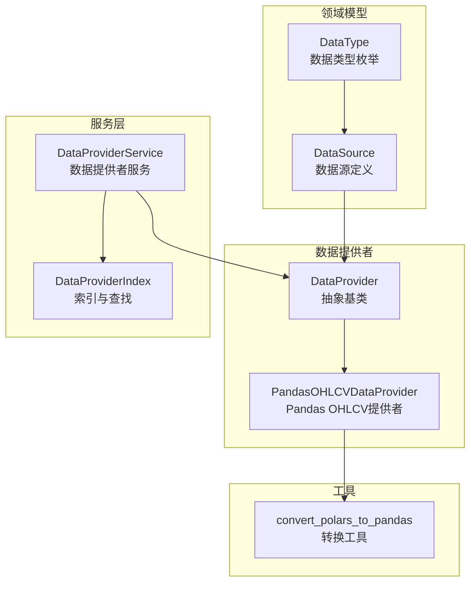
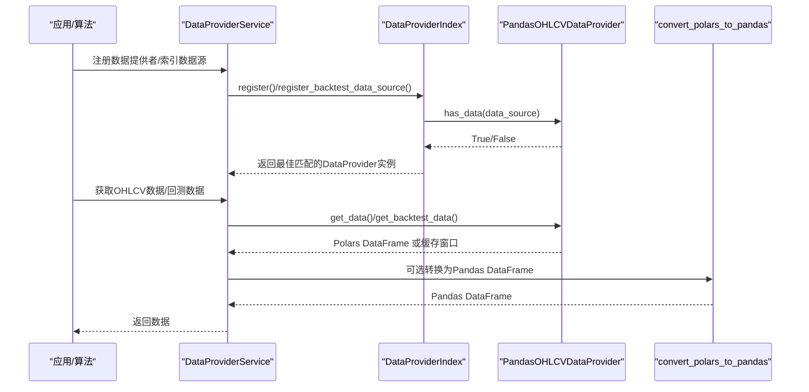
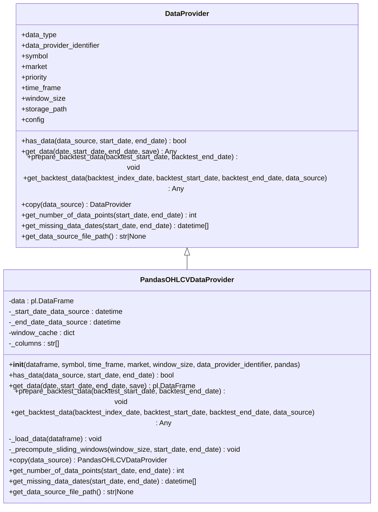
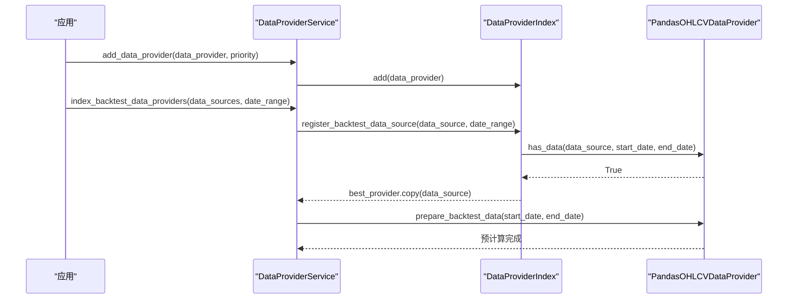
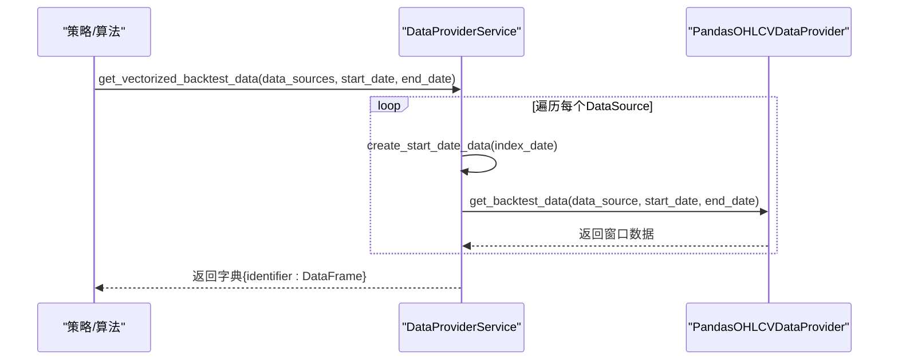
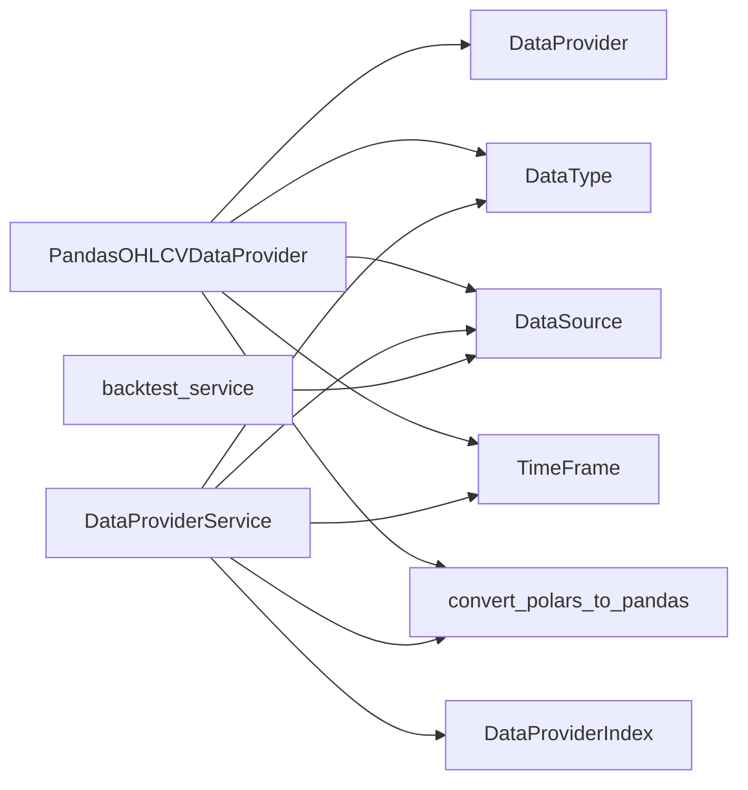

# Pandas数据提供者

<cite>
**本文引用的文件**
- [pandas.py](file://investing_algorithm_framework/infrastructure/data_providers/pandas.py)
- [data_provider.py](file://investing_algorithm_framework/domain/data_provider.py)
- [data_provider_service.py](file://investing_algorithm_framework/services/data_providers/data_provider_service.py)
- [data_source.py](file://investing_algorithm_framework/domain/models/data/data_source.py)
- [data_type.py](file://investing_algorithm_framework/domain/models/data/data_type.py)
- [polars.py](file://investing_algorithm_framework/domain/utils/polars.py)
- [test_run_backtest_with_pandas_datasources.py](file://tests/scenarios/event_backtests/test_run_backtest_with_pandas_datasources.py)
- [backtest_service.py](file://investing_algorithm_framework/services/backtesting/backtest_service.py)
</cite>

## 目录
1. [简介](#简介)
2. [项目结构](#项目结构)
3. [核心组件](#核心组件)
4. [架构总览](#架构总览)
5. [详细组件分析](#详细组件分析)
6. [依赖关系分析](#依赖关系分析)
7. [性能考量](#性能考量)
8. [故障排查指南](#故障排查指南)
9. [结论](#结论)
10. [附录](#附录)

## 简介
本文件面向希望在框架中使用内存中的Pandas DataFrame作为数据源的用户，系统性地介绍Pandas数据提供者的注册、配置与使用方法，涵盖：
- DataFrame结构要求（索引、列名、时间序列格式）
- 时间序列处理与滑动窗口缓存机制
- 在回测场景中的优势（快速访问、复杂数据操作、向量化回测协同）
- 实际示例：从数据库或CSV加载数据到DataFrame，并集成到框架中
- 与向量化回测的协同工作方式

## 项目结构
围绕Pandas数据提供者的关键模块如下：
- 基础抽象层：DataProvider 抽象类定义统一接口
- 具体实现：PandasOHLCVDataProvider 将内存中的Pandas DataFrame包装为OHLCV数据提供者
- 数据服务层：DataProviderService 提供注册、查找、回测数据准备与获取等能力
- 数据模型：DataSource 定义数据源标识、类型、时间窗、市场等参数
- 工具函数：convert_polars_to_pandas 支持Polars与Pandas之间的互转
- 测试用例：验证Pandas数据提供者在事件回测中的正确使用

图表来源
- [data_provider.py](file://investing_algorithm_framework/domain/data_provider.py#L1-L335)
- [pandas.py](file://investing_algorithm_framework/infrastructure/data_providers/pandas.py#L1-L600)
- [data_provider_service.py](file://investing_algorithm_framework/services/data_providers/data_provider_service.py#L1-L851)
- [data_source.py](file://investing_algorithm_framework/domain/models/data/data_source.py#L1-L223)
- [data_type.py](file://investing_algorithm_framework/domain/models/data/data_type.py#L1-L47)
- [polars.py](file://investing_algorithm_framework/domain/utils/polars.py#L1-L53)

章节来源
- [data_provider.py](file://investing_algorithm_framework/domain/data_provider.py#L1-L335)
- [pandas.py](file://investing_algorithm_framework/infrastructure/data_providers/pandas.py#L1-L600)
- [data_provider_service.py](file://investing_algorithm_framework/services/data_providers/data_provider_service.py#L1-L851)
- [data_source.py](file://investing_algorithm_framework/domain/models/data/data_source.py#L1-L223)
- [data_type.py](file://investing_algorithm_framework/domain/models/data/data_type.py#L1-L47)
- [polars.py](file://investing_algorithm_framework/domain/utils/polars.py#L1-L53)

## 核心组件
- 抽象基类 DataProvider：定义统一接口（has_data、get_data、prepare_backtest_data、get_backtest_data、copy、get_number_of_data_points、get_missing_data_dates、get_data_source_file_path），并负责通用属性（数据类型、标识、优先级、时间窗、存储路径等）。
- PandasOHLCVDataProvider：将传入的pd.DataFrame转换为内部使用的Polars DataFrame，确保Datetime列为UTC毫秒精度；支持按日期范围过滤、滑动窗口预计算缓存、缺失数据检测与回测模式下的快速取数。
- DataProviderService：负责数据提供者的注册、索引、查找、回测数据准备与获取；支持向量化回测批量拉取多资产数据。
- DataSource：描述数据源的标识、类型、符号、时间窗、市场、是否返回Pandas等参数；提供创建起始日期、所需数据点数量等辅助逻辑。
- convert_polars_to_pandas：在需要时将Polars DataFrame转换为Pandas DataFrame，并可选择添加索引与Datetime列。

章节来源
- [data_provider.py](file://investing_algorithm_framework/domain/data_provider.py#L1-L335)
- [pandas.py](file://investing_algorithm_framework/infrastructure/data_providers/pandas.py#L1-L600)
- [data_provider_service.py](file://investing_algorithm_framework/services/data_providers/data_provider_service.py#L1-L851)
- [data_source.py](file://investing_algorithm_framework/domain/models/data/data_source.py#L1-L223)
- [polars.py](file://investing_algorithm_framework/domain/utils/polars.py#L1-L53)

## 架构总览
下图展示了从应用侧到数据提供者再到回测执行的整体流程，以及Pandas数据提供者在其中的角色。

图表来源
- [data_provider_service.py](file://investing_algorithm_framework/services/data_providers/data_provider_service.py#L1-L851)
- [pandas.py](file://investing_algorithm_framework/infrastructure/data_providers/pandas.py#L1-L600)
- [polars.py](file://investing_algorithm_framework/domain/utils/polars.py#L1-L53)

## 详细组件分析

### PandasOHLCVDataProvider 组件分析
- 职责
  - 接收pd.DataFrame，内部转换为Polars DataFrame并规范化Datetime列（UTC、毫秒）
  - 检查必需列（Datetime/Open/High/Low/Close/Volume）
  - 提供has_data/get_data/prepare_backtest_data/get_backtest_data/copy等接口
  - 支持滑动窗口预计算缓存以提升回测取数效率
  - 支持缺失数据检测与统计
- 关键实现要点
  - DataFrame结构要求：必须包含Datetime列或DatetimeIndex；列名需包含Open/High/Low/Close/Volume；Datetime列应为UTC且为毫秒精度
  - 时间窗与回测：通过DataSource的window_size与time_frame推导所需数据范围；prepare_backtest_data会校验可用数据范围并生成滑动窗口缓存
  - 输出控制：可通过pandas参数决定返回Polars还是Pandas DataFrame；若返回Pandas，可选择添加索引与Datetime列
  - 错误处理：当DataFrame缺少必要列或索引不满足要求时抛出异常

图表来源
- [data_provider.py](file://investing_algorithm_framework/domain/data_provider.py#L1-L335)
- [pandas.py](file://investing_algorithm_framework/infrastructure/data_providers/pandas.py#L1-L600)

章节来源
- [pandas.py](file://investing_algorithm_framework/infrastructure/data_providers/pandas.py#L1-L600)
- [data_provider.py](file://investing_algorithm_framework/domain/data_provider.py#L1-L335)

### DataProviderService 与 DataProviderIndex 组件分析
- DataProviderService
  - 提供add_data_provider、index_data_providers、index_backtest_data_providers、get_ohlcv_data、get_backtest_data、get_vectorized_backtest_data等方法
  - 在回测模式下，prepare_backtest_data会调用每个已注册数据提供者的prepare_backtest_data进行预处理
  - 支持将Polars DataFrame转换为Pandas DataFrame以便策略侧使用
- DataProviderIndex
  - 维护数据提供者的查找索引，支持OHLCV/TICKER两类数据源的快速定位
  - 支持基于优先级的最佳匹配与复制实例化

图表来源
- [data_provider_service.py](file://investing_algorithm_framework/services/data_providers/data_provider_service.py#L1-L851)
- [pandas.py](file://investing_algorithm_framework/infrastructure/data_providers/pandas.py#L1-L600)

章节来源
- [data_provider_service.py](file://investing_algorithm_framework/services/data_providers/data_provider_service.py#L1-L851)

### 回测与向量化回测协同
- 事件回测：通过DataProviderService.get_backtest_data按索引日期获取对应窗口数据；若未预计算，会根据最近的时间戳回退到缓存中最接近的窗口
- 向量化回测：DataProviderService.get_vectorized_backtest_data会为每个DataSource计算起始日期并批量获取回测数据，便于策略侧一次性获得多资产窗口数据

图表来源
- [data_provider_service.py](file://investing_algorithm_framework/services/data_providers/data_provider_service.py#L599-L630)
- [data_source.py](file://investing_algorithm_framework/domain/models/data/data_source.py#L181-L223)
- [pandas.py](file://investing_algorithm_framework/infrastructure/data_providers/pandas.py#L313-L417)

章节来源
- [data_provider_service.py](file://investing_algorithm_framework/services/data_providers/data_provider_service.py#L599-L630)
- [data_source.py](file://investing_algorithm_framework/domain/models/data/data_source.py#L181-L223)

## 依赖关系分析
- PandasOHLCVDataProvider 依赖
  - DataProvider 抽象基类
  - DataType、TimeFrame、DataSource 等领域模型
  - convert_polars_to_pandas 工具函数用于输出转换
- DataProviderService 依赖
  - DataProviderIndex 索引与查找
  - DataSource、DataType、TimeFrame
  - backtest_service 中的索引提取逻辑（用于向量化回测）

图表来源
- [pandas.py](file://investing_algorithm_framework/infrastructure/data_providers/pandas.py#L1-L600)
- [data_provider.py](file://investing_algorithm_framework/domain/data_provider.py#L1-L335)
- [data_provider_service.py](file://investing_algorithm_framework/services/data_providers/data_provider_service.py#L1-L851)
- [data_source.py](file://investing_algorithm_framework/domain/models/data/data_source.py#L1-L223)
- [data_type.py](file://investing_algorithm_framework/domain/models/data/data_type.py#L1-L47)
- [backtest_service.py](file://investing_algorithm_framework/services/backtesting/backtest_service.py#L90-L125)

章节来源
- [pandas.py](file://investing_algorithm_framework/infrastructure/data_providers/pandas.py#L1-L600)
- [data_provider_service.py](file://investing_algorithm_framework/services/data_providers/data_provider_service.py#L1-L851)
- [backtest_service.py](file://investing_algorithm_framework/services/backtesting/backtest_service.py#L90-L125)

## 性能考量
- 内存数据访问：PandasOHLCVDataProvider将DataFrame转换为Polars后常驻内存，查询与过滤在Polars上进行，具备较好的性能表现
- 滑动窗口缓存：prepare_backtest_data会预先计算窗口并缓存，回测时按索引时间快速命中，避免重复切片开销
- 时间窗与缺失数据：通过expected_dates与actual_dates对比，可快速识别缺失点位，便于策略侧进行填充或跳过处理
- 输出转换成本：若pandas=True，会进行Polars到Pandas的转换，建议在策略侧尽量复用Polars以减少转换次数

[本节为通用指导，无需特定文件引用]

## 故障排查指南
- DataFrame结构错误
  - 缺少Datetime列或DatetimeIndex：将触发异常，需确保DataFrame包含Datetime列或DatetimeIndex
  - 缺少OHLCV列：将触发异常，需补齐Open/High/Low/Close/Volume列
- 时间范围越界
  - 回测开始/结束日期超出数据范围：将抛出异常，需调整回测日期范围或补充数据
- 未注册数据提供者
  - 使用DataProviderService.get_ohlcv_data或get_backtest_data时未找到匹配的数据提供者：检查DataSource参数与优先级设置
- 向量化回测数据缺失
  - get_vectorized_backtest_data返回空DataFrame：检查各DataSource的window_size与时间窗是否合理，确认prepare_backtest_data已完成

章节来源
- [pandas.py](file://investing_algorithm_framework/infrastructure/data_providers/pandas.py#L418-L473)
- [pandas.py](file://investing_algorithm_framework/infrastructure/data_providers/pandas.py#L207-L281)
- [data_provider_service.py](file://investing_algorithm_framework/services/data_providers/data_provider_service.py#L369-L404)
- [data_provider_service.py](file://investing_algorithm_framework/services/data_providers/data_provider_service.py#L567-L630)

## 结论
Pandas数据提供者为框架提供了灵活、高性能的内存数据接入能力：
- 结构简单：仅需满足OHLCV列与Datetime列要求即可快速接入
- 功能完备：支持回测前预处理、滑动窗口缓存、缺失数据检测与多种输出格式
- 协同良好：与DataProviderService、DataSource、向量化回测无缝衔接，适合复杂策略的数据预处理与多资产回测场景

[本节为总结性内容，无需特定文件引用]

## 附录

### 如何注册与配置 Pandas 数据提供者
- 步骤概览
  - 准备DataFrame：确保包含Datetime列或DatetimeIndex，且包含Open/High/Low/Close/Volume列
  - 创建PandasOHLCVDataProvider实例：指定symbol、time_frame、market、window_size、data_provider_identifier、pandas等参数
  - 注册到应用：通过DataProviderService.add_data_provider或直接注册到应用容器
  - 回测准备：调用index_backtest_data_providers与prepare_backtest_data，确保数据范围与窗口缓存就绪
  - 获取数据：在策略中通过DataProviderService.get_ohlcv_data或get_backtest_data获取数据；向量化回测使用get_vectorized_backtest_data

章节来源
- [pandas.py](file://investing_algorithm_framework/infrastructure/data_providers/pandas.py#L34-L71)
- [data_provider_service.py](file://investing_algorithm_framework/services/data_providers/data_provider_service.py#L671-L757)
- [data_provider_service.py](file://investing_algorithm_framework/services/data_providers/data_provider_service.py#L758-L800)

### DataFrame 结构要求与时间序列处理
- 列要求：Datetime、Open、High、Low、Close、Volume
- 索引要求：DataFrame必须包含Datetime列或DatetimeIndex；若无Datetime列但有DatetimeIndex，将自动重命名为Datetime
- 时间格式：Datetime列需为UTC且为毫秒精度
- 时间窗与回测：通过DataSource的time_frame与window_size推导所需数据范围；prepare_backtest_data会校验范围并生成滑动窗口缓存

章节来源
- [pandas.py](file://investing_algorithm_framework/infrastructure/data_providers/pandas.py#L418-L473)
- [pandas.py](file://investing_algorithm_framework/infrastructure/data_providers/pandas.py#L207-L281)
- [data_source.py](file://investing_algorithm_framework/domain/models/data/data_source.py#L181-L223)

### 与向量化回测的协同工作
- get_vectorized_backtest_data会为每个DataSource计算起始日期（考虑window_size与time_frame），批量返回各资产窗口数据
- backtest_service中会根据DataFrame类型提取Datetime索引，确保向量化回测流程一致

章节来源
- [data_provider_service.py](file://investing_algorithm_framework/services/data_providers/data_provider_service.py#L599-L630)
- [backtest_service.py](file://investing_algorithm_framework/services/backtesting/backtest_service.py#L90-L125)

### 实际示例（从数据库/CSV加载到DataFrame并集成）
- 示例思路
  - 从数据库或CSV读取原始数据，转换为Pandas DataFrame
  - 使用convert_polars_to_pandas（或直接使用Pandas DataFrame）创建PandasOHLCVDataProvider
  - 通过应用容器或DataProviderService注册数据提供者
  - 运行回测或向量化回测，策略侧直接获取所需窗口数据

章节来源
- [test_run_backtest_with_pandas_datasources.py](file://tests/scenarios/event_backtests/test_run_backtest_with_pandas_datasources.py#L1-L90)
- [polars.py](file://investing_algorithm_framework/domain/utils/polars.py#L1-L53)