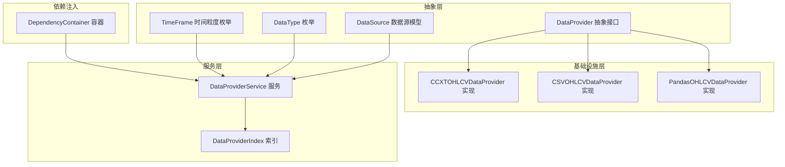
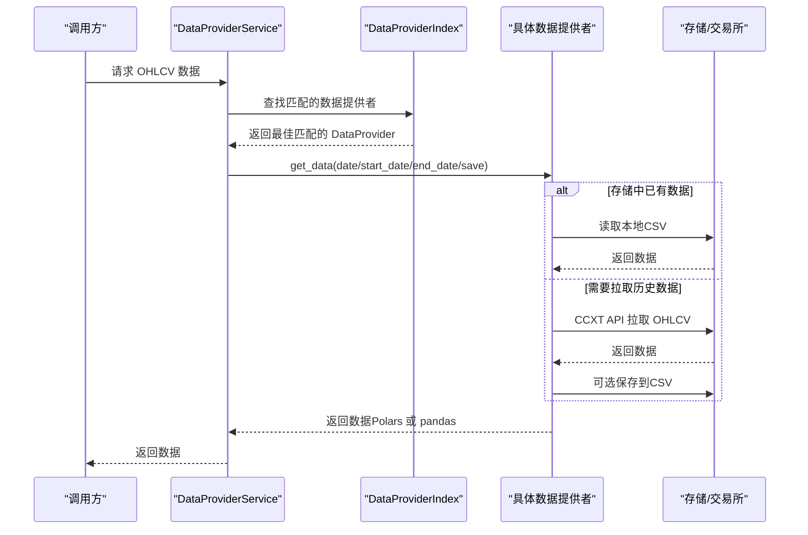
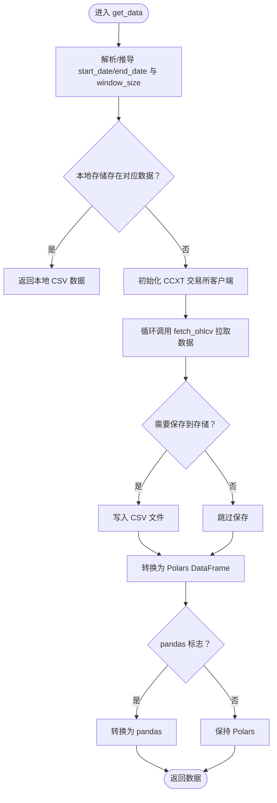
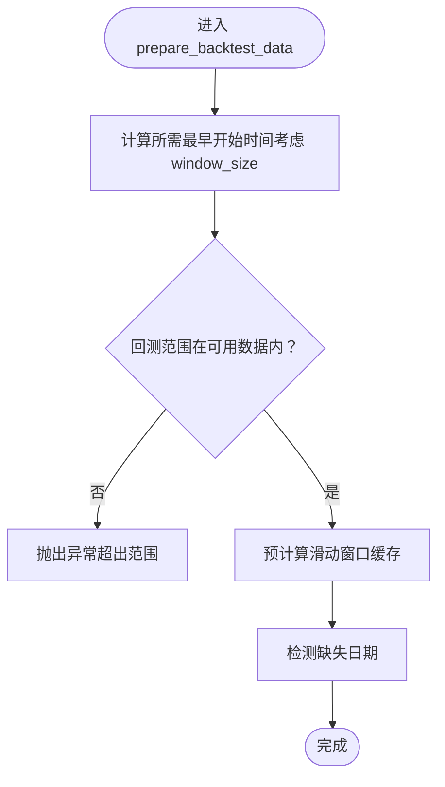
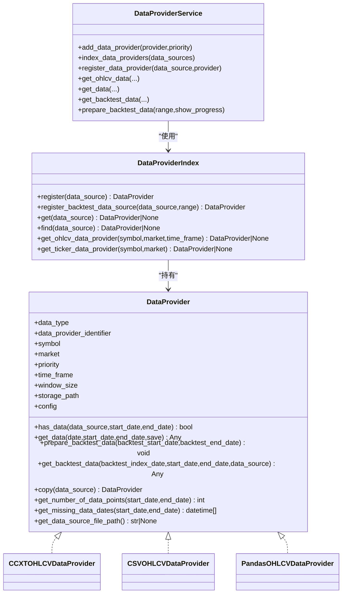
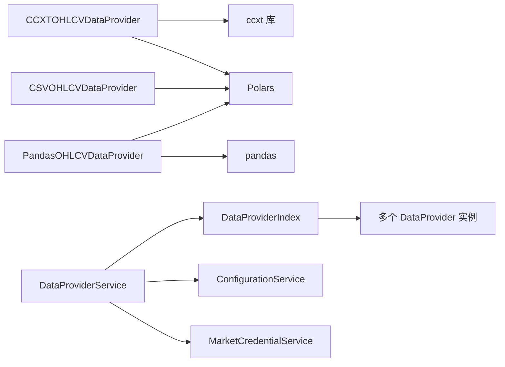

# 数据提供者

<cite>
**本文引用的文件列表**
- [investing_algorithm_framework/domain/data_provider.py](file://investing_algorithm_framework/domain/data_provider.py)
- [investing_algorithm_framework/infrastructure/data_providers/ccxt.py](file://investing_algorithm_framework/infrastructure/data_providers/ccxt.py)
- [investing_algorithm_framework/infrastructure/data_providers/csv.py](file://investing_algorithm_framework/infrastructure/data_providers/csv.py)
- [investing_algorithm_framework/infrastructure/data_providers/pandas.py](file://investing_algorithm_framework/infrastructure/data_providers/pandas.py)
- [investing_algorithm_framework/services/data_providers/data_provider_service.py](file://investing_algorithm_framework/services/data_providers/data_provider_service.py)
- [investing_algorithm_framework/domain/models/data/data_type.py](file://investing_algorithm_framework/domain/models/data/data_type.py)
- [investing_algorithm_framework/domain/models/data/data_source.py](file://investing_algorithm_framework/domain/models/data/data_source.py)
- [investing_algorithm_framework/domain/models/time_frame.py](file://investing_algorithm_framework/domain/models/time_frame.py)
- [investing_algorithm_framework/dependency_container.py](file://investing_algorithm_framework/dependency_container.py)
- [tests/infrastructure/data_providers/test_ccxt_ohlcv_data_provider.py](file://tests/infrastructure/data_providers/test_ccxt_ohlcv_data_provider.py)
- [tests/infrastructure/data_providers/test_csv_ohlcv_data_provider.py](file://tests/infrastructure/data_providers/test_csv_ohlcv_data_provider.py)
</cite>

## 目录
1. [简介](#简介)
2. [项目结构](#项目结构)
3. [核心组件](#核心组件)
4. [架构总览](#架构总览)
5. [详细组件分析](#详细组件分析)
6. [依赖关系分析](#依赖关系分析)
7. [性能考量](#性能考量)
8. [故障排查指南](#故障排查指南)
9. [结论](#结论)
10. [附录：自定义数据提供者示例](#附录自定义数据提供者示例)

## 简介
本章节系统性阐述数据提供者（DataProvider）抽象接口的设计原理与实现机制，覆盖以下要点：
- DataProvider 基类的接口契约与职责边界
- 通过继承实现自定义数据源的标准流程与注意事项
- CCXT 数据提供者的实现细节：如何集成 CCXT 库与 Bitvavo、Binance 等主流加密货币交易所进行 API 通信，支持实时与历史数据获取
- CSV 数据提供者的实现细节：文件路径配置、数据解析与时间序列对齐策略
- Pandas 数据提供者的内存数据处理能力与转换逻辑
- 数据提供者的注册机制与依赖注入配置
- 创建自定义数据提供者的完整示例，包含必要方法重写与异常处理

## 项目结构
围绕数据提供者的核心模块组织如下：
- 抽象层：定义统一的数据提供者接口与数据模型
- 基础设施层：具体数据提供者实现（CCXT、CSV、Pandas）
- 服务层：数据提供者索引与服务封装，负责注册、查找与回测数据准备
- 依赖注入：容器化管理数据提供者服务与其他核心服务

图表来源
- [investing_algorithm_framework/domain/data_provider.py](file://investing_algorithm_framework/domain/data_provider.py#L1-L335)
- [investing_algorithm_framework/infrastructure/data_providers/ccxt.py](file://investing_algorithm_framework/infrastructure/data_providers/ccxt.py#L1-L200)
- [investing_algorithm_framework/infrastructure/data_providers/csv.py](file://investing_algorithm_framework/infrastructure/data_providers/csv.py#L1-L120)
- [investing_algorithm_framework/infrastructure/data_providers/pandas.py](file://investing_algorithm_framework/infrastructure/data_providers/pandas.py#L1-L120)
- [investing_algorithm_framework/services/data_providers/data_provider_service.py](file://investing_algorithm_framework/services/data_providers/data_provider_service.py#L1-L120)
- [investing_algorithm_framework/dependency_container.py](file://investing_algorithm_framework/dependency_container.py#L1-L80)

章节来源
- [investing_algorithm_framework/domain/data_provider.py](file://investing_algorithm_framework/domain/data_provider.py#L1-L120)
- [investing_algorithm_framework/services/data_providers/data_provider_service.py](file://investing_algorithm_framework/services/data_providers/data_provider_service.py#L1-L120)

## 核心组件
- DataProvider 抽象接口：定义统一的数据提供者契约，包括数据类型、标识符、优先级、时间粒度、窗口大小、存储路径等属性，以及 has_data、get_data、prepare_backtest_data、get_backtest_data、copy、get_number_of_data_points、get_missing_data_dates、get_data_source_file_path 等抽象方法。
- 具体实现：
  - CCXTOHLCVDataProvider：基于 CCXT 的 OHLCV 数据提供者，支持从交易所拉取历史数据、保存到本地 CSV、回测模式下的滑动窗口缓存与缺失日期检测。
  - CSVOHLCVDataProvider：基于本地 CSV 文件的 OHLCV 数据提供者，负责加载 CSV、校验列名、时间序列过滤与滑动窗口预计算。
  - PandasOHLCVDataProvider：基于内存 pandas DataFrame 的 OHLCV 数据提供者，负责将 pandas 转换为 Polars 并保持一致的数据格式。
- 服务与索引：
  - DataProviderService：对外提供统一的数据获取入口，负责注册数据提供者、索引构建、回测数据准备与数据返回。
  - DataProviderIndex：以 O(1) 时间复杂度快速查找数据提供者，按市场、符号、时间粒度建立多维索引。
- 模型与枚举：
  - DataSource：描述数据源的标识、数据类型、符号、时间粒度、窗口大小、市场、存储路径、日期范围等。
  - DataType：OHLCV、TICKER、ORDER_BOOK、CUSTOM 等数据类型枚举。
  - TimeFrame：分钟级到年级的时间粒度枚举及比较运算。

章节来源
- [investing_algorithm_framework/domain/data_provider.py](file://investing_algorithm_framework/domain/data_provider.py#L1-L335)
- [investing_algorithm_framework/infrastructure/data_providers/ccxt.py](file://investing_algorithm_framework/infrastructure/data_providers/ccxt.py#L1-L200)
- [investing_algorithm_framework/infrastructure/data_providers/csv.py](file://investing_algorithm_framework/infrastructure/data_providers/csv.py#L1-L120)
- [investing_algorithm_framework/infrastructure/data_providers/pandas.py](file://investing_algorithm_framework/infrastructure/data_providers/pandas.py#L1-L120)
- [investing_algorithm_framework/services/data_providers/data_provider_service.py](file://investing_algorithm_framework/services/data_providers/data_provider_service.py#L1-L200)
- [investing_algorithm_framework/domain/models/data/data_source.py](file://investing_algorithm_framework/domain/models/data/data_source.py#L1-L120)
- [investing_algorithm_framework/domain/models/data/data_type.py](file://investing_algorithm_framework/domain/models/data/data_type.py#L1-L47)
- [investing_algorithm_framework/domain/models/time_frame.py](file://investing_algorithm_framework/domain/models/time_frame.py#L1-L154)

## 架构总览
数据提供者体系采用“抽象接口 + 多实现 + 服务索引 + 依赖注入”的分层设计：
- 抽象接口约束所有实现必须遵循统一契约，确保上层调用一致性
- 具体实现聚焦于不同数据源（交易所 API、本地 CSV、内存 DataFrame）的接入细节
- 服务层负责注册、索引与回测数据准备，屏蔽底层差异
- 依赖注入容器集中管理服务生命周期与依赖关系

图表来源
- [investing_algorithm_framework/services/data_providers/data_provider_service.py](file://investing_algorithm_framework/services/data_providers/data_provider_service.py#L360-L566)
- [investing_algorithm_framework/infrastructure/data_providers/ccxt.py](file://investing_algorithm_framework/infrastructure/data_providers/ccxt.py#L275-L410)
- [investing_algorithm_framework/infrastructure/data_providers/csv.py](file://investing_algorithm_framework/infrastructure/data_providers/csv.py#L125-L206)

章节来源
- [investing_algorithm_framework/services/data_providers/data_provider_service.py](file://investing_algorithm_framework/services/data_providers/data_provider_service.py#L360-L566)

## 详细组件分析

### DataProvider 抽象接口
- 关键属性
  - data_type：数据类型（OHLCV/TICKER/CUSTOM）
  - data_provider_identifier：数据提供者唯一标识
  - symbol/market：目标交易对与市场
  - priority：优先级（数值越小优先级越高）
  - time_frame/window_size：时间粒度与窗口大小
  - storage_path/storage_directory：本地存储路径或目录
  - config：配置对象（用于传递全局配置）
- 关键方法
  - has_data：判断是否具备指定参数范围内的数据
  - get_data：按日期范围或窗口大小获取数据
  - prepare_backtest_data：回测前准备数据（可预计算滑窗、检测缺失）
  - get_backtest_data：回测时按索引日期返回窗口或范围数据
  - copy：基于 DataSource 复制实例，确保每个数据源拥有独立实例
  - get_number_of_data_points/get_missing_data_dates：统计与缺失日期检测
  - get_data_source_file_path：返回本地存储文件路径（若适用）

章节来源
- [investing_algorithm_framework/domain/data_provider.py](file://investing_algorithm_framework/domain/data_provider.py#L1-L335)

### CCXT 数据提供者（CCXTOHLCVDataProvider）
- 设计要点
  - 支持从 Bitvavo、Binance 等 CCXT 支持的交易所拉取 OHLCV 数据
  - 回测模式下优先从本地 CSV 加载，缺失则通过 CCXT API 拉取并保存
  - 使用 Polars DataFrame 内存存储，支持可选转换为 pandas
  - 提供滑动窗口预计算与缺失日期检测，提升回测效率
- 关键流程
  - has_data：先检查本地存储是否存在对应时间段数据；否则尝试通过 CCXT 列出可用市场与交易对
  - get_data：根据传入的 date/start_date/end_date 与 window_size 计算时间范围；优先读取本地 CSV；不存在则调用 CCXT fetch_ohlcv 分批拉取并去重合并；可选保存到 CSV
  - prepare_backtest_data：计算所需最早开始时间（考虑 window_size），拉取或加载数据，设置 data、起止时间、总点数、缺失点数，并预计算滑动窗口缓存
  - get_backtest_data：在回测模式下，按 backtest_index_date 返回对应窗口或范围数据；若未找到则返回最近的不晚于该日期的窗口
  - 交换机初始化与凭据校验：根据 market 选择 CCXT 交易所类，按需校验 apiKey/secret 是否满足交易所要求
  - 本地存储：按约定命名规则生成 CSV 文件名，写入 CSV

图表来源
- [investing_algorithm_framework/infrastructure/data_providers/ccxt.py](file://investing_algorithm_framework/infrastructure/data_providers/ccxt.py#L275-L410)
- [investing_algorithm_framework/infrastructure/data_providers/ccxt.py](file://investing_algorithm_framework/infrastructure/data_providers/ccxt.py#L525-L623)
- [investing_algorithm_framework/infrastructure/data_providers/ccxt.py](file://investing_algorithm_framework/infrastructure/data_providers/ccxt.py#L712-L764)

章节来源
- [investing_algorithm_framework/infrastructure/data_providers/ccxt.py](file://investing_algorithm_framework/infrastructure/data_providers/ccxt.py#L1-L200)
- [investing_algorithm_framework/infrastructure/data_providers/ccxt.py](file://investing_algorithm_framework/infrastructure/data_providers/ccxt.py#L200-L420)
- [investing_algorithm_framework/infrastructure/data_providers/ccxt.py](file://investing_algorithm_framework/infrastructure/data_providers/ccxt.py#L420-L800)

### CSV 数据提供者（CSVOHLCVDataProvider）
- 设计要点
  - 从本地 CSV 文件加载 OHLCV 数据，严格校验列名（Datetime/Open/High/Low/Close/Volume）
  - 将 Datetime 解析为 UTC 毫秒时间戳并缓存起止时间
  - 支持窗口大小与时间粒度的回测数据准备，预计算滑动窗口缓存
  - 提供缺失日期检测与数据点统计
- 关键流程
  - has_data：当提供 start_date/end_date 且满足时间范围与窗口需求时返回 True
  - get_data：根据 start_date/end_date 与 window_size 计算窗口范围，过滤时间序列并返回
  - prepare_backtest_data：校验回测范围，预计算滑动窗口缓存，检测缺失日期
  - get_backtest_data：在回测范围内返回指定窗口或最近可用窗口
  - _load_data：读取 CSV，校验列名，转换 Datetime 类型，缓存起止时间

图表来源
- [investing_algorithm_framework/infrastructure/data_providers/csv.py](file://investing_algorithm_framework/infrastructure/data_providers/csv.py#L208-L281)
- [investing_algorithm_framework/infrastructure/data_providers/csv.py](file://investing_algorithm_framework/infrastructure/data_providers/csv.py#L390-L436)

章节来源
- [investing_algorithm_framework/infrastructure/data_providers/csv.py](file://investing_algorithm_framework/infrastructure/data_providers/csv.py#L1-L120)
- [investing_algorithm_framework/infrastructure/data_providers/csv.py](file://investing_algorithm_framework/infrastructure/data_providers/csv.py#L120-L281)
- [investing_algorithm_framework/infrastructure/data_providers/csv.py](file://investing_algorithm_framework/infrastructure/data_providers/csv.py#L281-L569)

### Pandas 数据提供者（PandasOHLCVDataProvider）
- 设计要点
  - 接收内存中的 pandas DataFrame，自动补齐 Datetime 列（支持索引为时间索引）
  - 转换为 Polars DataFrame，确保 Datetime 为 UTC 毫秒
  - 提供与 CSV/Polars 一致的接口行为（has_data、get_data、prepare_backtest_data、get_backtest_data、copy 等）
- 关键流程
  - _load_data：校验列名、转换 Datetime、转为 Polars 并缓存起止时间
  - 其余方法与 CSV 版本保持一致的逻辑与返回格式

章节来源
- [investing_algorithm_framework/infrastructure/data_providers/pandas.py](file://investing_algorithm_framework/infrastructure/data_providers/pandas.py#L1-L120)
- [investing_algorithm_framework/infrastructure/data_providers/pandas.py](file://investing_algorithm_framework/infrastructure/data_providers/pandas.py#L120-L220)
- [investing_algorithm_framework/infrastructure/data_providers/pandas.py](file://investing_algorithm_framework/infrastructure/data_providers/pandas.py#L220-L420)

### 数据提供者注册机制与依赖注入
- 注册流程
  - add_data_provider：添加数据提供者并设置优先级与配置
  - index_data_providers：基于 DataSource 列表进行注册，内部调用 DataProviderIndex.register，按 has_data 匹配并排序优先级，copy 实例后存入索引
  - register_backtest_data_source：针对回测场景，按 BacktestDateRange 进行注册与索引更新
- 索引结构
  - DataProviderIndex 维护多维索引：按 (symbol, market)、无市场、带时间粒度等维度存储最佳 Provider
  - get_ohlcv_data_provider/get_ticker_data_provider：按符号、市场、时间粒度快速检索
- 依赖注入
  - DependencyContainer 中声明 DataProviderService 单例，注入 ConfigurationService 与 MarketCredentialService
  - 上层组件通过容器获取 DataProviderService，无需直接管理 Provider 生命周期

图表来源
- [investing_algorithm_framework/domain/data_provider.py](file://investing_algorithm_framework/domain/data_provider.py#L1-L335)
- [investing_algorithm_framework/infrastructure/data_providers/ccxt.py](file://investing_algorithm_framework/infrastructure/data_providers/ccxt.py#L1-L120)
- [investing_algorithm_framework/infrastructure/data_providers/csv.py](file://investing_algorithm_framework/infrastructure/data_providers/csv.py#L1-L120)
- [investing_algorithm_framework/infrastructure/data_providers/pandas.py](file://investing_algorithm_framework/infrastructure/data_providers/pandas.py#L1-L120)
- [investing_algorithm_framework/services/data_providers/data_provider_service.py](file://investing_algorithm_framework/services/data_providers/data_provider_service.py#L1-L200)

章节来源
- [investing_algorithm_framework/services/data_providers/data_provider_service.py](file://investing_algorithm_framework/services/data_providers/data_provider_service.py#L1-L200)
- [investing_algorithm_framework/dependency_container.py](file://investing_algorithm_framework/dependency_container.py#L1-L80)

## 依赖关系分析
- 组件耦合
  - DataProviderService 依赖 DataProviderIndex 与 ConfigurationService/MarketCredentialService
  - 具体 Provider 依赖 DataType、TimeFrame、DataSource 等模型
  - CCXT Provider 依赖 ccxt 库与 Polars/pandas
- 外部依赖
  - CCXT：交易所 API 访问
  - Polars/pandas：高性能数据结构与转换
  - 日志：记录网络错误与调试信息
- 循环依赖
  - 通过服务层与索引层解耦 Provider 与调用方，避免循环导入

图表来源
- [investing_algorithm_framework/infrastructure/data_providers/ccxt.py](file://investing_algorithm_framework/infrastructure/data_providers/ccxt.py#L1-L120)
- [investing_algorithm_framework/infrastructure/data_providers/csv.py](file://investing_algorithm_framework/infrastructure/data_providers/csv.py#L1-L120)
- [investing_algorithm_framework/infrastructure/data_providers/pandas.py](file://investing_algorithm_framework/infrastructure/data_providers/pandas.py#L1-L120)
- [investing_algorithm_framework/services/data_providers/data_provider_service.py](file://investing_algorithm_framework/services/data_providers/data_provider_service.py#L1-L120)
- [investing_algorithm_framework/dependency_container.py](file://investing_algorithm_framework/dependency_container.py#L1-L80)

章节来源
- [investing_algorithm_framework/services/data_providers/data_provider_service.py](file://investing_algorithm_framework/services/data_providers/data_provider_service.py#L1-L120)
- [investing_algorithm_framework/dependency_container.py](file://investing_algorithm_framework/dependency_container.py#L1-L80)

## 性能考量
- 数据结构
  - 使用 Polars DataFrame 作为内部统一数据结构，具备高效的时间序列操作与内存布局
  - 可选转换为 pandas 以适配下游生态，但默认保持 Polars 以减少转换开销
- 回测优化
  - 滑动窗口预计算：在 prepare_backtest_data 中一次性构建窗口缓存，回测时 O(1) 获取窗口
  - 缺失日期检测：通过期望时间序列与实际时间序列差集快速定位缺失区间
- IO 与网络
  - 优先从本地 CSV 读取，减少 CCXT API 调用次数
  - CCXT 拉取采用 rateLimit 控制请求频率，避免触发限流
- 内存占用
  - CSV/Pandas Provider 将整段历史数据加载至内存，适合中小规模回测
  - CCXT Provider 在回测准备阶段仅缓存必要窗口，避免全量加载

[本节为通用指导，不直接分析具体文件]

## 故障排查指南
- 常见异常与定位
  - 未配置 data_type 或 data_provider_identifier：初始化阶段抛出配置异常
  - 未设置 market/symbol/time_frame：调用 get_data 前必须设置
  - 未找到匹配的数据提供者：注册阶段或查询阶段抛出配置异常
  - CCXT 网络错误：捕获网络异常并转换为统一 NetworkError
  - CSV 缺少必要列：读取 CSV 时抛出操作异常
- 排查步骤
  - 确认 DataSource 的 data_type、symbol、time_frame、market 设置正确
  - 检查 DataProviderService.add_data_provider 与 index_data_providers 的调用顺序
  - 对于 CCXT Provider，确认凭据配置与交易所支持情况
  - 对于 CSV Provider，确认 CSV 文件路径与列名一致

章节来源
- [investing_algorithm_framework/domain/data_provider.py](file://investing_algorithm_framework/domain/data_provider.py#L120-L170)
- [investing_algorithm_framework/infrastructure/data_providers/ccxt.py](file://investing_algorithm_framework/infrastructure/data_providers/ccxt.py#L300-L360)
- [investing_algorithm_framework/infrastructure/data_providers/ccxt.py](file://investing_algorithm_framework/infrastructure/data_providers/ccxt.py#L600-L620)
- [investing_algorithm_framework/infrastructure/data_providers/csv.py](file://investing_algorithm_framework/infrastructure/data_providers/csv.py#L409-L436)
- [investing_algorithm_framework/services/data_providers/data_provider_service.py](file://investing_algorithm_framework/services/data_providers/data_provider_service.py#L360-L420)

## 结论
本体系通过抽象接口统一了多种数据源的接入方式，结合服务层的注册与索引机制，实现了灵活、可扩展、高性能的数据供给能力。CCXT、CSV、Pandas 三种 Provider 各司其职：前者面向实时与历史数据拉取，后者面向离线回测数据加载，前者面向内存数据处理。配合依赖注入容器，整体架构清晰、易于维护与扩展。

[本节为总结性内容，不直接分析具体文件]

## 附录：自定义数据提供者示例
- 必要步骤
  - 继承 DataProvider，设置 data_type 与 data_provider_identifier
  - 实现 has_data、get_data、prepare_backtest_data、get_backtest_data、copy、get_number_of_data_points、get_missing_data_dates、get_data_source_file_path 等方法
  - 在构造函数中校验必要参数（如 data_type、data_provider_identifier），并在需要时设置 config
  - 在 DataProviderService 中注册自定义 Provider，并通过 DataSource 进行索引
- 异常处理
  - 对于外部依赖（如网络、文件系统）的异常，应捕获并转换为统一的操作异常或网络异常
  - 对于配置缺失的情况，在初始化阶段抛出配置异常
- 示例参考
  - CCXT Provider 的 get_ohlcv、initialize_exchange、check_credentials 等方法展示了交易所对接与凭据校验的完整流程
  - CSV Provider 的 _load_data 展示了列名校验与时间列处理的最佳实践
  - Pandas Provider 的 _load_data 展示了从 pandas 到 Polars 的转换与类型规范化

章节来源
- [investing_algorithm_framework/domain/data_provider.py](file://investing_algorithm_framework/domain/data_provider.py#L1-L120)
- [investing_algorithm_framework/infrastructure/data_providers/ccxt.py](file://investing_algorithm_framework/infrastructure/data_providers/ccxt.py#L525-L623)
- [investing_algorithm_framework/infrastructure/data_providers/csv.py](file://investing_algorithm_framework/infrastructure/data_providers/csv.py#L390-L436)
- [investing_algorithm_framework/infrastructure/data_providers/pandas.py](file://investing_algorithm_framework/infrastructure/data_providers/pandas.py#L418-L473)
- [tests/infrastructure/data_providers/test_ccxt_ohlcv_data_provider.py](file://tests/infrastructure/data_providers/test_ccxt_ohlcv_data_provider.py#L1-L120)
- [tests/infrastructure/data_providers/test_csv_ohlcv_data_provider.py](file://tests/infrastructure/data_providers/test_csv_ohlcv_data_provider.py#L1-L120)