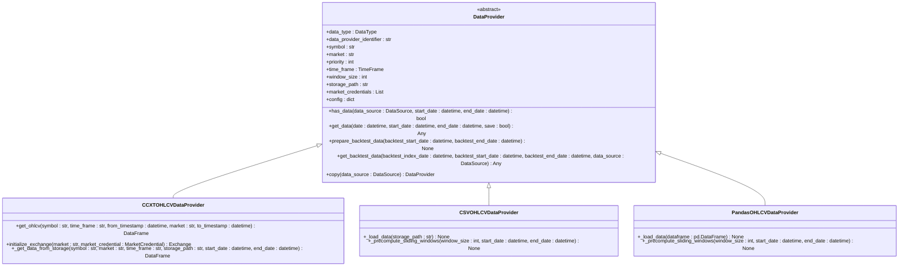
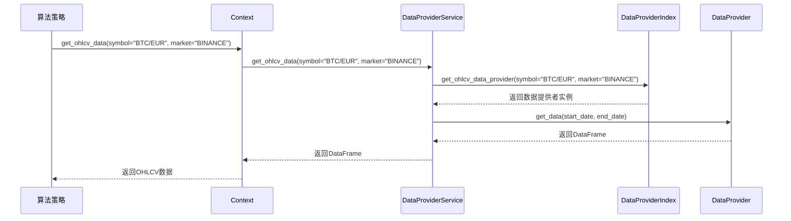
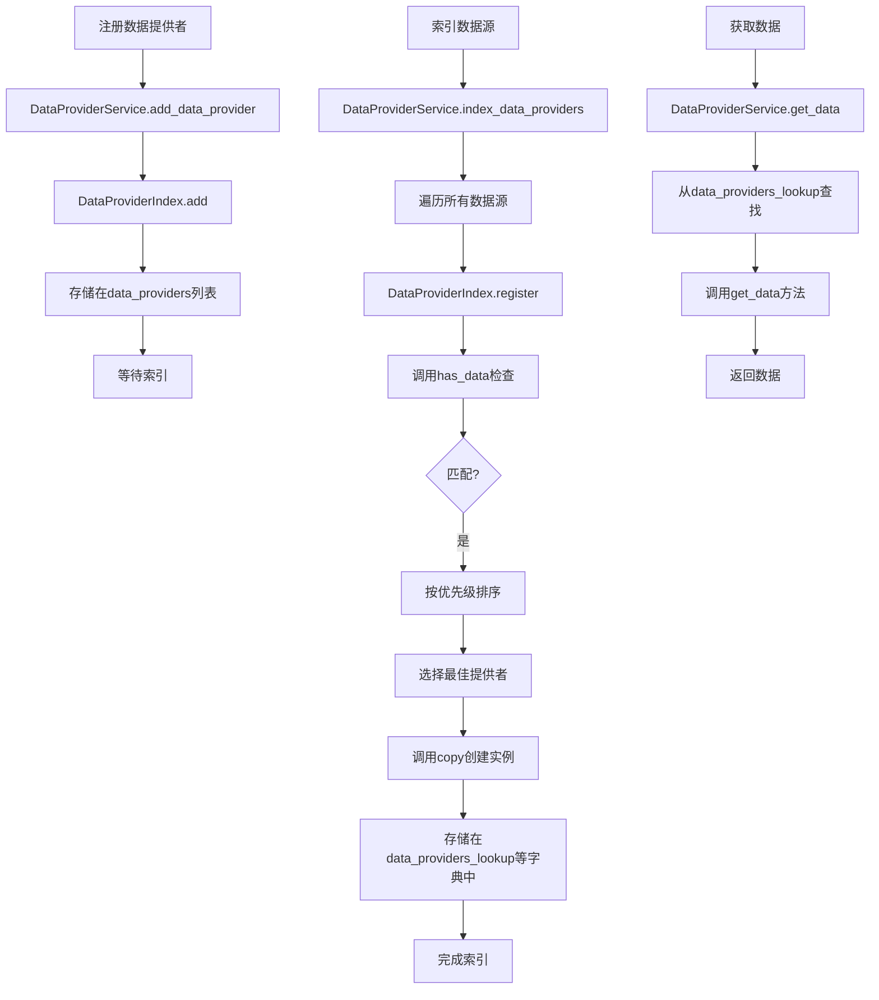

# 数据提供者基类

<cite>
**本文档引用的文件**   
- [data_provider.py](file://investing_algorithm_framework/domain/data_provider.py)
- [data_provider_service.py](file://investing_algorithm_framework/services/data_providers/data_provider_service.py)
- [ccxt.py](file://investing_algorithm_framework/infrastructure/data_providers/ccxt.py)
- [csv.py](file://investing_algorithm_framework/infrastructure/data_providers/csv.py)
- [pandas.py](file://investing_algorithm_framework/infrastructure/data_providers/pandas.py)
- [context.py](file://investing_algorithm_framework/app/context.py)
- [data_type.py](file://investing_algorithm_framework/domain/models/data/data_type.py)
- [data_source.py](file://investing_algorithm_framework/domain/models/data/data_source.py)
- [dependency_container.py](file://investing_algorithm_framework/dependency_container.py)
</cite>

## 目录
1. [引言](#引言)
2. [核心设计原理](#核心设计原理)
3. [接口契约与核心方法](#接口契约与核心方法)
4. [依赖注入与注册机制](#依赖注入与注册机制)
5. [数据标准化与时间序列对齐](#数据标准化与时间序列对齐)
6. [实现自定义数据提供者](#实现自定义数据提供者)
7. [生命周期与上下文集成](#生命周期与上下文集成)
8. [错误处理与最佳实践](#错误处理与最佳实践)

## 引言

数据提供者（DataProvider）是投资算法框架中的核心抽象基类，为所有具体的数据提供者实现提供了统一的接口。该基类的设计旨在为交易算法提供一个标准化的数据获取和准备机制，无论数据来源是实时市场、历史回测数据还是自定义数据源。通过定义清晰的接口契约，框架能够以一致的方式处理不同来源和格式的数据，从而简化了算法开发并增强了系统的可扩展性。

**Section sources**
- [data_provider.py](file://investing_algorithm_framework/domain/data_provider.py#L1-L41)

## 核心设计原理

数据提供者基类的设计遵循了依赖倒置原则和单一职责原则。它通过抽象方法定义了数据获取、验证和准备的核心行为，而具体的实现则由继承该基类的子类完成。这种设计模式使得框架能够轻松集成多种数据源，如通过CCXT库连接的交易所、本地CSV文件或内存中的Pandas数据框，而无需修改核心业务逻辑。

基类通过`data_type`和`data_provider_identifier`等属性强制要求每个实现都必须明确其提供的数据类型（如OHLCV、TICKER）和唯一标识符。这为框架的依赖注入系统提供了关键的元数据，使其能够根据数据需求精确地选择和注入正确的数据提供者实例。此外，`priority`属性允许在多个提供者支持同一数据源时进行优先级排序，确保了数据获取的灵活性和可靠性。

**Diagram sources **
- [data_provider.py](file://investing_algorithm_framework/domain/data_provider.py#L12-L335)
- [ccxt.py](file://investing_algorithm_framework/infrastructure/data_providers/ccxt.py#L21-L1144)
- [csv.py](file://investing_algorithm_framework/infrastructure/data_providers/csv.py#L11-L569)
- [pandas.py](file://investing_algorithm_framework/infrastructure/data_providers/pandas.py#L12-L600)

**Section sources**
- [data_provider.py](file://investing_algorithm_framework/domain/data_provider.py#L12-L335)

## 接口契约与核心方法

数据提供者基类定义了一组关键的抽象方法，这些方法构成了其接口契约。`get_data`方法是核心，用于根据指定的日期范围或特定日期获取数据。`get_symbol_data`方法（在具体实现中体现）则专注于为特定交易对获取数据。`has_data`方法允许框架在实际获取数据前检查数据源的可用性，这对于优化性能和避免不必要的网络请求至关重要。

`prepare_backtest_data`和`get_backtest_data`方法专门用于回测场景。前者在回测开始前预加载和准备所需数据，后者则在回测过程中根据当前索引日期高效地提供数据子集。`copy`方法确保了每个数据源都能获得一个独立的数据提供者实例，避免了状态污染。这些方法共同构成了一个强大而灵活的数据访问接口。

**Diagram sources **
- [data_provider.py](file://investing_algorithm_framework/domain/data_provider.py#L172-L335)
- [data_provider_service.py](file://investing_algorithm_framework/services/data_providers/data_provider_service.py#L486-L566)
- [context.py](file://investing_algorithm_framework/app/context.py#L463-L478)

**Section sources**
- [data_provider.py](file://investing_algorithm_framework/domain/data_provider.py#L172-L335)

## 依赖注入与注册机制

框架通过依赖注入容器（DependencyContainer）管理数据提供者服务（DataProviderService）的生命周期。当应用程序启动时，数据提供者服务会通过`add_data_provider`方法注册具体的提供者实例。在回测或实时运行时，`index_backtest_data_providers`或`index_data_providers`方法会根据用户定义的`DataSource`对象，利用`DataProviderIndex`内部的查找表，自动匹配并注册最合适的数据提供者。

这种机制的核心在于`DataProviderIndex`类，它维护了多个字典（如`ohlcv_data_providers`、`ticker_data_providers`），实现了基于符号、市场和时间框架的O(1)时间复杂度的快速查找。当策略请求数据时，服务会通过`get`或`get_ohlcv_data`等便捷方法，从索引中检索出已注册的提供者实例，并调用其`get_data`方法。

**Diagram sources **
- [dependency_container.py](file://investing_algorithm_framework/dependency_container.py#L57-L61)
- [data_provider_service.py](file://investing_algorithm_framework/services/data_providers/data_provider_service.py#L671-L757)
- [data_provider_service.py](file://investing_algorithm_framework/services/data_providers/data_provider_service.py#L370-L405)

**Section sources**
- [data_provider_service.py](file://investing_algorithm_framework/services/data_providers/data_provider_service.py#L334-L800)
- [dependency_container.py](file://investing_algorithm_framework/dependency_container.py#L57-L61)

## 数据标准化与时间序列对齐

框架强制要求所有OHLCV数据必须遵循统一的标准化格式。数据必须包含`Datetime`、`Open`、`High`、`Low`、`Close`和`Volume`这六个列。`Datetime`列必须为UTC时区，并以毫秒精度存储。数据在内部统一使用Polars DataFrame进行处理，以确保高性能和内存效率。

为了保证时间序列的完整性，数据提供者会进行时间对齐检查。在`prepare_backtest_data`阶段，提供者会计算预期的时间点序列（基于时间框架），并与实际数据中的时间点进行对比，从而识别出缺失的数据点。这有助于在回测开始前发现数据质量问题，确保回测结果的准确性。对于实时数据，框架会通过`get_missing_data_dates`方法来监控数据流的连续性。

**Section sources**
- [csv.py](file://investing_algorithm_framework/infrastructure/data_providers/csv.py#L15-L17)
- [pandas.py](file://investing_algorithm_framework/infrastructure/data_providers/pandas.py#L15-L17)
- [ccxt.py](file://investing_algorithm_framework/infrastructure/data_providers/ccxt.py#L36-L39)
- [csv.py](file://investing_algorithm_framework/infrastructure/data_providers/csv.py#L265-L273)
- [pandas.py](file://investing_algorithm_framework/infrastructure/data_providers/pandas.py#L297-L304)

## 实现自定义数据提供者

要实现一个自定义数据提供者，开发者需要继承`DataProvider`基类，并实现所有抽象方法。首先，必须设置`data_type`和`data_provider_identifier`类属性。然后，在`has_data`方法中，应根据`DataSource`对象的参数判断数据是否可用。`get_data`方法负责核心的数据获取逻辑，无论是从网络API、数据库还是文件系统。

对于需要滑动窗口的场景，应在`prepare_backtest_data`方法中预计算并缓存窗口数据，以提升回测性能。`get_backtest_data`方法应能高效地从缓存中检索出对应时间窗口的数据。`copy`方法必须返回一个包含新状态的新实例，以保证线程安全和状态隔离。

**Section sources**
- [data_provider.py](file://investing_algorithm_framework/domain/data_provider.py#L172-L335)
- [ccxt.py](file://investing_algorithm_framework/infrastructure/data_providers/ccxt.py#L106-L175)
- [csv.py](file://investing_algorithm_framework/infrastructure/data_providers/csv.py#L74-L123)
- [pandas.py](file://investing_algorithm_framework/infrastructure/data_providers/pandas.py#L73-L123)

## 生命周期与上下文集成

数据提供者的生命周期由`DataProviderService`管理。在应用程序上下文（Context）中，通过`data_provider_service`属性可以访问该服务。策略代码通过Context提供的`get_ohlcv_data`或`get_ticker_data`等便捷方法间接使用数据提供者，而无需直接与服务或提供者交互。

在回测模式下，`prepare_backtest_data`方法会在回测开始前被调用，以加载和准备所有必要的数据。在实时模式下，`get_data`方法会按需调用。`config`和`market_credentials`属性允许提供者在运行时访问应用程序的配置和市场凭证，实现了与框架上下文的深度集成。

**Section sources**
- [context.py](file://investing_algorithm_framework/app/context.py#L48-L52)
- [context.py](file://investing_algorithm_framework/app/context.py#L463-L478)
- [data_provider_service.py](file://investing_algorithm_framework/services/data_providers/data_provider_service.py#L758-L800)

## 错误处理与最佳实践

数据提供者在遇到错误时应抛出框架定义的异常，如`OperationalException`或`ImproperlyConfigured`。例如，当`get_data`方法缺少必要参数时，应抛出`OperationalException`。在`__init__`方法中，如果关键属性未设置，应抛出`ImproperlyConfigured`异常。

最佳实践包括：实现高效的缓存策略以减少重复计算；确保`copy`方法创建的是深拷贝或独立状态的新实例；在`get_data`方法中正确处理`save`参数，以便将获取的数据持久化到存储路径；以及在`has_data`方法中尽可能利用本地存储信息进行快速判断，避免不必要的网络调用。

**Section sources**
- [data_provider.py](file://investing_algorithm_framework/domain/data_provider.py#L124-L137)
- [ccxt.py](file://investing_algorithm_framework/infrastructure/data_providers/ccxt.py#L300-L316)
- [csv.py](file://investing_algorithm_framework/infrastructure/data_providers/csv.py#L409-L420)
- [pandas.py](file://investing_algorithm_framework/infrastructure/data_providers/pandas.py#L433-L444)