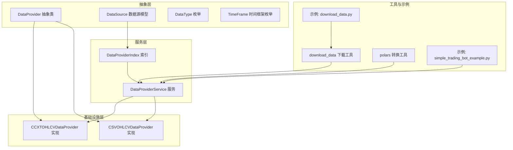
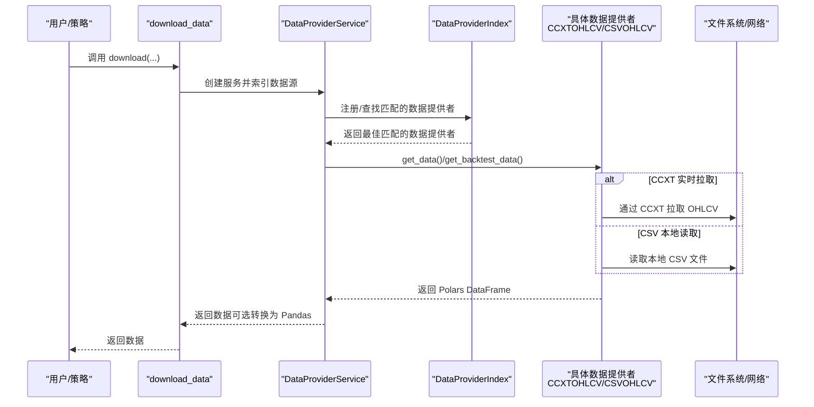
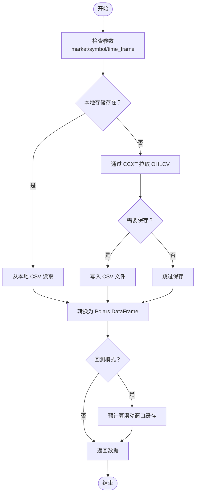
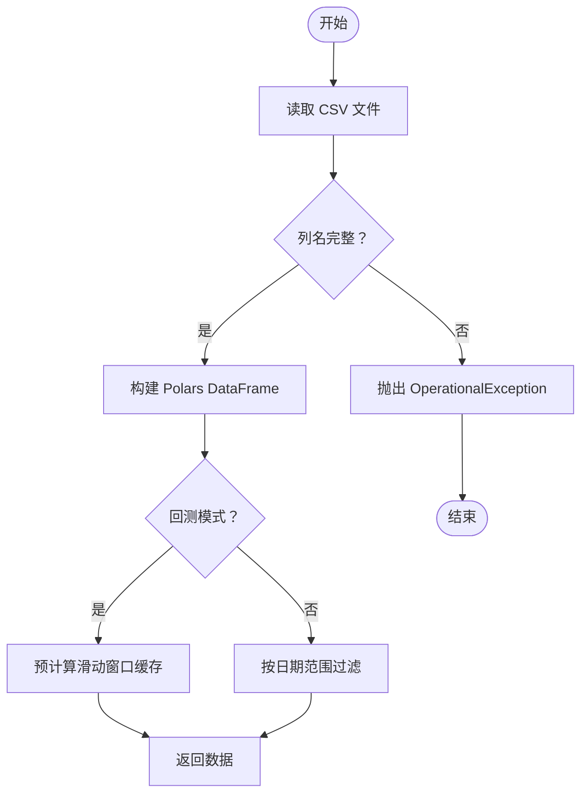
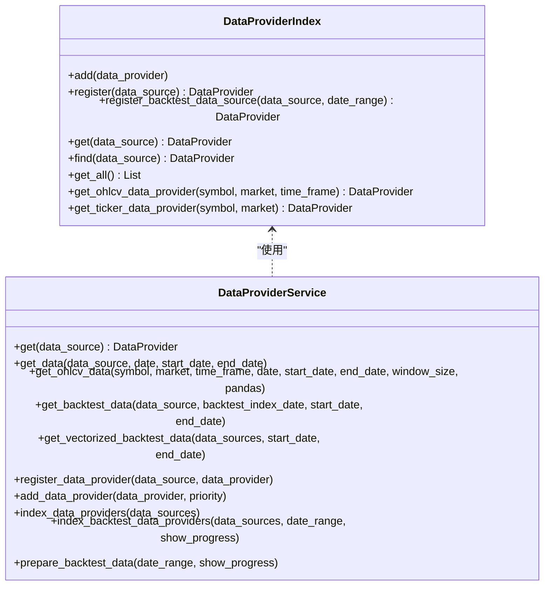
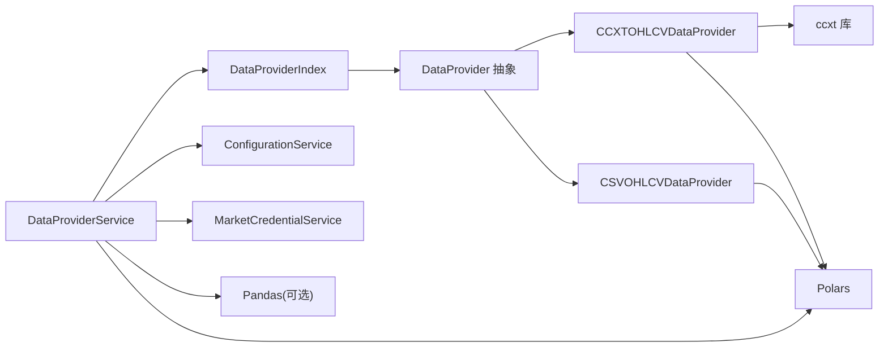

# 数据管理

<cite>
**本文引用的文件**
- [investing_algorithm_framework/domain/data_provider.py](file://investing_algorithm_framework/domain/data_provider.py)
- [investing_algorithm_framework/infrastructure/data_providers/ccxt.py](file://investing_algorithm_framework/infrastructure/data_providers/ccxt.py)
- [investing_algorithm_framework/infrastructure/data_providers/csv.py](file://investing_algorithm_framework/infrastructure/data_providers/csv.py)
- [investing_algorithm_framework/services/data_providers/data_provider_service.py](file://investing_algorithm_framework/services/data_providers/data_provider_service.py)
- [investing_algorithm_framework/domain/models/data/data_type.py](file://investing_algorithm_framework/domain/models/data/data_type.py)
- [investing_algorithm_framework/domain/models/data/data_source.py](file://investing_algorithm_framework/domain/models/data/data_source.py)
- [investing_algorithm_framework/domain/models/time_frame.py](file://investing_algorithm_framework/domain/models/time_frame.py)
- [investing_algorithm_framework/download_data.py](file://investing_algorithm_framework/download_data.py)
- [investing_algorithm_framework/domain/utils/polars.py](file://investing_algorithm_framework/domain/utils/polars.py)
- [examples/download_data.py](file://examples/download_data.py)
- [examples/simple_trading_bot_example.py](file://examples/simple_trading_bot_example.py)
- [tests/infrastructure/data_providers/test_ccxt_ohlcv_data_provider.py](file://tests/infrastructure/data_providers/test_ccxt_ohlcv_data_provider.py)
- [tests/infrastructure/data_providers/test_csv_ohlcv_data_provider.py](file://tests/infrastructure/data_providers/test_csv_ohlcv_data_provider.py)
</cite>

## 目录
1. [简介](#简介)
2. [项目结构](#项目结构)
3. [核心组件](#核心组件)
4. [架构总览](#架构总览)
5. [详细组件分析](#详细组件分析)
6. [依赖关系分析](#依赖关系分析)
7. [性能考量](#性能考量)
8. [故障排查指南](#故障排查指南)
9. [结论](#结论)
10. [附录](#附录)

## 简介
本章节系统性阐述框架的数据管理能力，重点围绕数据提供者（DataProvider）抽象接口、CCXT与CSV两种数据提供者实现、多市场与多时间框架的数据配置与注册、OHLCV数据模型与时间序列处理流程、实时数据拉取与历史CSV加载、数据缓存与性能优化策略，以及数据缺失与异常处理与数据下载工具的最佳实践。

## 项目结构
数据管理相关代码主要分布在以下模块：
- 抽象层：定义数据提供者接口与数据模型
- 基础设施层：具体数据提供者实现（CCXT、CSV）
- 服务层：数据提供者索引与服务封装
- 工具与示例：下载工具、示例应用与测试用例

图表来源
- [investing_algorithm_framework/domain/data_provider.py](file://investing_algorithm_framework/domain/data_provider.py#L1-L335)
- [investing_algorithm_framework/infrastructure/data_providers/ccxt.py](file://investing_algorithm_framework/infrastructure/data_providers/ccxt.py#L1-L800)
- [investing_algorithm_framework/infrastructure/data_providers/csv.py](file://investing_algorithm_framework/infrastructure/data_providers/csv.py#L1-L569)
- [investing_algorithm_framework/services/data_providers/data_provider_service.py](file://investing_algorithm_framework/services/data_providers/data_provider_service.py#L1-L851)
- [investing_algorithm_framework/domain/models/data/data_source.py](file://investing_algorithm_framework/domain/models/data/data_source.py#L1-L223)
- [investing_algorithm_framework/domain/models/data/data_type.py](file://investing_algorithm_framework/domain/models/data/data_type.py#L1-L47)
- [investing_algorithm_framework/domain/models/time_frame.py](file://investing_algorithm_framework/domain/models/time_frame.py#L1-L154)
- [investing_algorithm_framework/download_data.py](file://investing_algorithm_framework/download_data.py#L1-L109)
- [investing_algorithm_framework/domain/utils/polars.py](file://investing_algorithm_framework/domain/utils/polars.py#L1-L54)
- [examples/download_data.py](file://examples/download_data.py#L1-L14)
- [examples/simple_trading_bot_example.py](file://examples/simple_trading_bot_example.py#L1-L254)

章节来源
- [investing_algorithm_framework/domain/data_provider.py](file://investing_algorithm_framework/domain/data_provider.py#L1-L335)
- [investing_algorithm_framework/services/data_providers/data_provider_service.py](file://investing_algorithm_framework/services/data_providers/data_provider_service.py#L1-L851)

## 核心组件
- DataProvider 抽象接口：定义统一的数据提供者契约，包括数据类型、标识符、优先级、时间框架、窗口大小、存储路径等；并规定 has_data、get_data、prepare_backtest_data、get_backtest_data、copy、get_number_of_data_points、get_missing_data_dates、get_data_source_file_path 等方法。
- CCXTOHLCVDataProvider：基于 CCXT 的 OHLCV 数据提供者，支持从交易所实时拉取 OHLCV，并可按需保存到本地 CSV；在回测模式下预计算滑动窗口缓存以提升性能。
- CSVOHLCVDataProvider：基于本地 CSV 文件的 OHLCV 数据提供者，读取指定列（Datetime、Open、High、Low、Close、Volume），支持回测模式下的滑动窗口缓存与缺失数据检测。
- DataProviderService：数据提供者服务，负责索引与查找、注册、准备回测数据、向策略返回数据；支持将 Polars DataFrame 转换为 Pandas DataFrame。
- DataProviderIndex：数据提供者索引，按数据类型、符号、市场、时间框架快速定位匹配的数据提供者，并维护 OHLCV/TICKER 的查找表。
- DataSource：数据源模型，封装数据请求参数（数据类型、符号、时间框架、市场、日期范围、窗口大小、是否保存、存储路径等），并提供标识生成与相等比较逻辑。
- DataType/TimeFrame：枚举类型，统一数据类型与时间框架的表示与转换。
- download_data：便捷下载工具，封装配置、创建数据源、索引与获取数据的流程。

章节来源
- [investing_algorithm_framework/domain/data_provider.py](file://investing_algorithm_framework/domain/data_provider.py#L1-L335)
- [investing_algorithm_framework/infrastructure/data_providers/ccxt.py](file://investing_algorithm_framework/infrastructure/data_providers/ccxt.py#L1-L800)
- [investing_algorithm_framework/infrastructure/data_providers/csv.py](file://investing_algorithm_framework/infrastructure/data_providers/csv.py#L1-L569)
- [investing_algorithm_framework/services/data_providers/data_provider_service.py](file://investing_algorithm_framework/services/data_providers/data_provider_service.py#L1-L851)
- [investing_algorithm_framework/domain/models/data/data_source.py](file://investing_algorithm_framework/domain/models/data/data_source.py#L1-L223)
- [investing_algorithm_framework/domain/models/data/data_type.py](file://investing_algorithm_framework/domain/models/data/data_type.py#L1-L47)
- [investing_algorithm_framework/domain/models/time_frame.py](file://investing_algorithm_framework/domain/models/time_frame.py#L1-L154)
- [investing_algorithm_framework/download_data.py](file://investing_algorithm_framework/download_data.py#L1-L109)

## 架构总览
数据流从策略或下载工具发起，通过 DataProviderService 查找匹配的数据提供者，再由具体实现（CCXT 或 CSV）完成数据获取与回测准备。回测模式下，数据提供者会预计算滑动窗口缓存，以 O(1) 快速返回窗口数据。

图表来源
- [investing_algorithm_framework/download_data.py](file://investing_algorithm_framework/download_data.py#L1-L109)
- [investing_algorithm_framework/services/data_providers/data_provider_service.py](file://investing_algorithm_framework/services/data_providers/data_provider_service.py#L1-L851)
- [investing_algorithm_framework/infrastructure/data_providers/ccxt.py](file://investing_algorithm_framework/infrastructure/data_providers/ccxt.py#L1-L800)
- [investing_algorithm_framework/infrastructure/data_providers/csv.py](file://investing_algorithm_framework/infrastructure/data_providers/csv.py#L1-L569)

## 详细组件分析

### DataProvider 抽象接口
- 设计要点
  - 统一属性：data_type、data_provider_identifier、priority、time_frame、window_size、storage_path/storage_directory、market_credentials。
  - 关键方法：has_data、get_data、prepare_backtest_data、get_backtest_data、copy、get_number_of_data_points、get_missing_data_dates、get_data_source_file_path。
  - 配置校验：构造时强制要求 data_type 与 data_provider_identifier，否则抛出配置错误。
  - 市场凭证：支持按市场检索凭证，用于初始化交易所客户端。
- 复杂度与性能
  - has_data 与 get_data 的复杂度取决于具体实现（网络请求或文件读取）。
  - 回测准备阶段会进行预计算与缓存，显著降低回测时的查询成本。

章节来源
- [investing_algorithm_framework/domain/data_provider.py](file://investing_algorithm_framework/domain/data_provider.py#L1-L335)

### CCXTOHLCVDataProvider（CCXT 实时 OHLCV）
- 功能特性
  - 支持从 CCXT 交易所实时拉取 OHLCV，自动处理 rateLimit 与分页拉取。
  - 支持将数据保存到本地 CSV，文件名包含起止时间戳，便于重复使用。
  - 回测模式下预计算滑动窗口缓存，按索引日期快速返回窗口数据。
  - 缺失数据检测：根据期望时间序列与实际时间序列差集计算缺失点。
  - 凭证校验：根据交易所 requiredCredentials 校验 API Key/Secret。
- 数据模型与时间序列
  - 列：Datetime、Open、High、Low、Close、Volume；Datetime 为 UTC 毫秒时间戳。
  - 时间框架：通过 TimeFrame 枚举转换为分钟数，用于窗口计算与边界推导。
- 错误处理
  - 网络错误捕获并转换为 NetworkError。
  - 参数校验：缺少 market/symbol/time_frame 时抛出 OperationalException。
  - 日期范围校验：起始日期必须早于结束日期。
- 性能优化
  - 使用 Polars DataFrame 加载与计算，减少 Python 层开销。
  - 回测窗口缓存：以索引时间作为键，O(1) 获取最近可用窗口。
  - 速率限制：遵循 exchange.rateLimit 控制请求节奏。

图表来源
- [investing_algorithm_framework/infrastructure/data_providers/ccxt.py](file://investing_algorithm_framework/infrastructure/data_providers/ccxt.py#L275-L524)

章节来源
- [investing_algorithm_framework/infrastructure/data_providers/ccxt.py](file://investing_algorithm_framework/infrastructure/data_providers/ccxt.py#L1-L800)
- [investing_algorithm_framework/domain/models/time_frame.py](file://investing_algorithm_framework/domain/models/time_frame.py#L1-L154)

### CSVOHLCVDataProvider（CSV 历史 OHLCV）
- 功能特性
  - 从本地 CSV 文件加载 OHLCV，严格校验列名完整性。
  - 支持按 start_date/end_date 或 window_size 计算窗口范围。
  - 回测模式下同样预计算滑动窗口缓存，支持缺失数据检测。
  - 支持复制实例以适配不同的数据源配置。
- 数据模型与时间序列
  - 列：Datetime、Open、High、Low、Close、Volume；Datetime 为 UTC 毫秒时间戳。
  - 时间序列连续性：通过期望时间序列与实际时间序列差集识别缺失点。
- 错误处理
  - 缺少必要列时抛出 OperationalException。
  - 超出数据范围时返回空结果或抛出异常。
- 性能优化
  - Polars DataFrame 加载与过滤，提升回测时窗口查询效率。
  - 滑动窗口缓存避免重复切片。

图表来源
- [investing_algorithm_framework/infrastructure/data_providers/csv.py](file://investing_algorithm_framework/infrastructure/data_providers/csv.py#L1-L569)

章节来源
- [investing_algorithm_framework/infrastructure/data_providers/csv.py](file://investing_algorithm_framework/infrastructure/data_providers/csv.py#L1-L569)

### DataProviderService 与 DataProviderIndex
- DataProviderIndex
  - 提供 O(1) 快速查找：按数据类型、符号、市场、时间框架建立查找表。
  - 支持优先级排序与更细粒度的时间框架覆盖。
  - 维护 OHLCV/TICKER 的专用查找表，便于策略直接获取。
- DataProviderService
  - 封装注册、索引、回测准备、数据获取与转换。
  - 在回测模式下调用数据提供者的 prepare_backtest_data 并启用窗口缓存。
  - 将 Polars DataFrame 转换为 Pandas DataFrame（可选），保持一致的数据访问体验。

图表来源
- [investing_algorithm_framework/services/data_providers/data_provider_service.py](file://investing_algorithm_framework/services/data_providers/data_provider_service.py#L1-L851)

章节来源
- [investing_algorithm_framework/services/data_providers/data_provider_service.py](file://investing_algorithm_framework/services/data_providers/data_provider_service.py#L1-L851)

### DataSource 与数据模型
- DataSource
  - 统一封装数据请求参数，支持字符串到枚举的自动转换与 UTC 时间规范化。
  - 提供标识生成与相等比较，确保相同语义的数据源可被正确识别与复用。
  - 支持计算窗口所需的数据点数量与起始日期。
- DataType/TimeFrame
  - DataType：OHLCV、TICKER、ORDER_BOOK、CUSTOM。
  - TimeFrame：1m、2m、5m、15m、30m、1h、2h、4h、12h、1d、1W、1M、1Y 等，并提供分钟数映射与比较。

章节来源
- [investing_algorithm_framework/domain/models/data/data_source.py](file://investing_algorithm_framework/domain/models/data/data_source.py#L1-L223)
- [investing_algorithm_framework/domain/models/data/data_type.py](file://investing_algorithm_framework/domain/models/data/data_type.py#L1-L47)
- [investing_algorithm_framework/domain/models/time_frame.py](file://investing_algorithm_framework/domain/models/time_frame.py#L1-L154)

### OHLCV 数据模型与时间序列处理
- 数据模型
  - 字段：Datetime（UTC 毫秒）、Open、High、Low、Close、Volume。
  - 存储格式：CSV 文件，文件名包含起止时间戳，便于版本化与检索。
- 时间序列处理
  - 连续性检查：通过期望时间序列（按时间框架等间距）与实际时间序列差集识别缺失点。
  - 窗口计算：以索引时间作为键，缓存长度为 window_size 的滑动窗口。
  - 回测数据裁剪：在回测范围内按 start_date/end_date 过滤窗口。

章节来源
- [investing_algorithm_framework/infrastructure/data_providers/ccxt.py](file://investing_algorithm_framework/infrastructure/data_providers/ccxt.py#L275-L524)
- [investing_algorithm_framework/infrastructure/data_providers/csv.py](file://investing_algorithm_framework/infrastructure/data_providers/csv.py#L208-L388)

### 配置与注册多个市场数据源
- 多市场与多时间框架
  - 通过 DataSource 的 market、symbol、time_frame、data_type 组合，支持同一符号在不同市场与时间框架的数据。
  - DataProviderIndex 会根据优先级与时间框架精细程度选择最佳提供者。
- 注册流程
  - 使用 DataProviderService.index_data_providers 或 index_backtest_data_providers 完成索引。
  - 回测模式下，先调用 prepare_backtest_data 再进行 get_backtest_data。
- 示例
  - 示例应用中通过 DataSource 定义多组数据源（RSI 与 EMA 不同时间框架），并在回测中使用。

章节来源
- [investing_algorithm_framework/services/data_providers/data_provider_service.py](file://investing_algorithm_framework/services/data_providers/data_provider_service.py#L688-L800)
- [examples/simple_trading_bot_example.py](file://examples/simple_trading_bot_example.py#L1-L254)

### 从主流交易所获取实时数据与加载历史 CSV
- 实时数据（CCXT）
  - 通过 CCXTOHLCVDataProvider.get_ohlcv 与 exchange.fetch_ohlcv 拉取 OHLCV。
  - 可设置 pandas 为 False 以返回 Polars DataFrame，减少转换开销。
  - 支持保存到本地 CSV，便于后续回测。
- 历史数据（CSV）
  - 通过 CSVOHLCVDataProvider 读取本地 CSV 文件，严格校验列名。
  - 支持按窗口大小或日期范围返回数据。
- 下载工具
  - download_data 提供一键下载入口，自动解析日期为 UTC，创建 DataSource 并索引与获取数据。

章节来源
- [investing_algorithm_framework/infrastructure/data_providers/ccxt.py](file://investing_algorithm_framework/infrastructure/data_providers/ccxt.py#L525-L623)
- [investing_algorithm_framework/infrastructure/data_providers/csv.py](file://investing_algorithm_framework/infrastructure/data_providers/csv.py#L390-L436)
- [investing_algorithm_framework/download_data.py](file://investing_algorithm_framework/download_data.py#L1-L109)
- [examples/download_data.py](file://examples/download_data.py#L1-L14)

### 数据缓存策略与性能优化
- 缓存策略
  - 回测窗口缓存：以索引时间作为键，缓存长度为 window_size 的滑动窗口，O(1) 查询。
  - 数据源文件路径缓存：CSVOHLCVDataProvider 提供 get_data_source_file_path。
- 性能优化
  - Polars DataFrame：高性能加载与计算，减少 Python 层开销。
  - 速率限制：遵循 exchange.rateLimit，避免触发风控。
  - 数据类型转换：convert_polars_to_pandas 支持去重与索引设置，便于 Pandas 使用场景。
  - 本地存储：优先从本地 CSV 读取，减少网络请求。

章节来源
- [investing_algorithm_framework/infrastructure/data_providers/ccxt.py](file://investing_algorithm_framework/infrastructure/data_providers/ccxt.py#L250-L274)
- [investing_algorithm_framework/infrastructure/data_providers/csv.py](file://investing_algorithm_framework/infrastructure/data_providers/csv.py#L437-L485)
- [investing_algorithm_framework/domain/utils/polars.py](file://investing_algorithm_framework/domain/utils/polars.py#L1-L54)

### 数据缺失与异常处理
- 缺失数据检测
  - CCXTOHLCVDataProvider/CSVOHLCVDataProvider 分别计算期望时间序列与实际时间序列差集，得到缺失日期列表。
  - 提供 get_missing_data_dates 与 get_number_of_data_points 接口。
- 异常处理
  - 网络错误：转换为 NetworkError 并记录日志。
  - 参数错误：缺少 market/symbol/time_frame 或日期范围非法时抛出 OperationalException。
  - 凭证错误：根据 requiredCredentials 校验失败时抛出 OperationalException。
  - CSV 列缺失：抛出 OperationalException 并提示缺失列名。

章节来源
- [investing_algorithm_framework/infrastructure/data_providers/ccxt.py](file://investing_algorithm_framework/infrastructure/data_providers/ccxt.py#L605-L614)
- [investing_algorithm_framework/infrastructure/data_providers/csv.py](file://investing_algorithm_framework/infrastructure/data_providers/csv.py#L409-L431)

### 数据下载工具使用方法与最佳实践
- 使用方法
  - 调用 download(...)，传入 symbol、market、time_frame、start_date、end_date、window_size、pandas、save、storage_path。
  - 工具内部自动解析日期为 UTC，创建 DataSource，索引并获取数据。
- 最佳实践
  - 明确时间框架与窗口大小，确保回测所需的前置数据充足。
  - 优先使用本地 CSV 存储，减少网络依赖。
  - 在生产环境配置市场凭证，避免限流与鉴权失败。
  - 使用 Polars DataFrame 以获得更好的性能，仅在需要 Pandas 兼容时转换。

章节来源
- [investing_algorithm_framework/download_data.py](file://investing_algorithm_framework/download_data.py#L1-L109)
- [examples/download_data.py](file://examples/download_data.py#L1-L14)

## 依赖关系分析
- 组件耦合
  - DataProviderService 依赖 DataProviderIndex、ConfigurationService、MarketCredentialService。
  - DataProviderIndex 依赖 DataProvider 的 has_data/copy/prepare_backtest_data/get_backtest_data。
  - CCXTOHLCVDataProvider/CSVOHLCVDataProvider 依赖 Polars、CCXT、时间框架与凭证模型。
- 外部依赖
  - CCXT：交易所 API 访问与速率限制控制。
  - Polars：高性能数据结构与计算。
  - Pandas：可选的数据类型转换。

图表来源
- [investing_algorithm_framework/services/data_providers/data_provider_service.py](file://investing_algorithm_framework/services/data_providers/data_provider_service.py#L1-L851)
- [investing_algorithm_framework/infrastructure/data_providers/ccxt.py](file://investing_algorithm_framework/infrastructure/data_providers/ccxt.py#L1-L800)
- [investing_algorithm_framework/infrastructure/data_providers/csv.py](file://investing_algorithm_framework/infrastructure/data_providers/csv.py#L1-L569)

章节来源
- [investing_algorithm_framework/services/data_providers/data_provider_service.py](file://investing_algorithm_framework/services/data_providers/data_provider_service.py#L1-L851)

## 性能考量
- 数据结构
  - Polars DataFrame 在加载与计算上优于 Pandas，建议默认使用 Polars。
- 索引与查找
  - DataProviderIndex 使用字典与元组键进行 O(1) 查找，降低策略运行时开销。
- 回测优化
  - 预计算滑动窗口缓存，避免每次回测迭代重复切片。
  - 本地 CSV 优先，减少网络抖动对回测的影响。
- 网络与速率限制
  - 遵循 exchange.rateLimit，合理控制并发与频率。
- 类型转换
  - convert_polars_to_pandas 支持去重与索引设置，兼顾 Pandas 生态兼容性。

[本节为通用指导，不直接分析具体文件]

## 故障排查指南
- “未找到数据提供者”
  - 检查 DataSource 的 data_type、symbol、market、time_frame 是否与已注册提供者匹配。
  - 确认 DataProviderIndex 的 register/index_backtest_data_providers 是否正确执行。
- “网络错误/连接失败”
  - 检查网络连通性与代理设置；确认 CCXT 交易所可用性。
- “CSV 列缺失”
  - 确认 CSV 包含 Datetime、Open、High、Low、Close、Volume 列。
- “日期非 UTC”
  - download_data 会校验日期是否为 UTC，确保传入的日期对象带 UTC 时区。
- “凭证校验失败”
  - 根据 requiredCredentials 设置 API Key/Secret，或通过环境变量注入。

章节来源
- [investing_algorithm_framework/services/data_providers/data_provider_service.py](file://investing_algorithm_framework/services/data_providers/data_provider_service.py#L631-L648)
- [investing_algorithm_framework/infrastructure/data_providers/ccxt.py](file://investing_algorithm_framework/infrastructure/data_providers/ccxt.py#L605-L614)
- [investing_algorithm_framework/infrastructure/data_providers/csv.py](file://investing_algorithm_framework/infrastructure/data_providers/csv.py#L409-L431)
- [investing_algorithm_framework/download_data.py](file://investing_algorithm_framework/download_data.py#L72-L86)

## 结论
该框架通过抽象的 DataProvider 接口与 CCXT/CSV 两套实现，提供了统一且高性能的数据管理能力。结合 DataProviderService 与 DataProviderIndex，实现了灵活的多市场、多时间框架数据配置与注册；通过回测窗口缓存与 Polars 高性能数据结构，显著提升了回测效率。配合 download_data 工具与示例应用，开发者可以快速搭建从实时数据拉取到历史回测的完整数据管线。

[本节为总结性内容，不直接分析具体文件]

## 附录
- 示例参考
  - 下载工具示例：[examples/download_data.py](file://examples/download_data.py#L1-L14)
  - 策略示例（多数据源与回测）：[examples/simple_trading_bot_example.py](file://examples/simple_trading_bot_example.py#L1-L254)
- 测试参考
  - CCXT OHLCV 提供者测试：[tests/infrastructure/data_providers/test_ccxt_ohlcv_data_provider.py](file://tests/infrastructure/data_providers/test_ccxt_ohlcv_data_provider.py#L1-L312)
  - CSV OHLCV 提供者测试：[tests/infrastructure/data_providers/test_csv_ohlcv_data_provider.py](file://tests/infrastructure/data_providers/test_csv_ohlcv_data_provider.py#L1-L380)