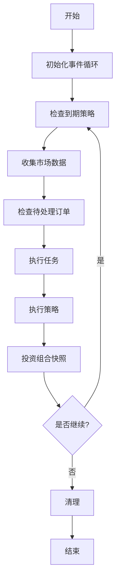
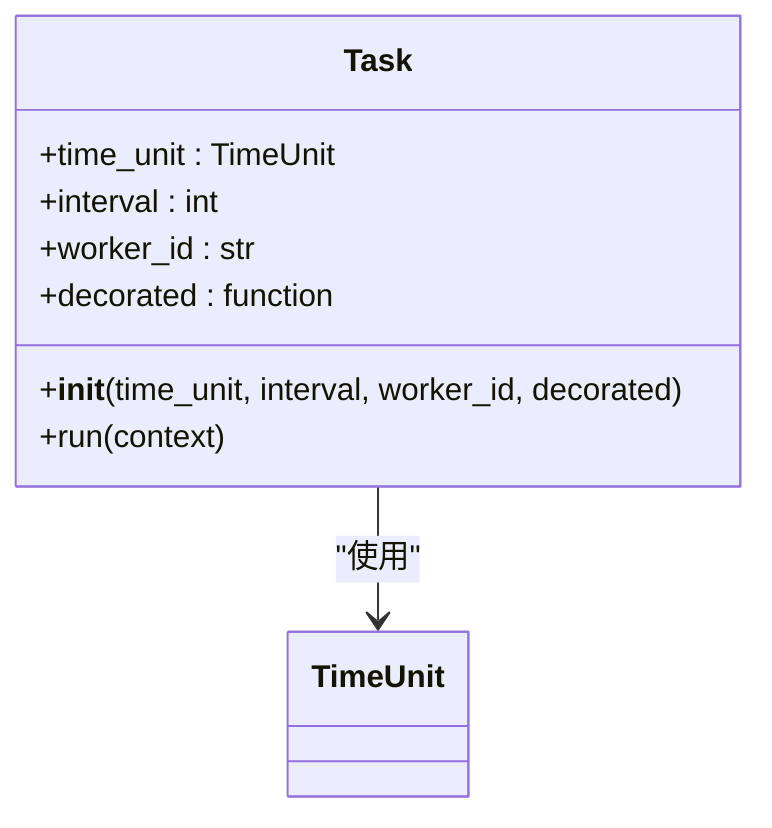
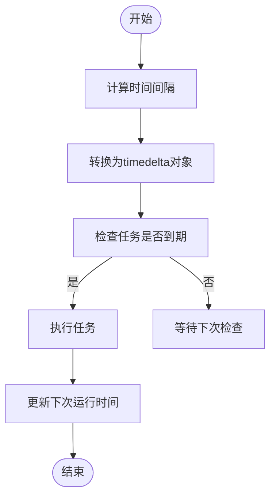
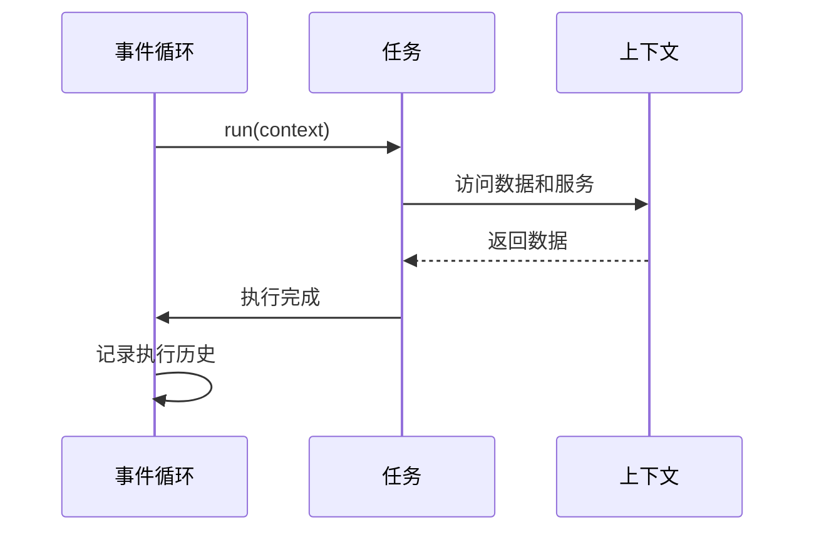

# 任务调度

<cite>
**本文档引用的文件**   
- [eventloop.py](file://investing_algorithm_framework/app/eventloop.py)
- [task.py](file://investing_algorithm_framework/app/task.py)
- [strategy.py](file://investing_algorithm_framework/app/strategy.py)
- [time_unit.py](file://investing_algorithm_framework/domain/models/time_unit.py)
- [app.py](file://investing_algorithm_framework/app/app.py)
- [backtest_service.py](file://investing_algorithm_framework/services/backtesting/backtest_service.py)
</cite>

## 目录
1. [引言](#引言)
2. [事件循环实现原理](#事件循环实现原理)
3. [任务装饰器工作机制](#任务装饰器工作机制)
4. [任务调度精度与延迟处理](#任务调度精度与延迟处理)
5. [配置示例](#配置示例)
6. [任务执行上下文](#任务执行上下文)
7. [任务依赖与执行顺序](#任务依赖与执行顺序)
8. [结论](#结论)

## 引言
本框架提供了一套完整的任务调度机制，用于管理交易策略和定时任务的执行。通过事件循环（EventLoop）服务，框架能够高效地运行交易算法，支持实时交易和回测两种模式。事件循环负责管理策略和任务的生命周期，包括数据收集、订单检查、策略执行和投资组合快照等关键环节。

**Section sources**
- [eventloop.py](file://investing_algorithm_framework/app/eventloop.py#L1-L621)

## 事件循环实现原理

事件循环服务（EventLoopService）是整个框架的核心组件，负责管理交易机器人的事件循环。该服务通过一个称为"迭代"（iteration）的周期来运行策略和任务，每个迭代包含以下关键任务：

1. 收集所有需要运行的策略和任务（根据调度计划）
2. 收集策略所需的所有市场数据
3. 检查待处理订单、止损和止盈
4. 执行所有任务
5. 执行所有策略
6. 执行策略运行钩子（on_strategy_run hooks）
7. 根据定义的快照间隔对投资组合进行快照

事件循环通过`start`方法启动，可以配置运行次数或提供时间表。在实时交易模式下，事件循环会定期检查哪些策略需要运行，并执行相应的任务。在回测模式下，事件循环会按照预定义的时间表逐个时间点执行。



**Diagram sources**
- [eventloop.py](file://investing_algorithm_framework/app/eventloop.py#L334-L444)

**Section sources**
- [eventloop.py](file://investing_algorithm_framework/app/eventloop.py#L19-L444)

## 任务装饰器工作机制

`@strategy.task`装饰器是框架中用于定义定时任务的核心机制。该装饰器基于`Task`类实现，允许开发者轻松创建周期性执行的任务。

### 内部工作原理

当使用`@strategy.task`装饰器时，框架会创建一个`Task`实例，该实例包含以下关键属性：

- `time_unit`: 任务执行的时间单位（秒、分钟、小时、天）
- `interval`: 执行间隔
- `worker_id`: 任务标识符
- `decorated`: 被装饰的函数



**Diagram sources**
- [task.py](file://investing_algorithm_framework/app/task.py#L5-L41)
- [time_unit.py](file://investing_algorithm_framework/domain/models/time_unit.py#L7-L17)

任务注册过程发生在应用初始化阶段。当调用`app.task()`装饰器时，框架会创建`Task`实例并将其添加到应用的任务列表中。任务的执行由事件循环在每次迭代中管理。

任务执行队列的管理通过`_run_iteration`方法实现。在每次迭代中，事件循环会检查所有注册的任务，并根据其时间间隔决定是否执行。任务的执行是同步的，按照注册顺序依次执行。

**Section sources**
- [task.py](file://investing_algorithm_framework/app/task.py#L5-L41)
- [app.py](file://investing_algorithm_framework/app/app.py#L702-L739)

## 任务调度精度与延迟处理

框架通过精确的时间间隔计算和灵活的调度策略来保证任务的准时执行。时间间隔的计算基于`TimeUnit`枚举类，支持秒、分钟、小时和天四种时间单位。

### 精度控制

任务调度的精度控制主要通过以下机制实现：

1. **时间单位转换**：框架将所有时间间隔统一转换为`timedelta`对象进行计算
2. **UTC时间基准**：所有时间计算基于UTC时区，避免时区转换带来的误差
3. **精确的时间比较**：使用`datetime.now(timezone.utc)`获取当前时间，并与预设的下次运行时间进行比较



**Diagram sources**
- [time_unit.py](file://investing_algorithm_framework/domain/models/time_unit.py#L94-L103)
- [eventloop.py](file://investing_algorithm_framework/app/eventloop.py#L188-L196)

### 延迟处理策略

当系统负载过高时，框架采用以下策略处理任务延迟：

1. **批量执行**：将多个到期任务在一次迭代中批量执行，减少系统开销
2. **优先级管理**：关键任务（如订单检查）优先执行
3. **时间补偿**：记录任务实际执行时间，用于后续的调度调整

在高负载情况下，框架会跳过进度条显示以提高性能，并通过日志记录任务执行情况，便于后续分析。

**Section sources**
- [eventloop.py](file://investing_algorithm_framework/app/eventloop.py#L334-L444)
- [time_unit.py](file://investing_algorithm_framework/domain/models/time_unit.py#L94-L103)

## 配置示例

以下示例展示了如何配置不同时间间隔的任务：

### 每分钟任务
```python
@app.task(time_unit=TimeUnit.MINUTE, interval=1)
def minute_task(context):
    # 每分钟执行的任务逻辑
    pass
```

### 每小时任务
```python
@app.task(time_unit=TimeUnit.HOUR, interval=1)
def hourly_task(context):
    # 每小时执行的任务逻辑
    pass
```

### 每日任务
```python
@app.task(time_unit=TimeUnit.DAY, interval=1)
def daily_task(context):
    # 每日执行的任务逻辑
    pass
```

### 自定义间隔任务
```python
# 每30分钟执行一次
@app.task(time_unit=TimeUnit.MINUTE, interval=30)
def custom_interval_task(context):
    # 自定义间隔任务逻辑
    pass
```

这些配置通过`app.task()`装饰器实现，框架会自动将任务添加到任务队列中，并根据指定的时间间隔进行调度。

**Section sources**
- [app.py](file://investing_algorithm_framework/app/app.py#L702-L739)

## 任务执行上下文

每个任务在执行时都会接收到一个上下文（context）对象，该对象提供了访问框架核心功能的接口。

### 异常处理

框架采用分层的异常处理机制：

1. **任务级异常**：每个任务的执行被包裹在try-catch块中，防止单个任务失败影响整个系统
2. **系统级异常**：通过`OperationalException`类处理框架级别的错误
3. **日志记录**：所有异常都会被记录到日志中，便于调试和监控

### 日志记录

框架使用标准的Python logging模块进行日志记录。每个任务执行时都会生成相应的日志条目，包括：

- 任务开始执行
- 任务执行完成
- 任何异常或错误

### 性能监控

框架通过以下方式实现性能监控：

1. **执行计数**：记录每个策略的总执行次数
2. **时间戳记录**：记录每次执行的时间
3. **历史跟踪**：维护策略执行的历史记录



**Diagram sources**
- [eventloop.py](file://investing_algorithm_framework/app/eventloop.py#L535-L536)
- [task.py](file://investing_algorithm_framework/app/task.py#L34-L41)

**Section sources**
- [eventloop.py](file://investing_algorithm_framework/app/eventloop.py#L583-L620)
- [task.py](file://investing_algorithm_framework/app/task.py#L34-L41)

## 任务依赖与执行顺序

框架通过任务注册顺序和策略依赖关系来管理任务的执行顺序。

### 依赖关系管理

任务间的依赖关系通过以下方式实现：

1. **注册顺序**：任务按照注册的顺序执行
2. **显式依赖**：通过策略配置定义依赖关系
3. **数据依赖**：基于数据源的依赖关系自动排序

### 执行顺序控制

执行顺序控制机制包括：

1. **策略优先级**：通过`strategy_id`和`worker_id`确定执行顺序
2. **时间间隔**：较短时间间隔的任务优先执行
3. **动态调整**：根据系统负载动态调整执行顺序

任务的动态启停通过事件循环的控制机制实现。可以通过修改策略的`interval`属性或从任务列表中移除任务来实现动态控制。

**Section sources**
- [eventloop.py](file://investing_algorithm_framework/app/eventloop.py#L447-L587)
- [strategy.py](file://investing_algorithm_framework/app/strategy.py#L51-L102)

## 结论

本框架的任务调度系统通过事件循环服务实现了高效、可靠的定时任务执行机制。系统采用模块化设计，将任务调度、策略执行和数据管理分离，提高了系统的可维护性和扩展性。

关键特性包括：
- 精确的时间间隔控制
- 灵活的任务注册机制
- 完善的异常处理和日志记录
- 高效的批量执行策略
- 支持实时交易和回测模式

通过`@strategy.task`装饰器，开发者可以轻松创建和管理定时任务，而框架负责处理复杂的调度逻辑和系统集成。