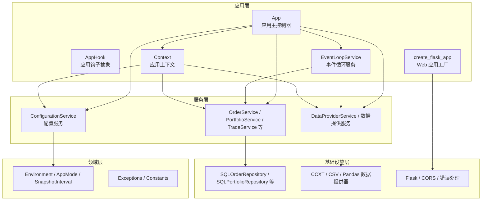
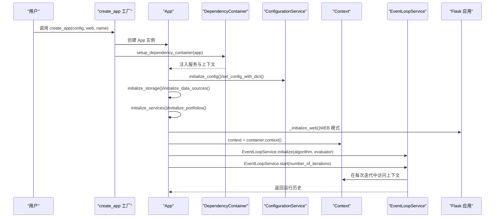
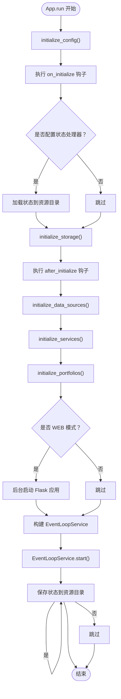
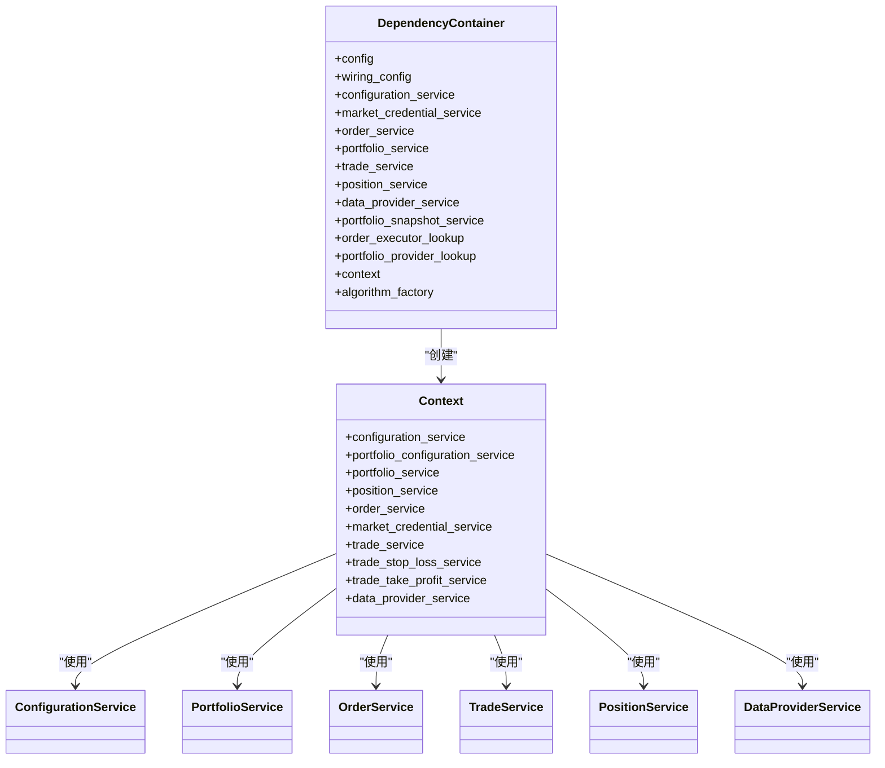
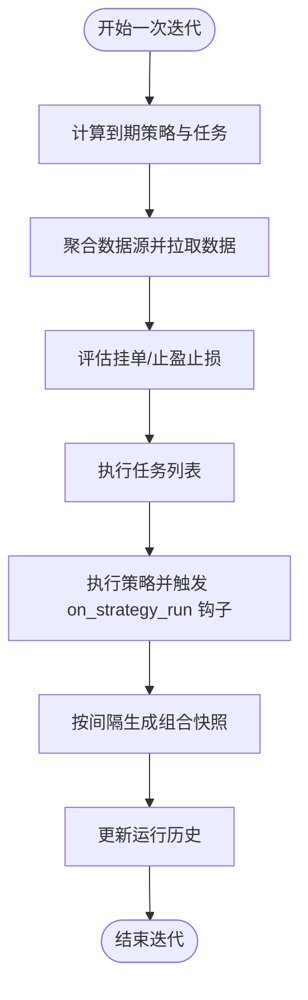
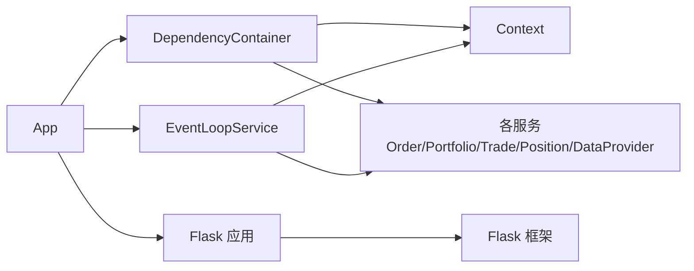

# 应用架构

<cite>
**本文引用的文件**
- [investing_algorithm_framework/app/app.py](file://investing_algorithm_framework/app/app.py)
- [investing_algorithm_framework/dependency_container.py](file://investing_algorithm_framework/dependency_container.py)
- [investing_algorithm_framework/app/context.py](file://investing_algorithm_framework/app/context.py)
- [investing_algorithm_framework/app/app_hook.py](file://investing_algorithm_framework/app/app_hook.py)
- [investing_algorithm_framework/create_app.py](file://investing_algorithm_framework/create_app.py)
- [investing_algorithm_framework/app/eventloop.py](file://investing_algorithm_framework/app/eventloop.py)
- [investing_algorithm_framework/services/configuration_service.py](file://investing_algorithm_framework/services/configuration_service.py)
- [investing_algorithm_framework/domain/config.py](file://investing_algorithm_framework/domain/config.py)
- [investing_algorithm_framework/app/web/create_app.py](file://investing_algorithm_framework/app/web/create_app.py)
- [investing_algorithm_framework/cli/cli.py](file://investing_algorithm_framework/cli/cli.py)
- [investing_algorithm_framework/cli/deploy_to_azure_function.py](file://investing_algorithm_framework/cli/deploy_to_azure_function.py)
- [examples/simple_trading_bot_example.py](file://examples/simple_trading_bot_example.py)
</cite>

## 目录
1. [简介](#简介)
2. [项目结构](#项目结构)
3. [核心组件](#核心组件)
4. [架构总览](#架构总览)
5. [详细组件分析](#详细组件分析)
6. [依赖关系分析](#依赖关系分析)
7. [性能考量](#性能考量)
8. [故障排查指南](#故障排查指南)
9. [结论](#结论)
10. [附录](#附录)

## 简介
本文件系统化梳理该投资算法框架的分层设计与组件交互，重点围绕以下目标展开：
- App 类的初始化流程与生命周期管理：从配置加载、服务注册到事件循环启动的完整链路。
- 依赖注入容器（DependencyContainer）的实现机制与解耦优势：如何通过容器统一管理服务实例与上下文。
- 应用上下文（Context）的作用域与数据共享：如何在不同组件间安全传递状态。
- 应用钩子（App Hooks）的扩展机制：可用钩子点与自定义逻辑注入方式。
- 实际代码示例路径：展示应用配置、服务注册与钩子函数的实现位置。
- 架构决策权衡：事件驱动与轮询的取舍，以及对多部署模式（本地、Web、云函数）的支持策略。

## 项目结构
该仓库采用按领域与层次划分的组织方式：
- 应用层：App、AppHook、EventLoopService、Web 应用入口等。
- 服务层：订单、组合、交易、快照、数据提供等服务。
- 基础设施层：数据提供器、数据库、仓库、执行器等。
- 领域模型与常量：配置、时间单位、环境枚举、异常等。
- CLI 与模板：项目初始化、AWS Lambda/Azure Functions 部署脚手架。

图表来源
- [investing_algorithm_framework/app/app.py](file://investing_algorithm_framework/app/app.py#L1-L200)
- [investing_algorithm_framework/dependency_container.py](file://investing_algorithm_framework/dependency_container.py#L1-L166)
- [investing_algorithm_framework/app/context.py](file://investing_algorithm_framework/app/context.py#L1-L120)
- [investing_algorithm_framework/app/eventloop.py](file://investing_algorithm_framework/app/eventloop.py#L1-L120)
- [investing_algorithm_framework/app/web/create_app.py](file://investing_algorithm_framework/app/web/create_app.py#L1-L21)
- [investing_algorithm_framework/services/configuration_service.py](file://investing_algorithm_framework/services/configuration_service.py#L1-L96)
- [investing_algorithm_framework/domain/config.py](file://investing_algorithm_framework/domain/config.py#L1-L112)

章节来源
- [investing_algorithm_framework/app/app.py](file://investing_algorithm_framework/app/app.py#L1-L200)
- [investing_algorithm_framework/dependency_container.py](file://investing_algorithm_framework/dependency_container.py#L1-L166)

## 核心组件
- App：应用主控制器，负责配置初始化、存储初始化、数据源初始化、服务初始化、Web 模式初始化、事件循环启动与生命周期钩子触发。
- DependencyContainer：基于依赖注入容器声明式定义服务与仓库的构造关系，提供线程安全单例与工厂模式，集中管理上下文与服务实例。
- Context：应用上下文，封装配置、订单、组合、交易、仓位、数据提供器等服务访问入口，为策略与任务提供统一的状态视图。
- AppHook：应用钩子抽象，支持 on_initialize、after_initialize、on_strategy_run 等钩子点，允许用户注入自定义逻辑。
- EventLoopService：事件循环服务，调度策略与任务、收集数据、评估挂单与止盈止损、生成快照并记录历史。
- ConfigurationService：配置中心，提供默认配置、读写配置、Flask 配置等能力。
- create_flask_app：Web 应用工厂，基于配置装配 Flask 应用、CORS、蓝图与错误处理。
- CLI：提供项目初始化与云部署命令，支持 AWS Lambda 与 Azure Functions。

章节来源
- [investing_algorithm_framework/app/app.py](file://investing_algorithm_framework/app/app.py#L1-L200)
- [investing_algorithm_framework/dependency_container.py](file://investing_algorithm_framework/dependency_container.py#L1-L166)
- [investing_algorithm_framework/app/context.py](file://investing_algorithm_framework/app/context.py#L1-L120)
- [investing_algorithm_framework/app/app_hook.py](file://investing_algorithm_framework/app/app_hook.py#L1-L29)
- [investing_algorithm_framework/app/eventloop.py](file://investing_algorithm_framework/app/eventloop.py#L1-L120)
- [investing_algorithm_framework/services/configuration_service.py](file://investing_algorithm_framework/services/configuration_service.py#L1-L96)
- [investing_algorithm_framework/app/web/create_app.py](file://investing_algorithm_framework/app/web/create_app.py#L1-L21)
- [investing_algorithm_framework/cli/cli.py](file://investing_algorithm_framework/cli/cli.py#L50-L226)

## 架构总览
下图展示了从应用创建到事件循环运行的关键调用序列，以及钩子与上下文在其中的位置。

图表来源
- [investing_algorithm_framework/create_app.py](file://investing_algorithm_framework/create_app.py#L1-L55)
- [investing_algorithm_framework/app/app.py](file://investing_algorithm_framework/app/app.py#L566-L700)
- [investing_algorithm_framework/app/eventloop.py](file://investing_algorithm_framework/app/eventloop.py#L334-L445)
- [investing_algorithm_framework/app/web/create_app.py](file://investing_algorithm_framework/app/web/create_app.py#L1-L21)

章节来源
- [investing_algorithm_framework/create_app.py](file://investing_algorithm_framework/create_app.py#L1-L55)
- [investing_algorithm_framework/app/app.py](file://investing_algorithm_framework/app/app.py#L566-L700)
- [investing_algorithm_framework/app/eventloop.py](file://investing_algorithm_framework/app/eventloop.py#L334-L445)

## 详细组件分析

### App 类：初始化流程与生命周期
- 初始化阶段
  - 配置加载：通过 create_app 设置环境变量与应用目录；App.initialize_config() 设置默认配置项（环境、数据库名、索引时间等），并根据环境设置数据库 URI。
  - 存储初始化：确保资源目录、数据库目录存在，创建 SQLite URI 并初始化 SQLAlchemy 与表。
  - 数据源初始化：注册用户自定义数据提供器，添加默认 CCXT 提供器，按策略需求索引数据源或回测数据准备。
  - 服务初始化：初始化市场凭证、组合配置校验、Web 模式下的 Flask 应用。
- 生命周期钩子
  - on_initialize：应用启动前执行，适合做前置检查或外部初始化。
  - after_initialize：应用初始化完成后执行，适合做后置检查或状态恢复。
  - on_strategy_run：每次策略运行前执行，适合做日志、指标采集或风控前置。
- 事件循环启动
  - 构造 EventLoopService，传入 Context、OrderService、PortfolioService、TradeService、DataProviderService、PortfolioSnapshotService。
  - 启动事件循环，支持无限循环、固定次数迭代、回测调度三种模式。
- Web 模式
  - 当配置为 WEB 模式时，后台线程启动 Flask 应用监听端口。

图表来源
- [investing_algorithm_framework/app/app.py](file://investing_algorithm_framework/app/app.py#L566-L700)
- [investing_algorithm_framework/app/app.py](file://investing_algorithm_framework/app/app.py#L1648-L1698)

章节来源
- [investing_algorithm_framework/app/app.py](file://investing_algorithm_framework/app/app.py#L228-L382)
- [investing_algorithm_framework/app/app.py](file://investing_algorithm_framework/app/app.py#L566-L700)
- [investing_algorithm_framework/app/app.py](file://investing_algorithm_framework/app/app.py#L1648-L1698)

### 依赖注入容器（DependencyContainer）
- 设计要点
  - 使用依赖注入容器声明式定义服务与仓库的构造关系，统一由容器提供线程安全单例或工厂实例。
  - 通过 WiringConfiguration 自动装配模块与包，减少手动绑定成本。
  - 上下文 Context 由容器统一创建，注入配置、组合、订单、交易、仓位、数据提供器、止盈止损服务等。
- 解耦优势
  - 组件间通过接口与容器解耦，便于替换实现（如回测/实盘服务替换）。
  - 便于测试与扩展，可在容器中重写特定服务实现。
- 关键服务映射（节选）
  - ConfigurationService、MarketCredentialService、OrderService、PortfolioService、TradeService、PositionService、DataProviderService、PortfolioSnapshotService、OrderExecutorLookup、PortfolioProviderLookup 等。

图表来源
- [investing_algorithm_framework/dependency_container.py](file://investing_algorithm_framework/dependency_container.py#L1-L166)
- [investing_algorithm_framework/app/context.py](file://investing_algorithm_framework/app/context.py#L1-L120)

章节来源
- [investing_algorithm_framework/dependency_container.py](file://investing_algorithm_framework/dependency_container.py#L1-L166)

### 应用上下文（Context）：作用域与数据共享
- 作用域
  - Context 作为应用状态的唯一可信来源，封装了配置、订单、组合、交易、仓位、数据提供器等服务的访问入口。
  - 通过容器注入，Context 在整个应用生命周期内保持一致的视图。
- 数据共享
  - 策略与任务通过 Context 获取当前组合、订单、交易、仓位信息，避免直接依赖具体实现。
  - 在回测模式下，Context 可以基于 INDEX_DATETIME 提供一致的时间轴视图。
- 安全传递
  - Context 不直接暴露底层仓库，而是通过服务层进行读写，降低越权访问风险。

章节来源
- [investing_algorithm_framework/app/context.py](file://investing_algorithm_framework/app/context.py#L1-L120)
- [investing_algorithm_framework/app/context.py](file://investing_algorithm_framework/app/context.py#L417-L462)

### 应用钩子（App Hooks）：扩展机制
- 钩子点
  - on_initialize：应用启动前执行。
  - after_initialize：应用初始化完成后执行。
  - on_strategy_run：每次策略运行前执行。
- 注册方式
  - 通过 App.on_initialize、App.after_initialize、App.on_strategy_run 注册自定义 Hook 类或实例。
- 执行时机
  - 在 App.run 中明确触发，确保钩子逻辑与业务流程解耦。

章节来源
- [investing_algorithm_framework/app/app.py](file://investing_algorithm_framework/app/app.py#L1648-L1698)
- [investing_algorithm_framework/app/app_hook.py](file://investing_algorithm_framework/app/app_hook.py#L1-L29)

### 事件循环（EventLoopService）：调度与数据流
- 调度策略
  - 基于策略的 time_unit 与 interval 计算下次运行时间，支持无限循环、固定次数迭代与回测调度。
- 数据流
  - 收集待运行策略与任务，聚合数据源，拉取 OHLCV/TICKER 数据，评估挂单与止盈止损，运行任务与策略，生成组合快照并更新历史。
- 性能优化
  - 合并数据请求，避免重复调用数据提供器；批量保存快照，减少数据库事务开销。

图表来源
- [investing_algorithm_framework/app/eventloop.py](file://investing_algorithm_framework/app/eventloop.py#L334-L445)
- [investing_algorithm_framework/app/eventloop.py](file://investing_algorithm_framework/app/eventloop.py#L446-L621)

章节来源
- [investing_algorithm_framework/app/eventloop.py](file://investing_algorithm_framework/app/eventloop.py#L1-L120)
- [investing_algorithm_framework/app/eventloop.py](file://investing_algorithm_framework/app/eventloop.py#L334-L445)

### 配置与环境：多部署模式支持
- 配置中心
  - ConfigurationService 提供默认配置字典、环境变量覆盖、Flask 配置等。
  - create_app 工厂加载 .env 并设置应用目录，支持 WEB 模式开关。
- 环境与日志
  - Environment 枚举支持 DEV/PROD/TEST/BACKTEST；提供日志配置（默认与 AWS Lambda）。
- 多部署模式
  - 本地：直接运行 App.run。
  - Web：设置 APP_MODE 为 WEB，后台启动 Flask 应用。
  - 云函数：CLI 提供 AWS Lambda 与 Azure Functions 一键部署模板与命令。

章节来源
- [investing_algorithm_framework/services/configuration_service.py](file://investing_algorithm_framework/services/configuration_service.py#L1-L96)
- [investing_algorithm_framework/create_app.py](file://investing_algorithm_framework/create_app.py#L1-L55)
- [investing_algorithm_framework/domain/config.py](file://investing_algorithm_framework/domain/config.py#L1-L112)
- [investing_algorithm_framework/cli/cli.py](file://investing_algorithm_framework/cli/cli.py#L50-L226)
- [investing_algorithm_framework/cli/deploy_to_azure_function.py](file://investing_algorithm_framework/cli/deploy_to_azure_function.py#L584-L624)

## 依赖关系分析
- 组件耦合
  - App 与 DependencyContainer 强耦合，但通过容器解耦具体服务实现。
  - EventLoopService 依赖 Context 与多个服务，通过容器注入，降低直接依赖。
  - Web 模式通过 create_flask_app 与 Flask 生态集成，不改变核心业务逻辑。
- 外部依赖
  - Flask、依赖注入容器、Polars、CCXT、SQLAlchemy 等。
- 循环依赖
  - 未发现明显循环依赖；服务通过容器与上下文间接交互。

图表来源
- [investing_algorithm_framework/app/app.py](file://investing_algorithm_framework/app/app.py#L1-L200)
- [investing_algorithm_framework/dependency_container.py](file://investing_algorithm_framework/dependency_container.py#L1-L166)
- [investing_algorithm_framework/app/eventloop.py](file://investing_algorithm_framework/app/eventloop.py#L1-L120)
- [investing_algorithm_framework/app/web/create_app.py](file://investing_algorithm_framework/app/web/create_app.py#L1-L21)

章节来源
- [investing_algorithm_framework/app/app.py](file://investing_algorithm_framework/app/app.py#L1-L200)
- [investing_algorithm_framework/dependency_container.py](file://investing_algorithm_framework/dependency_container.py#L1-L166)

## 性能考量
- 事件驱动 vs 轮询
  - 采用事件驱动的迭代式调度（策略/任务按计划运行），避免长轮询带来的 CPU 占用与延迟抖动。
  - 回测模式支持按时间轴推进，提高离线评估效率。
- 数据访问优化
  - 合并数据源请求，减少对外部数据提供器的调用次数。
  - 快照批量保存，降低数据库写入频率。
- 并发与线程
  - Web 模式使用后台线程启动 Flask，不影响事件循环主线程。
- 日志与可观测性
  - 默认日志配置与 AWS Lambda 日志配置分离，便于在不同环境下输出。

[本节为通用指导，无需列出具体文件来源]

## 故障排查指南
- 配置问题
  - 确认资源目录、数据库目录与数据库 URI 正确生成；检查环境变量与默认值覆盖。
- 服务初始化失败
  - 检查组合配置数量是否为零；确认市场凭证初始化成功。
- Web 模式无法访问
  - 检查 Flask 配置、CORS 白名单与端口占用情况。
- 事件循环无输出
  - 确认策略/任务已注册且时间单位与间隔合理；查看日志与运行历史。
- 云函数部署失败
  - 检查 CLI 命令参数、模板文件生成与凭据配置；Azure 需要订阅 ID 与登录状态。

章节来源
- [investing_algorithm_framework/app/app.py](file://investing_algorithm_framework/app/app.py#L566-L700)
- [investing_algorithm_framework/app/web/create_app.py](file://investing_algorithm_framework/app/web/create_app.py#L1-L21)
- [investing_algorithm_framework/cli/cli.py](file://investing_algorithm_framework/cli/cli.py#L50-L226)

## 结论
该框架通过清晰的分层设计与依赖注入容器实现了高内聚、低耦合的应用架构。App 作为主控制器串联配置、存储、数据源、服务与事件循环，Context 提供统一的状态视图，AppHook 支撑灵活的扩展机制。事件驱动的迭代调度兼顾实时与回测场景，CLI 与模板支持多部署模式。整体架构在保证可维护性的同时，提供了良好的扩展性与可移植性。

[本节为总结性内容，无需列出具体文件来源]

## 附录
- 实际代码示例路径（仅提供路径，不展示代码内容）
  - 应用创建与运行：[examples/simple_trading_bot_example.py](file://examples/simple_trading_bot_example.py#L221-L254)
  - 应用工厂与配置：[investing_algorithm_framework/create_app.py](file://investing_algorithm_framework/create_app.py#L1-L55)
  - 依赖注入容器定义：[investing_algorithm_framework/dependency_container.py](file://investing_algorithm_framework/dependency_container.py#L1-L166)
  - 应用上下文方法：[investing_algorithm_framework/app/context.py](file://investing_algorithm_framework/app/context.py#L1-L120)
  - 钩子注册与执行：[investing_algorithm_framework/app/app.py](file://investing_algorithm_framework/app/app.py#L1648-L1698)
  - 事件循环初始化与启动：[investing_algorithm_framework/app/eventloop.py](file://investing_algorithm_framework/app/eventloop.py#L259-L445)
  - Web 应用工厂：[investing_algorithm_framework/app/web/create_app.py](file://investing_algorithm_framework/app/web/create_app.py#L1-L21)
  - CLI 部署命令：[investing_algorithm_framework/cli/cli.py](file://investing_algorithm_framework/cli/cli.py#L50-L226)