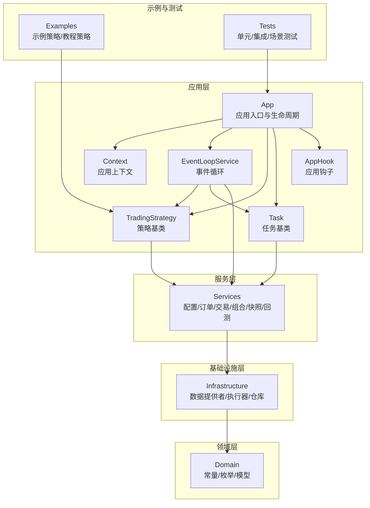
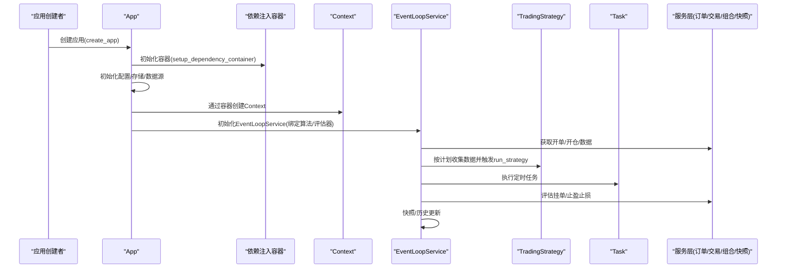
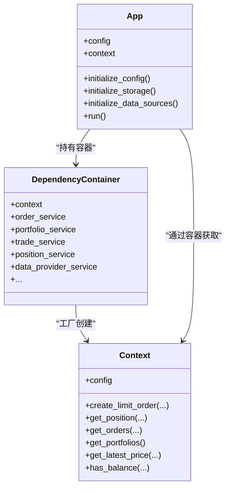
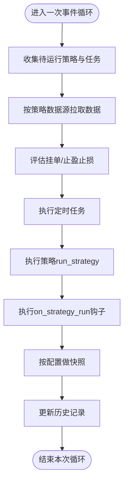
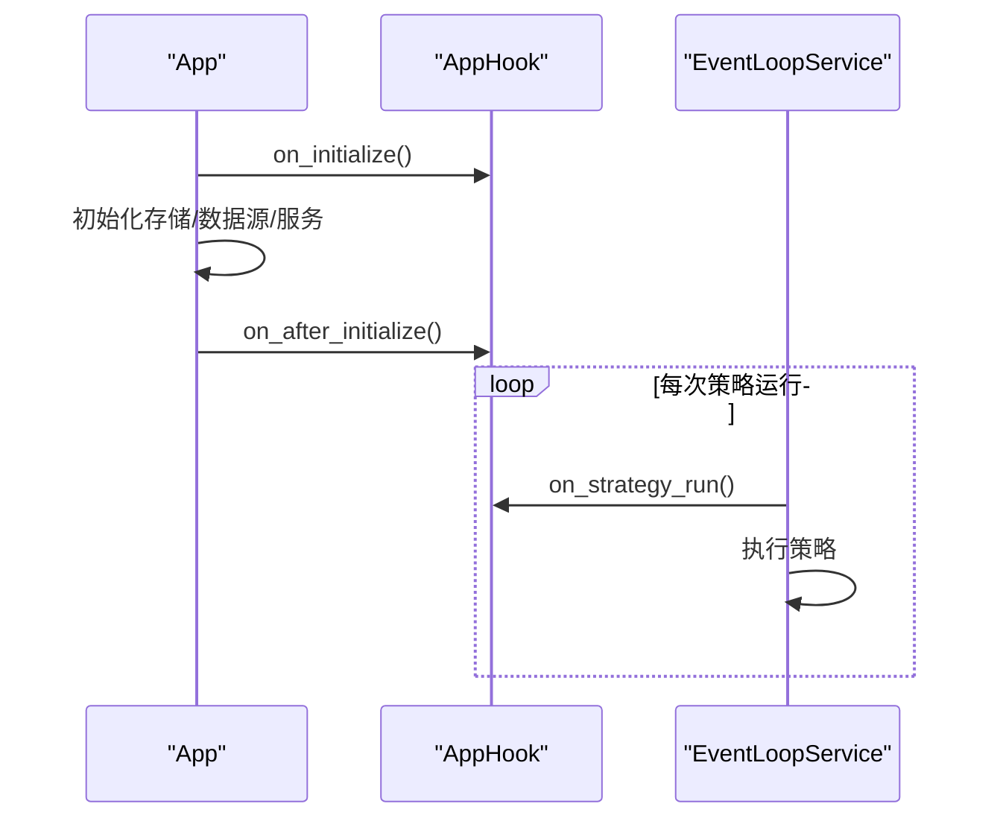
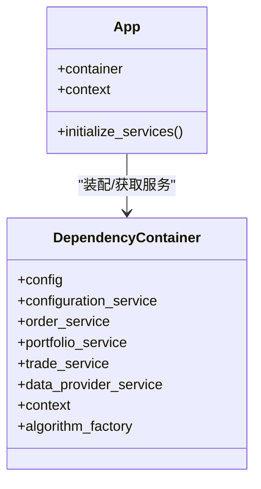
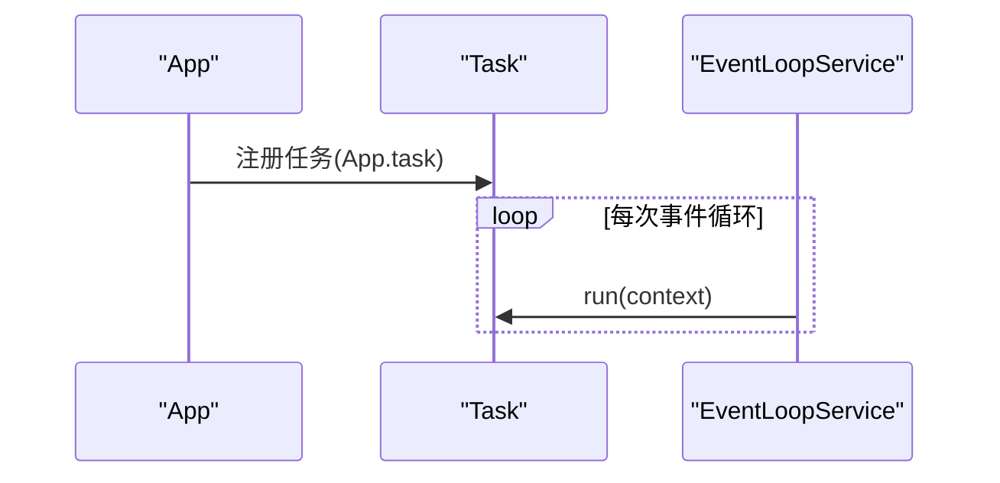
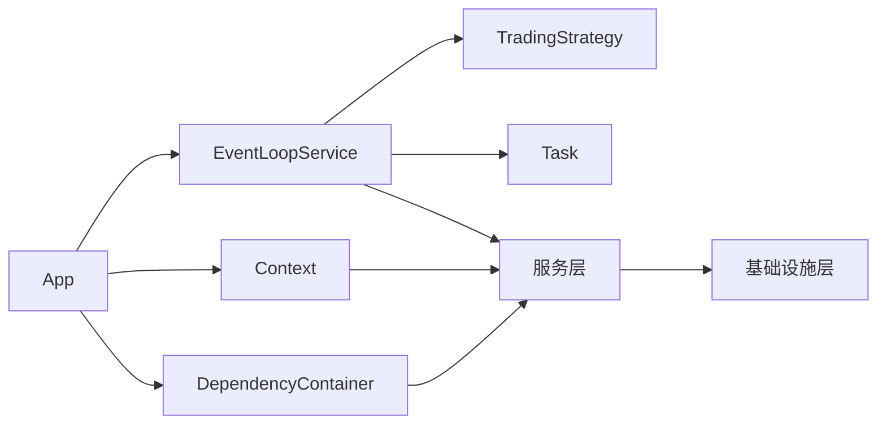

# 核心概念

<cite>
**本文引用的文件**
- [app.py](file://investing_algorithm_framework/app/app.py)
- [context.py](file://investing_algorithm_framework/app/context.py)
- [strategy.py](file://investing_algorithm_framework/app/strategy.py)
- [task.py](file://investing_algorithm_framework/app/task.py)
- [app_hook.py](file://investing_algorithm_framework/app/app_hook.py)
- [eventloop.py](file://investing_algorithm_framework/app/eventloop.py)
- [dependency_container.py](file://investing_algorithm_framework/dependency_container.py)
- [create_app.py](file://investing_algorithm_framework/create_app.py)
- [algorithm.py](file://investing_algorithm_framework/app/algorithm/algorithm.py)
- [algorithm_factory.py](file://investing_algorithm_framework/app/algorithm/algorithm_factory.py)
- [strategy.py](file://examples/example_strategies/macd_wr/strategy.py)
- [strategy.py](file://examples/tutorial/strategies/ema_crossover_rsi_filter/strategy.py)
</cite>

## 目录
1. [引言](#引言)
2. [项目结构](#项目结构)
3. [核心组件](#核心组件)
4. [架构总览](#架构总览)
5. [详细组件分析](#详细组件分析)
6. [依赖关系分析](#依赖关系分析)
7. [性能考量](#性能考量)
8. [故障排查指南](#故障排查指南)
9. [结论](#结论)
10. [附录](#附录)

## 引言
本文件面向希望深入理解该投资算法框架“核心概念与架构模式”的读者，围绕以下主题展开：应用上下文（App Context）的设计理念与生命周期管理；策略（Strategy）类的实现机制与事件驱动执行模型；应用钩子（App Hooks）的扩展点与自定义逻辑注入方式；依赖注入容器的工作原理与组件解耦优势；以及领域模型与基础设施实现的分离原则与可插拔组件设计。文中通过图示与路径引用的方式，帮助不同技术背景的用户快速把握系统全貌与关键实现细节。

## 项目结构
该框架采用分层与模块化组织：
- 应用层：应用入口、上下文、事件循环、策略与任务、应用钩子等
- 领域层：数据模型、常量、异常、时间单位与间隔、数据源抽象等
- 基础设施层：数据提供者、订单执行器、仓库、数据库适配等
- 服务层：配置、订单、交易、组合、快照、回测等服务
- 示例与测试：示例策略、教程策略、CLI与部署模板、测试用例

图表来源
- [app.py](file://investing_algorithm_framework/app/app.py#L1-L200)
- [context.py](file://investing_algorithm_framework/app/context.py#L1-L120)
- [eventloop.py](file://investing_algorithm_framework/app/eventloop.py#L1-L120)
- [strategy.py](file://investing_algorithm_framework/app/strategy.py#L1-L120)
- [task.py](file://investing_algorithm_framework/app/task.py#L1-L42)
- [app_hook.py](file://investing_algorithm_framework/app/app_hook.py#L1-L29)

章节来源
- [app.py](file://investing_algorithm_framework/app/app.py#L1-L200)
- [dependency_container.py](file://investing_algorithm_framework/dependency_container.py#L1-L166)

## 核心组件
- 应用入口与生命周期管理：负责应用初始化、配置、存储、数据源、服务初始化、Web模式、事件循环启动与状态保存/加载等
- 应用上下文（Context）：封装对配置、订单、交易、组合、仓位、数据提供者的统一访问入口，为策略与任务提供一致的运行时环境
- 策略（TradingStrategy）：定义信号生成、下单与风控规则，支持按时间单位与间隔触发
- 任务（Task）：定时任务载体，按时间单位与间隔执行
- 应用钩子（AppHook）：在应用初始化、策略运行等关键节点注入自定义逻辑
- 事件循环（EventLoopService）：统一调度策略与任务，聚合数据源，评估挂单/止盈止损，维护快照与历史
- 依赖注入容器（DependencyContainer）：集中声明与提供各服务与仓库实例，实现组件解耦与可替换

章节来源
- [app.py](file://investing_algorithm_framework/app/app.py#L1-L200)
- [context.py](file://investing_algorithm_framework/app/context.py#L1-L120)
- [strategy.py](file://investing_algorithm_framework/app/strategy.py#L1-L120)
- [task.py](file://investing_algorithm_framework/app/task.py#L1-L42)
- [app_hook.py](file://investing_algorithm_framework/app/app_hook.py#L1-L29)
- [eventloop.py](file://investing_algorithm_framework/app/eventloop.py#L1-L120)
- [dependency_container.py](file://investing_algorithm_framework/dependency_container.py#L1-L166)

## 架构总览
下图展示了从应用入口到事件循环、策略与任务、上下文与服务的整体交互关系。

图表来源
- [create_app.py](file://investing_algorithm_framework/create_app.py#L1-L55)
- [dependency_container.py](file://investing_algorithm_framework/dependency_container.py#L1-L166)
- [app.py](file://investing_algorithm_framework/app/app.py#L565-L700)
- [eventloop.py](file://investing_algorithm_framework/app/eventloop.py#L334-L445)
- [strategy.py](file://investing_algorithm_framework/app/strategy.py#L195-L349)
- [task.py](file://investing_algorithm_framework/app/task.py#L1-L42)

## 详细组件分析

### 应用上下文（App Context）设计理念与生命周期
- 设计理念
  - Context作为统一运行时入口，封装对配置、订单、交易、组合、仓位、数据提供者等的访问，避免策略与任务直接依赖具体实现
  - 提供创建订单、查询仓位、获取最新价格、检查余额等便捷方法，降低策略编写复杂度
- 生命周期管理
  - 容器在应用初始化阶段创建Context实例，并通过App的container.context()暴露给上层使用
  - 在App.run中，先执行初始化钩子，再加载状态（如存在），随后初始化存储、数据源与服务，最后启动事件循环
  - 运行结束时，若配置了状态处理器，则保存当前状态

图表来源
- [app.py](file://investing_algorithm_framework/app/app.py#L1-L200)
- [dependency_container.py](file://investing_algorithm_framework/dependency_container.py#L1-L166)
- [context.py](file://investing_algorithm_framework/app/context.py#L1-L120)

章节来源
- [app.py](file://investing_algorithm_framework/app/app.py#L565-L700)
- [dependency_container.py](file://investing_algorithm_framework/dependency_container.py#L140-L166)
- [context.py](file://investing_algorithm_framework/app/context.py#L1-L120)

### 策略（Strategy）类实现机制与事件驱动执行模型
- 实现机制
  - TradingStrategy定义了generate_buy_signals/generate_sell_signals两个抽象方法，由用户实现信号生成逻辑
  - run_strategy负责根据信号创建限价订单，并注册止盈止损规则；同时支持对开仓/挂单/止盈止损的事件回调扩展点
  - 支持按symbols列表与position_sizes、stop_losses、take_profits等规则进行参数化配置
- 事件驱动执行模型
  - EventLoopService按策略的时间单位与间隔计算下次运行时间，统一收集数据源，评估挂单/止盈止损，然后依次执行任务与策略
  - 策略在每次迭代中接收聚合后的数据字典，键为数据源标识符，值为对应的数据对象
  - 可通过on_strategy_run钩子在策略运行前后注入自定义逻辑

图表来源
- [eventloop.py](file://investing_algorithm_framework/app/eventloop.py#L446-L589)
- [strategy.py](file://investing_algorithm_framework/app/strategy.py#L195-L349)
- [app_hook.py](file://investing_algorithm_framework/app/app_hook.py#L1-L29)

章节来源
- [strategy.py](file://investing_algorithm_framework/app/strategy.py#L195-L349)
- [eventloop.py](file://investing_algorithm_framework/app/eventloop.py#L169-L200)
- [eventloop.py](file://investing_algorithm_framework/app/eventloop.py#L446-L589)

### 应用钩子（App Hooks）扩展点与自定义逻辑注入
- 扩展点
  - on_initialize：应用初始化前执行
  - on_after_initialize：应用初始化后执行
  - on_strategy_run：策略每次运行前执行
- 注入方式
  - App通过内部钩子列表维护这些扩展点，在App.run与EventLoopService运行期间调用
  - 用户可通过继承AppHook并实现on_run方法，将自定义逻辑注入到上述时机

图表来源
- [app.py](file://investing_algorithm_framework/app/app.py#L596-L624)
- [eventloop.py](file://investing_algorithm_framework/app/eventloop.py#L556-L566)
- [app_hook.py](file://investing_algorithm_framework/app/app_hook.py#L1-L29)

章节来源
- [app.py](file://investing_algorithm_framework/app/app.py#L596-L624)
- [eventloop.py](file://investing_algorithm_framework/app/eventloop.py#L556-L566)
- [app_hook.py](file://investing_algorithm_framework/app/app_hook.py#L1-L29)

### 依赖注入容器工作原理与组件解耦
- 工作原理
  - 使用dependency-injector声明式容器，集中定义ConfigurationService、OrderService、PortfolioService、TradeService、DataProviders、Repositories等
  - 通过providers.Factory/ThreadSafeSingleton等提供者类型，确保服务单例与按需构造
  - App通过setup_dependency_container将容器注入到App实例，并在运行时通过container.<service>()获取所需服务
- 组件解耦优势
  - 上层（App/Strategy/Task）仅依赖抽象接口与容器，不直接依赖具体实现
  - 易于替换数据提供者、订单执行器、仓库实现，便于测试与扩展
  - 通过override机制可在回测模式下替换服务实现（例如PortfolioService/OrderService）

图表来源
- [dependency_container.py](file://investing_algorithm_framework/dependency_container.py#L1-L166)
- [app.py](file://investing_algorithm_framework/app/app.py#L534-L565)

章节来源
- [dependency_container.py](file://investing_algorithm_framework/dependency_container.py#L1-L166)
- [app.py](file://investing_algorithm_framework/app/app.py#L534-L565)

### 定时任务装饰器与@strategy.task使用说明
- 定时任务装饰器
  - App.task提供两种用法：装饰器语法与函数包装语法，用于注册Task实例
  - Task包含time_unit、interval、worker_id等属性，run方法在EventLoopService中被调用
- 事件驱动执行模型
  - EventLoopService在每次迭代中遍历所有任务并调用其run方法，传入聚合后的数据对象
  - 任务可基于数据源标识符读取对应数据，实现与策略一致的数据访问体验

图表来源
- [app.py](file://investing_algorithm_framework/app/app.py#L702-L740)
- [task.py](file://investing_algorithm_framework/app/task.py#L1-L42)
- [eventloop.py](file://investing_algorithm_framework/app/eventloop.py#L534-L543)

章节来源
- [app.py](file://investing_algorithm_framework/app/app.py#L702-L740)
- [task.py](file://investing_algorithm_framework/app/task.py#L1-L42)
- [eventloop.py](file://investing_algorithm_framework/app/eventloop.py#L534-L543)

### 领域模型与基础设施实现的分离与可插拔组件
- 分离原则
  - 领域层定义时间单位、数据源类型、常量与异常等抽象
  - 基础设施层提供具体实现（如CCXT数据提供者、SQLAlchemy仓库）
  - 服务层通过接口与容器对接，屏蔽底层差异
- 可插拔组件
  - 数据提供者：通过DataProviders抽象与容器注入，可替换为CSV/Pandas/CCXT等实现
  - 订单执行器：通过OrderExecutorLookup与容器注入，支持回测/实盘切换
  - 仓库实现：通过SQLAlchemy适配，可替换为其他ORM或存储后端

章节来源
- [dependency_container.py](file://investing_algorithm_framework/dependency_container.py#L1-L166)
- [algorithm.py](file://investing_algorithm_framework/app/algorithm/algorithm.py#L1-L120)

### 实际代码示例（路径指引）
- 定义策略与配置任务调度
  - 示例策略：MACD+WR策略与EMA交叉+RSI过滤策略均继承TradingStrategy，设置symbols、time_unit、interval与data_sources
  - 路径参考：
    - [macd_wr策略](file://examples/example_strategies/macd_wr/strategy.py#L1-L120)
    - [EMA+RSI过滤策略](file://examples/tutorial/strategies/ema_crossover_rsi_filter/strategy.py#L1-L120)
- 访问应用服务
  - 在策略中通过Context访问订单、交易、组合、仓位与数据提供者
  - 路径参考：
    - [Context方法集合](file://investing_algorithm_framework/app/context.py#L1-L200)
- 启动应用与事件循环
  - 通过create_app创建App，App.run启动事件循环
  - 路径参考：
    - [create_app工厂](file://investing_algorithm_framework/create_app.py#L1-L55)
    - [App.run流程](file://investing_algorithm_framework/app/app.py#L565-L700)
    - [EventLoopService主循环](file://investing_algorithm_framework/app/eventloop.py#L334-L445)

章节来源
- [strategy.py](file://examples/example_strategies/macd_wr/strategy.py#L1-L120)
- [strategy.py](file://examples/tutorial/strategies/ema_crossover_rsi_filter/strategy.py#L1-L120)
- [context.py](file://investing_algorithm_framework/app/context.py#L1-L200)
- [create_app.py](file://investing_algorithm_framework/create_app.py#L1-L55)
- [app.py](file://investing_algorithm_framework/app/app.py#L565-L700)
- [eventloop.py](file://investing_algorithm_framework/app/eventloop.py#L334-L445)

## 依赖关系分析
- 组件耦合与内聚
  - App与EventLoopService强耦合（App.run中创建并启动），但通过容器与Context解耦服务依赖
  - Strategy与Task通过EventLoopService解耦，仅依赖Context与数据字典
  - 依赖注入容器承担了跨模块的服务装配职责，提升内聚性与可测试性
- 外部依赖与集成点
  - 数据提供者（CCXT/Pandas/CSV）、订单执行器（CCXT/回测）、数据库（SQLAlchemy）通过容器注入
  - Web模式通过Flask集成，AppMode控制运行模式

图表来源
- [app.py](file://investing_algorithm_framework/app/app.py#L565-L700)
- [eventloop.py](file://investing_algorithm_framework/app/eventloop.py#L1-L120)
- [dependency_container.py](file://investing_algorithm_framework/dependency_container.py#L1-L166)

章节来源
- [app.py](file://investing_algorithm_framework/app/app.py#L565-L700)
- [eventloop.py](file://investing_algorithm_framework/app/eventloop.py#L1-L120)
- [dependency_container.py](file://investing_algorithm_framework/dependency_container.py#L1-L166)

## 性能考量
- 数据拉取与缓存
  - EventLoopService在一次迭代中聚合策略所需数据源，避免重复请求，提高性能
- 快照批量写入
  - 事件循环结束后统一保存快照，减少数据库事务次数
- 回测调度
  - 回测服务按策略时间单位与间隔生成调度表，事件循环按时间推进执行，避免无效轮询

章节来源
- [eventloop.py](file://investing_algorithm_framework/app/eventloop.py#L446-L589)
- [eventloop.py](file://investing_algorithm_framework/app/eventloop.py#L200-L258)

## 故障排查指南
- 常见问题
  - 未添加策略：EventLoopService初始化时若无策略会抛出异常
  - 未设置时间单位或间隔：策略构造时若缺失会抛出异常
  - 未配置资金账户：App.initialize_services会校验账户配置
- 排查步骤
  - 检查App.run日志，确认初始化钩子与状态加载是否成功
  - 确认容器中服务实例已正确创建（如OrderService、PortfolioService、DataProviders）
  - 在策略run_strategy中捕获OperationalException，定位信号生成与下单逻辑问题

章节来源
- [eventloop.py](file://investing_algorithm_framework/app/eventloop.py#L283-L320)
- [strategy.py](file://investing_algorithm_framework/app/strategy.py#L66-L115)
- [app.py](file://investing_algorithm_framework/app/app.py#L534-L565)

## 结论
该框架以“应用上下文+事件循环+策略/任务+依赖注入容器”为核心，实现了清晰的领域与基础设施分离、可插拔组件与事件驱动的执行模型。通过AppHook扩展点与容器化装配，既保证了灵活性与可测试性，又降低了策略与任务的开发复杂度。建议在实际项目中：
- 将策略与任务聚焦于业务逻辑，通过Context与容器访问服务
- 利用AppHook在关键节点注入监控、日志与状态管理
- 通过容器替换基础设施实现，满足不同运行环境需求

## 附录
- 关键实现路径索引
  - 应用入口与生命周期：[app.py](file://investing_algorithm_framework/app/app.py#L565-L700)
  - 依赖注入容器：[dependency_container.py](file://investing_algorithm_framework/dependency_container.py#L1-L166)
  - 应用上下文：[context.py](file://investing_algorithm_framework/app/context.py#L1-L200)
  - 策略基类与执行：[strategy.py](file://investing_algorithm_framework/app/strategy.py#L195-L349)
  - 任务基类与注册：[task.py](file://investing_algorithm_framework/app/task.py#L1-L42)
  - 事件循环：[eventloop.py](file://investing_algorithm_framework/app/eventloop.py#L334-L445)
  - 应用钩子：[app_hook.py](file://investing_algorithm_framework/app/app_hook.py#L1-L29)
  - 算法与工厂：[algorithm.py](file://investing_algorithm_framework/app/algorithm/algorithm.py#L1-L200), [algorithm_factory.py](file://investing_algorithm_framework/app/algorithm/algorithm_factory.py#L1-L115)
  - 示例策略：[macd_wr策略](file://examples/example_strategies/macd_wr/strategy.py#L1-L120), [EMA+RSI过滤策略](file://examples/tutorial/strategies/ema_crossover_rsi_filter/strategy.py#L1-L120)