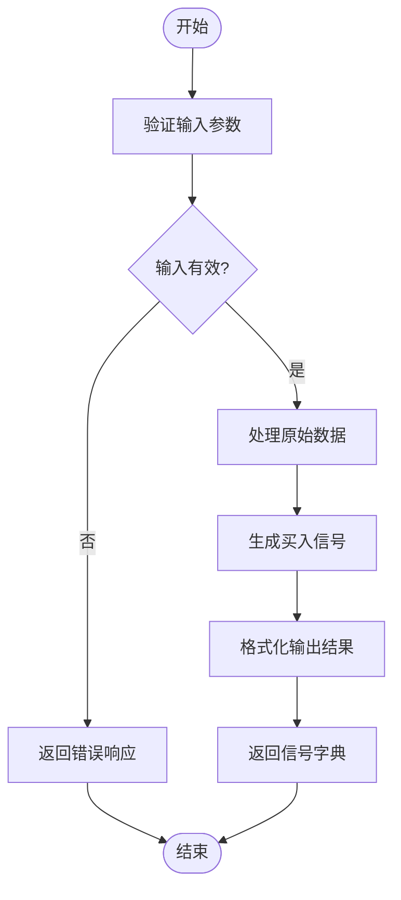
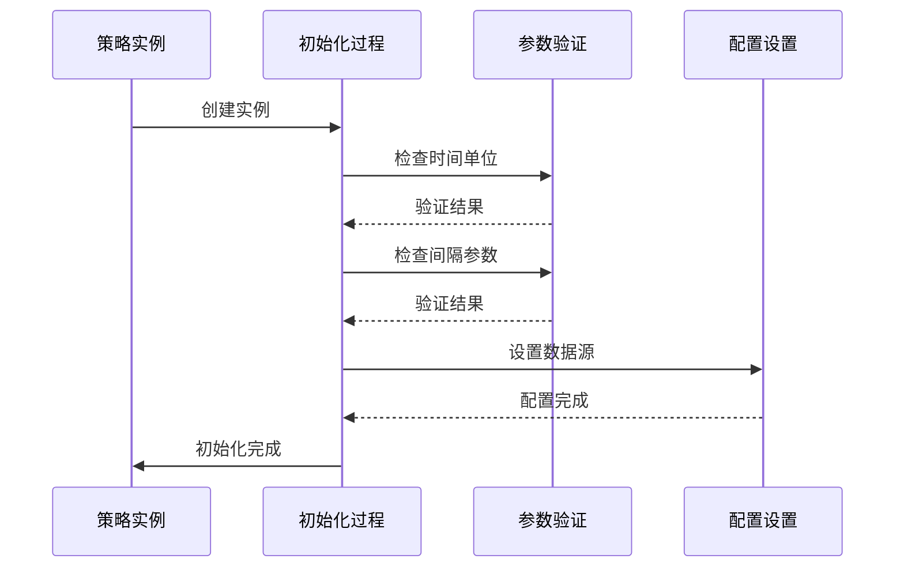
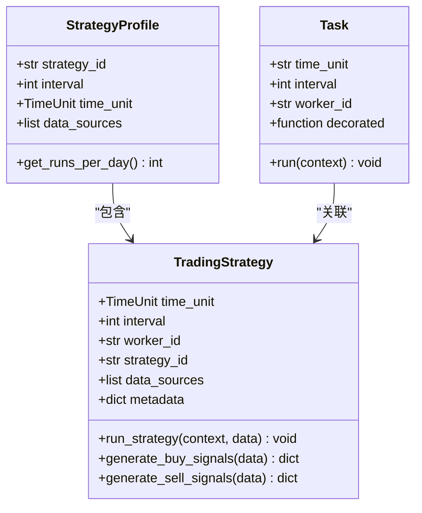
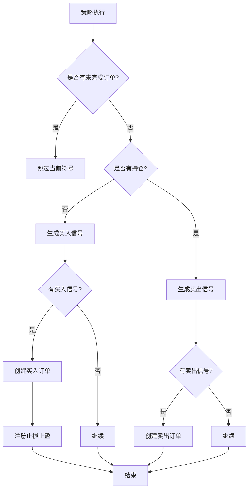
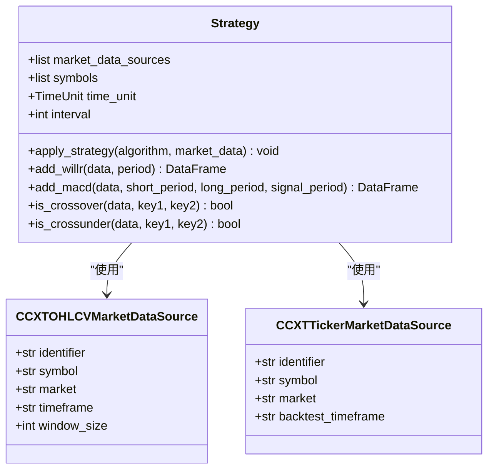
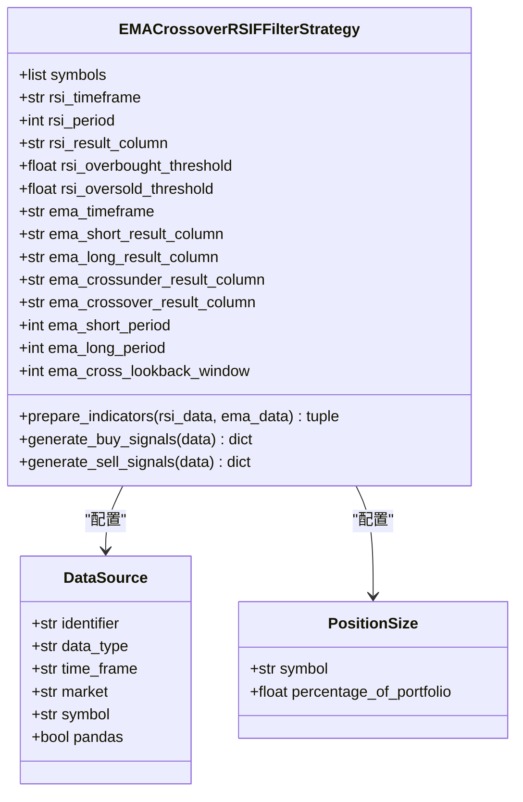

# 策略开发

<cite>
**本文档中引用的文件**   
- [strategy.py](file://investing_algorithm_framework/app/strategy.py)
- [context.py](file://investing_algorithm_framework/app/context.py)
- [task.py](file://investing_algorithm_framework/app/task.py)
- [eventloop.py](file://investing_algorithm_framework/app/eventloop.py)
- [app.py](file://investing_algorithm_framework/app/app.py)
- [strategy_profile.py](file://investing_algorithm_framework/domain/models/strategy_profile.py)
- [macd_wr/strategy.py](file://examples/example_strategies/macd_wr/strategy.py)
- [ema_crossover_rsi_filter/strategy.py](file://examples/tutorial/strategies/ema_crossover_rsi_filter/strategy.py)
</cite>

## 目录
1. [引言](#引言)
2. [策略基类设计](#策略基类设计)
3. [策略生命周期管理](#策略生命周期管理)
4. [定时任务调度机制](#定时任务调度机制)
5. [应用上下文交互](#应用上下文交互)
6. [策略实现示例](#策略实现示例)
7. [策略间通信与依赖](#策略间通信与依赖)
8. [结论](#结论)

## 引言
本策略开发文档全面阐述了投资算法框架中策略类的设计与实现原理。文档深入解析了策略基类的接口定义、抽象方法、装饰器机制、定时任务调度原理以及策略与应用上下文的交互模式。通过详细说明策略的生命周期管理、数据共享模式和依赖关系处理，为开发者提供完整的策略开发指导。文档还通过具体代码示例展示了不同类型的策略实现，帮助开发者快速掌握框架的使用方法。

## 策略基类设计

策略基类`TradingStrategy`是所有交易策略的抽象基类，定义了策略的核心接口和行为规范。该基类通过一系列属性和方法为策略提供了标准化的框架，确保所有策略遵循统一的设计模式。

### 核心属性
策略基类定义了多个关键属性，用于配置策略的运行参数：
- **time_unit**: 时间单位，定义策略的运行周期，如小时、天、周、月
- **interval**: 间隔，定义策略在时间单位内的执行频率
- **worker_id**: 工作线程ID，用于标识策略实例
- **strategy_id**: 策略ID，用于唯一标识策略
- **data_sources**: 数据源列表，定义策略所需的数据来源
- **metadata**: 元数据，用于存储策略的附加信息

### 抽象方法
策略基类定义了两个必须实现的抽象方法：

#### generate_buy_signals 方法
该方法用于生成买入信号，需要返回一个包含买入信号的pandas Series。方法接收一个包含所有匹配数据源的数据字典，返回一个以交易符号为键、pandas Series为值的字典。Series中的每个值表示对应时间点的买入信号（True表示买入，False表示不买入）。

**Diagram sources**
- [strategy.py](file://investing_algorithm_framework/app/strategy.py#L129-L157)

#### generate_sell_signals 方法
该方法用于生成卖出信号，其接口与`generate_buy_signals`方法类似。它接收相同的数据字典，返回一个包含卖出信号的字典。策略开发者需要根据市场分析和交易逻辑实现具体的信号生成算法。

### 策略配置
策略的配置通过`__init__`方法完成，支持多种配置方式。开发者可以在实例化时直接传入参数，也可以通过类属性进行配置。这种灵活性使得策略可以适应不同的应用场景和需求。

**Section sources**
- [strategy.py](file://investing_algorithm_framework/app/strategy.py#L51-L102)

## 策略生命周期管理

策略的生命周期管理涵盖了从初始化到执行再到销毁的完整过程。框架通过一系列机制确保策略能够正确地初始化、执行和清理资源。

### 初始化过程
策略的初始化过程在`__init__`方法中完成。该方法首先验证时间单位和间隔参数，确保它们被正确设置。如果这些参数未在类属性中定义，将抛出`OperationalException`异常。初始化过程还包括设置数据源、元数据、位置大小等配置参数。

**Diagram sources**
- [strategy.py](file://investing_algorithm_framework/app/strategy.py#L51-L114)

### 执行流程
策略的执行流程由`run_strategy`方法控制。该方法遵循特定的执行顺序：首先检查是否有未完成的订单，如果有则跳过当前符号；然后检查是否有持仓，如果没有则生成买入信号，如果有则生成卖出信号。执行过程中，框架会自动处理止损和止盈规则的注册。

### 销毁过程
策略的销毁过程在事件循环的清理阶段完成。当策略不再需要时，框架会调用相应的清理方法，释放占用的资源。这包括关闭数据库连接、清理内存中的数据结构等操作。

**Section sources**
- [strategy.py](file://investing_algorithm_framework/app/strategy.py#L195-L343)
- [eventloop.py](file://investing_algorithm_framework/app/eventloop.py#L444-L445)

## 定时任务调度机制

框架的定时任务调度机制基于时间单位和间隔参数实现，确保策略能够按照预定的时间表执行。

### 调度器实现
调度器的实现位于`backtest_service.py`文件中，通过`generate_schedule`方法创建时间表。该方法根据策略的时间单位和间隔生成一个基于时间的字典，其中键为时间戳，值为包含策略ID和任务ID的字典。

**Diagram sources**
- [strategy_profile.py](file://investing_algorithm_framework/domain/models/strategy_profile.py#L6-L34)
- [task.py](file://investing_algorithm_framework/app/task.py#L5-L41)
- [strategy.py](file://investing_algorithm_framework/app/strategy.py#L13-L800)

### 执行保证
框架通过事件循环确保策略的执行。在每个迭代周期，事件循环会检查当前时间，并执行所有到期的策略。对于回测场景，框架会按照预定义的时间序列执行策略；对于实时交易场景，框架会每秒检查一次是否有到期的策略需要执行。

**Section sources**
- [backtest_service.py](file://investing_algorithm_framework/services/backtesting/backtest_service.py#L453-L494)
- [eventloop.py](file://investing_algorithm_framework/app/eventloop.py#L379-L426)

## 应用上下文交互

策略与应用上下文的交互是策略执行的核心部分。通过上下文对象，策略可以访问市场数据、投资组合和订单服务。

### 市场数据访问
策略通过数据源配置访问市场数据。框架在执行策略前会自动收集所有配置的数据源，并将数据作为参数传递给策略的执行方法。数据以字典形式提供，键为数据源标识符，值为对应的数据集。

### 投资组合管理
策略可以通过上下文对象访问投资组合信息。`get_portfolio`方法返回当前投资组合的详细信息，包括总资产、已分配资产和未分配资产。策略可以使用这些信息来做出交易决策。

### 订单服务
策略通过上下文对象与订单服务交互。`create_limit_order`方法允许策略创建限价订单，`close_position`方法用于关闭持仓。这些方法提供了丰富的参数选项，如交易量、价格、精度等，满足不同交易需求。

**Diagram sources**
- [context.py](file://investing_algorithm_framework/app/context.py#L71-L344)
- [strategy.py](file://investing_algorithm_framework/app/strategy.py#L250-L343)

**Section sources**
- [context.py](file://investing_algorithm_framework/app/context.py#L18-L800)
- [strategy.py](file://investing_algorithm_framework/app/strategy.py#L490-L793)

## 策略实现示例

本节通过具体代码示例展示不同类型的策略实现，帮助开发者理解如何在实际项目中应用框架。

### MACD与威廉指标策略
该策略结合MACD和威廉指标进行交易决策。策略首先计算MACD指标，包括MACD线、信号线和柱状图；然后计算威廉指标。基于这些指标的交叉和超买超卖状态生成交易信号。

**Diagram sources**
- [macd_wr/strategy.py](file://examples/example_strategies/macd_wr/strategy.py#L1-L225)

### 均线交叉RSI过滤策略
该策略使用短期和长期指数移动平均线（EMA）的交叉作为主要交易信号，同时使用相对强弱指数（RSI）作为过滤条件。当短期EMA上穿长期EMA且RSI低于超卖阈值时生成买入信号；当短期EMA下穿长期EMA且RSI高于超买阈值时生成卖出信号。

**Diagram sources**
- [ema_crossover_rsi_filter/strategy.py](file://examples/tutorial/strategies/ema_crossover_rsi_filter/strategy.py#L1-L191)

**Section sources**
- [macd_wr/strategy.py](file://examples/example_strategies/macd_wr/strategy.py#L1-L225)
- [ema_crossover_rsi_filter/strategy.py](file://examples/tutorial/strategies/ema_crossover_rsi_filter/strategy.py#L1-L191)

## 策略间通信与依赖

框架提供了策略间通信和依赖管理的机制，支持复杂的多策略协同工作场景。

### 通信机制
策略间通信主要通过共享数据和事件驱动实现。框架在每次迭代中收集所有策略的数据需求，并将整合后的数据集提供给所有策略。这使得策略可以基于相同的数据集进行决策，确保一致性。

### 数据共享模式
数据共享通过上下文对象实现。所有策略共享同一个上下文实例，可以访问相同的投资组合、订单和市场数据。这种设计简化了数据管理，避免了数据冗余和不一致。

### 依赖关系处理
策略依赖关系通过执行顺序控制。框架按照策略的配置顺序执行策略，确保依赖策略先于被依赖策略执行。此外，策略可以通过自定义逻辑检查其他策略的状态，实现更复杂的依赖管理。

**Section sources**
- [app.py](file://investing_algorithm_framework/app/app.py#L1711-L1747)
- [eventloop.py](file://investing_algorithm_framework/app/eventloop.py#L446-L569)

## 结论
本策略开发文档全面阐述了投资算法框架中策略类的设计与实现。通过深入分析策略基类、生命周期管理、定时任务调度、应用上下文交互、实现示例以及策略间通信机制，为开发者提供了完整的开发指导。框架的设计注重灵活性和可扩展性，支持多种策略模式和复杂的交易逻辑。开发者可以根据具体需求，基于提供的示例和API文档快速构建和部署交易策略。