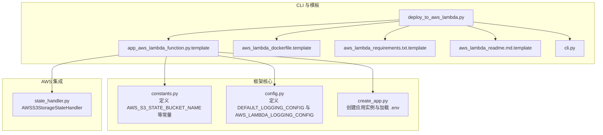
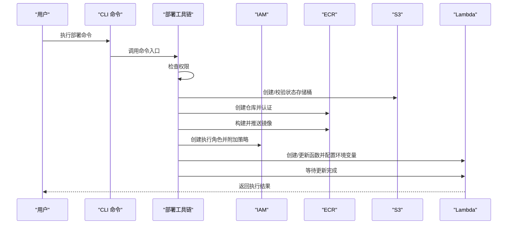
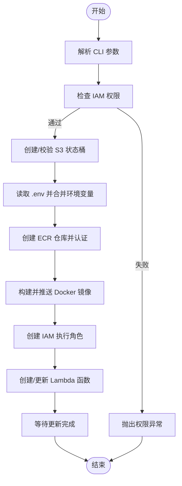
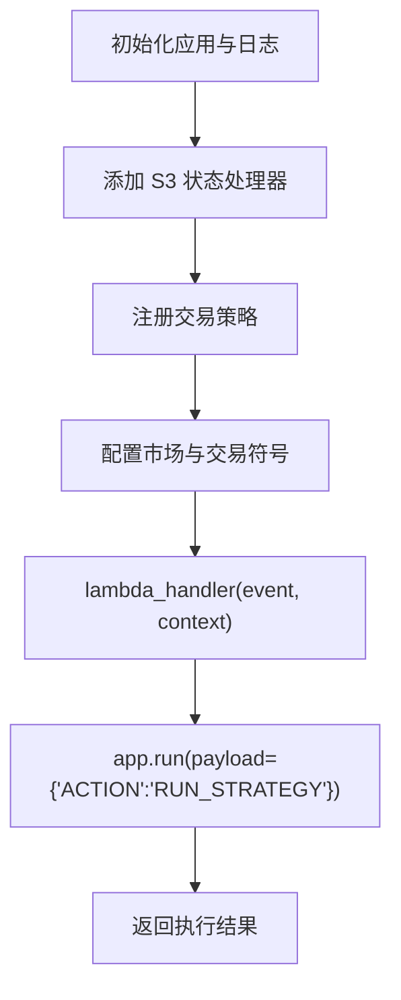
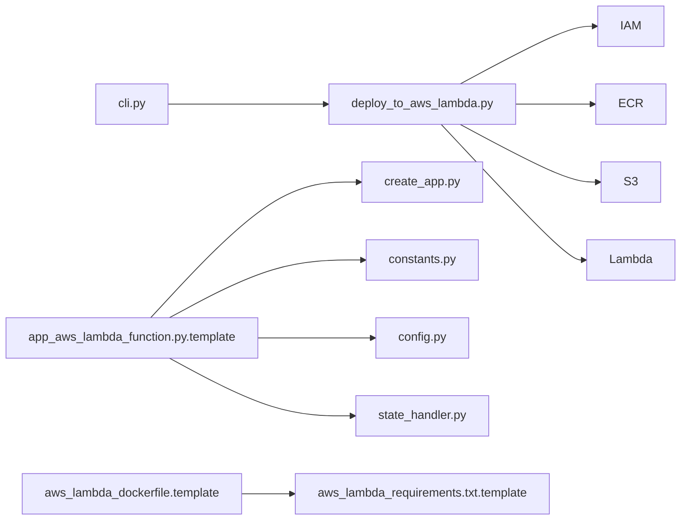

# AWS Lambda 部署

<cite>
**本文引用的文件**
- [deploy_to_aws_lambda.py](file://investing_algorithm_framework/cli/deploy_to_aws_lambda.py)
- [app_aws_lambda_function.py.template](file://investing_algorithm_framework/cli/templates/app_aws_lambda_function.py.template)
- [aws_lambda_dockerfile.template](file://investing_algorithm_framework/cli/templates/aws_lambda_dockerfile.template)
- [aws_lambda_requirements.txt.template](file://investing_algorithm_framework/cli/templates/aws_lambda_requirements.txt.template)
- [aws_lambda_readme.md.template](file://investing_algorithm_framework/cli/templates/aws_lambda_readme.md.template)
- [cli.py](file://investing_algorithm_framework/cli/cli.py)
- [constants.py](file://investing_algorithm_framework/domain/constants.py)
- [config.py](file://investing_algorithm_framework/domain/config.py)
- [create_app.py](file://investing_algorithm_framework/create_app.py)
- [state_handler.py](file://investing_algorithm_framework/infrastructure/services/aws/state_handler.py)
</cite>

## 目录
1. [简介](#简介)
2. [项目结构](#项目结构)
3. [核心组件](#核心组件)
4. [架构总览](#架构总览)
5. [详细组件分析](#详细组件分析)
6. [依赖关系分析](#依赖关系分析)
7. [性能考虑](#性能考虑)
8. [故障排除指南](#故障排除指南)
9. [结论](#结论)
10. [附录](#附录)

## 简介
本文件面向希望将交易策略部署到 AWS Lambda 的用户，系统性解析以下内容：
- deploy_to_aws_lambda.py 的实现机制与执行流程
- app_aws_lambda_function.py.template 模板的结构与关键组件
- Docker 镜像构建、依赖管理与容器化部署要求
- 环境变量配置、IAM 权限设置与密钥管理最佳实践
- 性能优化建议（内存分配、超时设置、冷启动缓解）
- 常见错误排查（运行时错误、超时、权限问题）与监控日志集成

## 项目结构
围绕 AWS Lambda 部署的相关文件主要位于 CLI 模块与模板目录中，同时涉及领域常量、日志配置以及 AWS S3 状态处理器。

图表来源
- [deploy_to_aws_lambda.py](file://investing_algorithm_framework/cli/deploy_to_aws_lambda.py#L1-L502)
- [app_aws_lambda_function.py.template](file://investing_algorithm_framework/cli/templates/app_aws_lambda_function.py.template#L1-L49)
- [aws_lambda_dockerfile.template](file://investing_algorithm_framework/cli/templates/aws_lambda_dockerfile.template#L1-L23)
- [aws_lambda_requirements.txt.template](file://investing_algorithm_framework/cli/templates/aws_lambda_requirements.txt.template#L1-L2)
- [aws_lambda_readme.md.template](file://investing_algorithm_framework/cli/templates/aws_lambda_readme.md.template#L1-L111)
- [cli.py](file://investing_algorithm_framework/cli/cli.py#L151-L226)
- [constants.py](file://investing_algorithm_framework/domain/constants.py#L1-L53)
- [config.py](file://investing_algorithm_framework/domain/config.py#L54-L112)
- [create_app.py](file://investing_algorithm_framework/create_app.py#L1-L55)
- [state_handler.py](file://investing_algorithm_framework/infrastructure/services/aws/state_handler.py#L46-L193)

章节来源
- [deploy_to_aws_lambda.py](file://investing_algorithm_framework/cli/deploy_to_aws_lambda.py#L1-L502)
- [app_aws_lambda_function.py.template](file://investing_algorithm_framework/cli/templates/app_aws_lambda_function.py.template#L1-L49)
- [aws_lambda_dockerfile.template](file://investing_algorithm_framework/cli/templates/aws_lambda_dockerfile.template#L1-L23)
- [aws_lambda_requirements.txt.template](file://investing_algorithm_framework/cli/templates/aws_lambda_requirements.txt.template#L1-L2)
- [aws_lambda_readme.md.template](file://investing_algorithm_framework/cli/templates/aws_lambda_readme.md.template#L1-L111)
- [cli.py](file://investing_algorithm_framework/cli/cli.py#L151-L226)
- [constants.py](file://investing_algorithm_framework/domain/constants.py#L1-L53)
- [config.py](file://investing_algorithm_framework/domain/config.py#L54-L112)
- [create_app.py](file://investing_algorithm_framework/create_app.py#L1-L55)
- [state_handler.py](file://investing_algorithm_framework/infrastructure/services/aws/state_handler.py#L46-L193)

## 核心组件
- CLI 命令入口：通过命令行参数接收函数名、区域、项目目录、内存大小与环境变量，调用部署工具链完成端到端部署。
- 部署工具链：负责检查权限、创建/校验 S3 存储桶、构建并推送 Docker 镜像至 ECR、创建 IAM 角色、部署 Lambda 函数并等待更新完成。
- Lambda 入口模板：定义 AWS Lambda 处理器函数，初始化应用、注入状态处理器与策略，并在事件触发时执行策略。
- Dockerfile 与 requirements：定义运行时基础镜像、安装编译工具、pip 安装依赖、复制代码并指定 CMD。
- 日志配置：为 Lambda 运行时提供专用日志格式，确保控制台输出可被 CloudWatch 收集。
- AWS S3 状态处理器：在 Lambda 中读取/写入数据库文件与资源，使用 S3 作为持久化存储。

章节来源
- [cli.py](file://investing_algorithm_framework/cli/cli.py#L151-L226)
- [deploy_to_aws_lambda.py](file://investing_algorithm_framework/cli/deploy_to_aws_lambda.py#L433-L502)
- [app_aws_lambda_function.py.template](file://investing_algorithm_framework/cli/templates/app_aws_lambda_function.py.template#L1-L49)
- [aws_lambda_dockerfile.template](file://investing_algorithm_framework/cli/templates/aws_lambda_dockerfile.template#L1-L23)
- [aws_lambda_requirements.txt.template](file://investing_algorithm_framework/cli/templates/aws_lambda_requirements.txt.template#L1-L2)
- [config.py](file://investing_algorithm_framework/domain/config.py#L86-L112)
- [state_handler.py](file://investing_algorithm_framework/infrastructure/services/aws/state_handler.py#L46-L193)

## 架构总览
下图展示从 CLI 到 AWS 各服务的端到端部署流程。

图表来源
- [cli.py](file://investing_algorithm_framework/cli/cli.py#L151-L226)
- [deploy_to_aws_lambda.py](file://investing_algorithm_framework/cli/deploy_to_aws_lambda.py#L335-L502)

章节来源
- [cli.py](file://investing_algorithm_framework/cli/cli.py#L151-L226)
- [deploy_to_aws_lambda.py](file://investing_algorithm_framework/cli/deploy_to_aws_lambda.py#L335-L502)

## 详细组件分析

### 组件一：CLI 命令与部署流程
- 命令入口：解析参数（函数名、区域、项目目录、内存大小、环境变量），调用命令入口函数。
- 命令入口函数：
  - 检查当前 IAM 用户/角色是否具备必要权限（模拟策略评估）。
  - 生成状态存储桶名称并创建/校验 S3 桶。
  - 读取本地 .env 文件并合并传入的环境变量，注入状态桶名常量。
  - 创建 ECR 仓库并构建/推送 Docker 镜像。
  - 创建 IAM 角色并附加基础执行与 S3 访问策略。
  - 部署 Lambda 函数（容器包类型），设置超时、内存与环境变量，等待更新完成。

图表来源
- [cli.py](file://investing_algorithm_framework/cli/cli.py#L151-L226)
- [deploy_to_aws_lambda.py](file://investing_algorithm_framework/cli/deploy_to_aws_lambda.py#L335-L502)

章节来源
- [cli.py](file://investing_algorithm_framework/cli/cli.py#L151-L226)
- [deploy_to_aws_lambda.py](file://investing_algorithm_framework/cli/deploy_to_aws_lambda.py#L335-L502)

### 组件二：Lambda 入口模板结构与关键组件
- 初始化应用：设置资源目录为可写路径（/tmp），加载 .env，应用日志配置。
- 注入状态处理器：从环境变量读取 S3 桶名，构造 AWSS3StorageStateHandler 并注册到应用。
- 注册策略与市场：添加自定义交易策略与目标市场配置。
- Lambda 处理器：捕获异常并返回标准响应；内部通过应用运行策略。

图表来源
- [app_aws_lambda_function.py.template](file://investing_algorithm_framework/cli/templates/app_aws_lambda_function.py.template#L1-L49)
- [create_app.py](file://investing_algorithm_framework/create_app.py#L1-L55)
- [constants.py](file://investing_algorithm_framework/domain/constants.py#L52-L53)
- [config.py](file://investing_algorithm_framework/domain/config.py#L86-L112)
- [state_handler.py](file://investing_algorithm_framework/infrastructure/services/aws/state_handler.py#L46-L193)

章节来源
- [app_aws_lambda_function.py.template](file://investing_algorithm_framework/cli/templates/app_aws_lambda_function.py.template#L1-L49)
- [create_app.py](file://investing_algorithm_framework/create_app.py#L1-L55)
- [constants.py](file://investing_algorithm_framework/domain/constants.py#L52-L53)
- [config.py](file://investing_algorithm_framework/domain/config.py#L86-L112)
- [state_handler.py](file://investing_algorithm_framework/infrastructure/services/aws/state_handler.py#L46-L193)

### 组件三：Docker 镜像构建与依赖管理
- 基础镜像：使用官方 AWS Lambda Python 运行时镜像。
- 编译工具：安装 gcc/g++/make/cmake 等以支持编译原生扩展。
- 工作目录：设置为 /var/task。
- 依赖安装：先升级 pip，再以只读方式安装 requirements.txt。
- 代码复制：将项目代码复制到镜像中。
- 入口点：CMD 指向模板中的处理器函数路径。

章节来源
- [aws_lambda_dockerfile.template](file://investing_algorithm_framework/cli/templates/aws_lambda_dockerfile.template#L1-L23)
- [aws_lambda_requirements.txt.template](file://investing_algorithm_framework/cli/templates/aws_lambda_requirements.txt.template#L1-L2)

### 组件四：环境变量配置与密钥管理
- 环境变量来源：
  - 本地 .env 文件（由部署工具读取并注入 Lambda 环境变量）。
  - CLI 传入的额外环境变量（多组键值对）。
- 关键常量：
  - AWS_S3_STATE_BUCKET_NAME：用于标识 S3 状态存储桶名。
- 密钥管理建议：
  - 使用 AWS Secrets Manager 或 Parameter Store 管理敏感信息，避免硬编码在 .env。
  - 在 IAM 角色策略中最小授权访问对应资源。

章节来源
- [deploy_to_aws_lambda.py](file://investing_algorithm_framework/cli/deploy_to_aws_lambda.py#L473-L483)
- [constants.py](file://investing_algorithm_framework/domain/constants.py#L52-L53)
- [aws_lambda_readme.md.template](file://investing_algorithm_framework/cli/templates/aws_lambda_readme.md.template#L30-L55)

### 组件五：IAM 权限与角色策略
- 角色信任策略：允许 lambda.amazonaws.com 假设角色。
- 策略附加：
  - AWSLambdaBasicExecutionRole：允许写入 CloudWatch 日志。
  - AmazonS3FullAccess：允许对 S3 进行完整访问（生产环境建议最小化）。
- 权限检查：通过策略模拟评估当前身份所需操作是否允许。

章节来源
- [deploy_to_aws_lambda.py](file://investing_algorithm_framework/cli/deploy_to_aws_lambda.py#L78-L124)
- [deploy_to_aws_lambda.py](file://investing_algorithm_framework/cli/deploy_to_aws_lambda.py#L335-L399)

### 组件六：AWS S3 状态处理器
- 初始化：从构造参数或环境变量读取桶名，初始化 S3 客户端。
- 保存：遍历本地状态目录，上传文件到 S3，设置 ACL 为私有。
- 加载：从 S3 下载文件，修正权限，确保数据库文件可写。
- 异常处理：对凭证缺失/不完整进行统一异常包装。

章节来源
- [state_handler.py](file://investing_algorithm_framework/infrastructure/services/aws/state_handler.py#L46-L193)

## 依赖关系分析
- CLI 命令依赖部署工具链模块，后者依赖 AWS SDK（boto3）、Click、subprocess 等。
- Lambda 入口模板依赖框架创建应用、日志配置、状态处理器与策略。
- Dockerfile 依赖 requirements.txt 中的框架与指标库版本。
- 常量与日志配置贯穿于模板与部署工具链。

图表来源
- [cli.py](file://investing_algorithm_framework/cli/cli.py#L151-L226)
- [deploy_to_aws_lambda.py](file://investing_algorithm_framework/cli/deploy_to_aws_lambda.py#L1-L502)
- [app_aws_lambda_function.py.template](file://investing_algorithm_framework/cli/templates/app_aws_lambda_function.py.template#L1-L49)
- [create_app.py](file://investing_algorithm_framework/create_app.py#L1-L55)
- [constants.py](file://investing_algorithm_framework/domain/constants.py#L52-L53)
- [config.py](file://investing_algorithm_framework/domain/config.py#L86-L112)
- [state_handler.py](file://investing_algorithm_framework/infrastructure/services/aws/state_handler.py#L46-L193)
- [aws_lambda_dockerfile.template](file://investing_algorithm_framework/cli/templates/aws_lambda_dockerfile.template#L1-L23)
- [aws_lambda_requirements.txt.template](file://investing_algorithm_framework/cli/templates/aws_lambda_requirements.txt.template#L1-L2)

章节来源
- [cli.py](file://investing_algorithm_framework/cli/cli.py#L151-L226)
- [deploy_to_aws_lambda.py](file://investing_algorithm_framework/cli/deploy_to_aws_lambda.py#L1-L502)
- [app_aws_lambda_function.py.template](file://investing_algorithm_framework/cli/templates/app_aws_lambda_function.py.template#L1-L49)
- [create_app.py](file://investing_algorithm_framework/create_app.py#L1-L55)
- [constants.py](file://investing_algorithm_framework/domain/constants.py#L52-L53)
- [config.py](file://investing_algorithm_framework/domain/config.py#L86-L112)
- [state_handler.py](file://investing_algorithm_framework/infrastructure/services/aws/state_handler.py#L46-L193)
- [aws_lambda_dockerfile.template](file://investing_algorithm_framework/cli/templates/aws_lambda_dockerfile.template#L1-L23)
- [aws_lambda_requirements.txt.template](file://investing_algorithm_framework/cli/templates/aws_lambda_requirements.txt.template#L1-L2)

## 性能考虑
- 内存分配：根据策略计算复杂度与数据规模调整 Lambda 内存（默认 3000MB）。更大内存通常带来更高 CPU 与网络带宽。
- 超时设置：部署工具默认超时较高（容器包类型），但策略执行应尽量在超时内完成；若需长时间任务，考虑拆分为多个触发或后台作业。
- 冷启动缓解：
  - 将大型依赖预装进镜像，减少运行时导入开销。
  - 使用 Provisioned Concurrency（按需启用）降低首次调用延迟。
  - 保持镜像精简，避免不必要的第三方库。
- I/O 与状态：
  - 使用 S3 作为状态存储，注意网络往返时间；可将频繁读写的临时数据放在 /tmp。
  - 对数据库文件权限进行修正，确保可写。

章节来源
- [deploy_to_aws_lambda.py](file://investing_algorithm_framework/cli/deploy_to_aws_lambda.py#L126-L193)
- [state_handler.py](file://investing_algorithm_framework/infrastructure/services/aws/state_handler.py#L113-L193)

## 故障排除指南
- 权限不足：
  - 现象：IAM 权限检查失败，提示缺少特定操作。
  - 排查：确认当前身份具备 Lambda、ECR、S3 等相关权限；必要时提升策略范围或使用更细粒度的角色。
- ECR 仓库不存在：
  - 现象：构建/推送阶段报仓库不存在。
  - 排查：先创建仓库或确认区域正确；检查仓库命名规范。
- S3 桶冲突或权限问题：
  - 现象：创建/访问 S3 桶失败或权限不足。
  - 排查：确认桶名符合 AWS 规范；检查角色策略是否包含 S3 访问权限。
- Lambda 更新超时：
  - 现象：等待函数更新完成超时。
  - 排查：检查镜像构建是否成功、网络连通性；适当延长等待时间或分步重试。
- 运行时异常：
  - 现象：策略执行抛出异常。
  - 排查：查看 CloudWatch 日志；确认 .env 中密钥与配置正确；检查策略与数据源可用性。
- 数据库权限问题：
  - 现象：加载/保存状态时权限异常。
  - 排查：确认数据库文件权限已修正；检查 S3 ACL 与角色策略。

章节来源
- [deploy_to_aws_lambda.py](file://investing_algorithm_framework/cli/deploy_to_aws_lambda.py#L335-L502)
- [state_handler.py](file://investing_algorithm_framework/infrastructure/services/aws/state_handler.py#L113-L193)

## 结论
通过 CLI 自动化部署链路，结合容器化与 S3 状态持久化，可以快速将交易策略部署到 AWS Lambda。建议在生产环境中最小化 IAM 权限、使用外部密钥管理、优化镜像体积与内存配置，并建立完善的日志与监控体系以保障稳定性与可观测性。

## 附录
- 部署命令示例与参数说明可参考 README 模板中的部署章节。
- 项目结构与推荐目录布局请参考 README 模板的“项目结构”部分。

章节来源
- [aws_lambda_readme.md.template](file://investing_algorithm_framework/cli/templates/aws_lambda_readme.md.template#L51-L73)