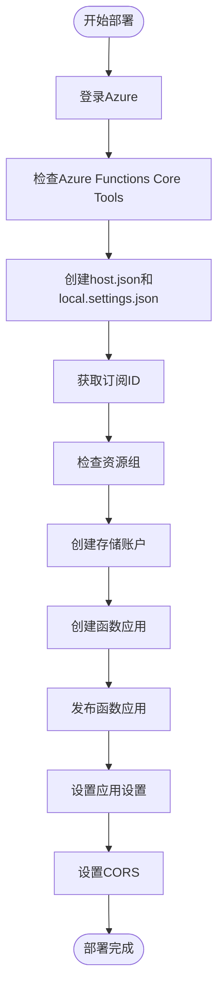
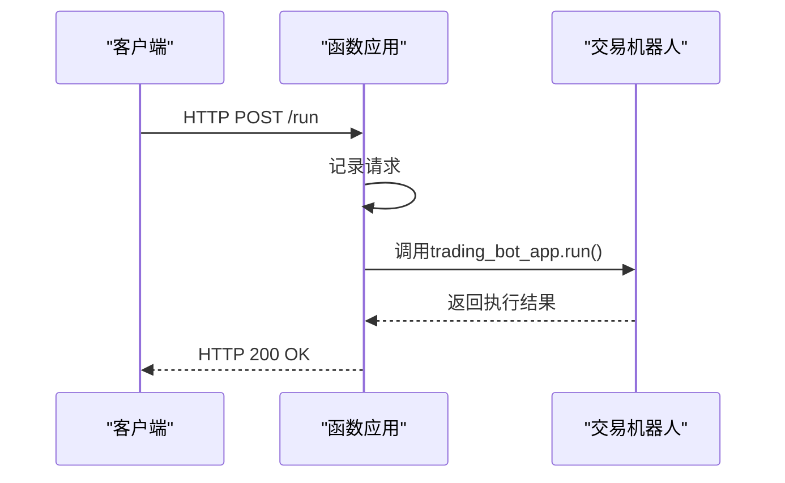

# Azure Functions 部署

<cite>
**本文档引用的文件**   
- [deploy_to_azure_function.py](file://investing_algorithm_framework/cli/deploy_to_azure_function.py)
- [app_azure_function.py.template](file://investing_algorithm_framework/cli/templates/app_azure_function.py.template)
- [azure_function_function_app.py.template](file://investing_algorithm_framework/cli/templates/azure_function_function_app.py.template)
- [azure_function_host.json.template](file://investing_algorithm_framework/cli/templates/azure_function_host.json.template)
- [azure_function_requirements.txt.template](file://investing_algorithm_framework/cli/templates/azure_function_requirements.txt.template)
- [azure_function_local.settings.json.template](file://investing_algorithm_framework/cli/templates/azure_function_local.settings.json.template)
- [env_azure_function.example.template](file://investing_algorithm_framework/cli/templates/env_azure_function.example.template)
- [state_handler.py](file://investing_algorithm_framework/infrastructure/services/azure/state_handler.py)
- [cli.py](file://investing_algorithm_framework/cli/cli.py)
</cite>

## 目录
1. [简介](#简介)
2. [部署流程与实现逻辑](#部署流程与实现逻辑)
3. [模板文件结构与配置](#模板文件结构与配置)
4. [配置文件与触发器](#配置文件与触发器)
5. [应用配置与安全集成](#应用配置与安全集成)
6. [性能优化建议](#性能优化建议)
7. [故障排除指南](#故障排除指南)
8. [Application Insights 集成](#application-insights-集成)
9. [结论](#结论)

## 简介

本文档详细介绍了如何将交易策略部署到Azure Functions无服务器平台。文档涵盖了`deploy_to_azure_function.py`的实现逻辑、部署流程，解析了`app_azure_function.py.template`和`azure_function_function_app.py.template`模板的结构与配置要求。同时，文档描述了`host.json`配置文件的作用、函数触发器设置和依赖管理（`requirements.txt`），并提供了Azure应用配置、密钥保管库集成和身份验证的最佳实践。此外，还包含性能优化建议，如实例大小选择、冷启动优化和缩放策略，并提供故障排除指南，解决常见的Azure Functions部署错误、依赖冲突和运行时异常。

**Section sources**
- [deploy_to_azure_function.py](file://investing_algorithm_framework/cli/deploy_to_azure_function.py#L1-L719)

## 部署流程与实现逻辑

`deploy_to_azure_function.py`脚本实现了完整的Azure Functions部署流程，包括资源组检查、存储账户创建、函数应用创建和发布。该脚本使用Azure SDK和Azure CLI命令来管理Azure资源。

部署流程从`command`函数开始，首先确保用户已通过`az login`登录Azure，并验证Azure Functions Core Tools是否已安装。然后调用`create_storage_and_function`函数，该函数负责创建必要的配置文件并执行部署。



**Diagram sources**
- [deploy_to_azure_function.py](file://investing_algorithm_framework/cli/deploy_to_azure_function.py#L674-L718)

**Section sources**
- [deploy_to_azure_function.py](file://investing_algorithm_framework/cli/deploy_to_azure_function.py#L674-L718)

## 模板文件结构与配置

### app_azure_function.py.template

此模板文件定义了交易机器人的核心应用配置。它使用`create_app`函数创建应用实例，并添加市场配置、算法和策略。

```python
from dotenv import load_dotenv
from investing_algorithm_framework import create_app, PortfolioConfiguration, \
    TimeUnit, CCXTOHLCVMarketDataSource, Algorithm, \
    CCXTTickerMarketDataSource, MarketCredential, AzureBlobStorageStateHandler
from strategies.strategy import MyTradingStrategy

load_dotenv()

app = create_app()
app.add_market(market="binance", initial_balance=1000, trading_symbol="EUR")
algorithm = Algorithm(name="MyTradingBot")
algorithm.add_strategy(MyTradingStrategy)
app.add_algorithm(algorithm)
```

**Section sources**
- [app_azure_function.py.template](file://investing_algorithm_framework/cli/templates/app_azure_function.py.template#L1-L15)

### azure_function_function_app.py.template

此模板文件定义了Azure Functions的入口点。它创建了一个Azure Functions应用，并定义了HTTP触发器和定时触发器。

```python
import azure.functions as func
import logging
import logging.config
from investing_algorithm_framework import DEFAULT_LOGGING_CONFIG,\
    StatelessAction, AzureBlobStorageStateHandler
from app import app as trading_bot_app

trading_bot_app.add_state_handler(
    state_handler=AzureBlobStorageStateHandler
)

logging.config.dictConfig(DEFAULT_LOGGING_CONFIG)
app = func.FunctionApp()

@app.route(route="ping", auth_level=func.AuthLevel.ANONYMOUS)
def trading_bot(req: func.HttpRequest) -> func.HttpResponse:
    logging.info("Ping request received.")
    try:
        response = trading_bot_app.run(
            payload={"action": StatelessAction.RUN_STRATEGY.value}
        )
        return func.HttpResponse(response, status_code=200)
    except Exception as e:
        return func.HttpResponse(
            f"Error running ping action: {e}",
            status_code=500
        )

@app.route(route="run", auth_level=func.AuthLevel.ANONYMOUS)
def run_trading_bot(req: func.HttpRequest) -> func.HttpResponse:
    logging.info("Run request received.")
    try:
        trading_bot_app.run(
            payload={"action": StatelessAction.RUN_STRATEGY.value}
        )
    except Exception as e:
        return func.HttpResponse(
            f"Error running trading bot: {e}",
            status_code=500
        )
    return func.HttpResponse(
        "Trading bot executed successfully.",
        status_code=200
    )

@app.function_name(name="scheduled_trading_bot_run")
@app.schedule(
    schedule="*/30 * * * * *",  # 每30秒执行一次，可根据需要修改
    arg_name="timer",
    auth_level=func.AuthLevel.ANONYMOUS,
    run_on_startup=True
)
def scheduled_trading_bot(timer: func.TimerRequest) -> None:
    logging.info("Scheduled trading bot triggered.")
    try:
        trading_bot_app.run(
            payload={"action": StatelessAction.RUN_STRATEGY.value}
        )
    except Exception as e:
        logging.error(f"Error running scheduled trading bot: {e}")
        raise e
    logging.info("Scheduled trading bot executed successfully.")
```

**Section sources**
- [azure_function_function_app.py.template](file://investing_algorithm_framework/cli/templates/azure_function_function_app.py.template#L1-L66)

## 配置文件与触发器

### host.json

`host.json`文件是Azure Functions的核心配置文件，定义了函数应用的全局配置。

```json
{
  "version": "2.0",
  "logging": {
    "applicationInsights": {
      "samplingSettings": {
        "isEnabled": true,
        "excludedTypes": "Request"
      }
    }
  },
  "extensionBundle": {
    "id": "Microsoft.Azure.Functions.ExtensionBundle",
    "version": "[4.*, 5.0.0)"
  }
}
```

该文件配置了Application Insights的采样设置，并指定了扩展包的版本。

**Section sources**
- [azure_function_host.json.template](file://investing_algorithm_framework/cli/templates/azure_function_host.json.template#L1-L15)

### local.settings.json

`local.settings.json`文件用于本地开发环境的配置。

```json
{
  "IsEncrypted": false,
  "Values": {
    "FUNCTIONS_WORKER_RUNTIME": "python",
    "AzureWebJobsFeatureFlags": "EnableWorkerIndexing",
    "AzureWebJobsStorage": ""
  }
}
```

**Section sources**
- [azure_function_local.settings.json.template](file://investing_algorithm_framework/cli/templates/azure_function_local.settings.json.template#L1-L8)

### 函数触发器

Azure Functions支持多种触发器类型，包括HTTP触发器和定时触发器。HTTP触发器允许通过HTTP请求触发函数执行，而定时触发器允许按计划执行函数。



**Diagram sources**
- [azure_function_function_app.py.template](file://investing_algorithm_framework/cli/templates/azure_function_function_app.py.template#L15-L47)

**Section sources**
- [azure_function_function_app.py.template](file://investing_algorithm_framework/cli/templates/azure_function_function_app.py.template#L15-L47)

## 应用配置与安全集成

### 环境变量配置

环境变量通过`.env`文件或Azure门户进行配置。`env_azure_function.example.template`提供了示例配置。

```env
BITVAVO_API_KEY=<YOUR_BITVAVO_API_KEY>
BITVAVO_SECRET_KEY=<YOUR_BITVAVO_API_SECRET>
AZURE_STORAGE_CONNECTION_STRING=<YOUR_AZURE_STORAGE_CONNECTION_STRING>
AZURE_STORAGE_CONTAINER_NAME=<YOUR_AZURE_STORAGE_CONTAINER_NAME>
```

### Azure Blob Storage 状态处理器

`AzureBlobStorageStateHandler`类用于将应用状态保存到Azure Blob Storage，确保在函数实例重启后能够恢复状态。

```python
class AzureBlobStorageStateHandler(StateHandler):
    def __init__(self, connection_string: str = None, container_name: str = None):
        self.connection_string = connection_string
        self.container_name = container_name

    def initialize(self):
        if self.connection_string is None:
            self.connection_string = os.getenv("AZURE_STORAGE_CONNECTION_STRING")
        if self.container_name is None:
            self.container_name = os.getenv("AZURE_STORAGE_CONTAINER_NAME")

    def save(self, source_directory: str):
        # 保存状态到Azure Blob Storage
        pass

    def load(self, target_directory: str):
        # 从Azure Blob Storage加载状态
        pass
```

**Section sources**
- [env_azure_function.example.template](file://investing_algorithm_framework/cli/templates/env_azure_function.example.template#L1-L4)
- [state_handler.py](file://investing_algorithm_framework/infrastructure/services/azure/state_handler.py#L1-L159)

## 性能优化建议

### 实例大小选择

选择合适的实例大小对于性能和成本至关重要。对于交易机器人，建议使用具有足够内存的实例以处理市场数据。

### 冷启动优化

冷启动是无服务器函数的一个常见问题。可以通过以下方式优化：
- 使用预热请求定期触发函数
- 选择合适的实例大小
- 减少依赖项的数量和大小

### 缩放策略

Azure Functions自动根据负载进行缩放。对于交易机器人，建议监控函数执行时间和资源使用情况，并根据需要调整缩放设置。

**Section sources**
- [deploy_to_azure_function.py](file://investing_algorithm_framework/cli/deploy_to_azure_function.py#L268-L272)

## 故障排除指南

### 常见部署错误

- **Azure Functions Core Tools未安装**：确保已安装Azure Functions Core Tools
- **资源组不存在**：使用`--create_resource_group_if_not_exists`选项创建资源组
- **存储账户名称冲突**：使用唯一名称或让脚本生成唯一名称

### 依赖冲突

确保`requirements.txt`中的依赖项版本兼容。使用虚拟环境进行开发和测试。

### 运行时异常

- 检查日志以获取详细的错误信息
- 确保所有必需的环境变量都已设置
- 验证Azure Blob Storage连接字符串和容器名称

**Section sources**
- [deploy_to_azure_function.py](file://investing_algorithm_framework/cli/deploy_to_azure_function.py#L33-L52)
- [deploy_to_azure_function.py](file://investing_algorithm_framework/cli/deploy_to_azure_function.py#L463-L479)

## Application Insights 集成

Application Insights用于监控函数应用的性能和诊断问题。`host.json`文件中已配置Application Insights。

```json
{
  "logging": {
    "applicationInsights": {
      "samplingSettings": {
        "isEnabled": true,
        "excludedTypes": "Request"
      }
    }
  }
}
```

通过Application Insights，可以监控函数执行时间、失败率和异常，帮助优化性能和可靠性。

**Section sources**
- [azure_function_host.json.template](file://investing_algorithm_framework/cli/templates/azure_function_host.json.template#L3-L9)

## 结论

本文档详细介绍了将交易策略部署到Azure Functions的完整流程。通过使用提供的模板和脚本，可以轻松地将交易机器人部署到Azure无服务器平台。建议遵循最佳实践，包括使用环境变量、配置Application Insights监控和优化性能，以确保交易机器人的稳定性和可靠性。