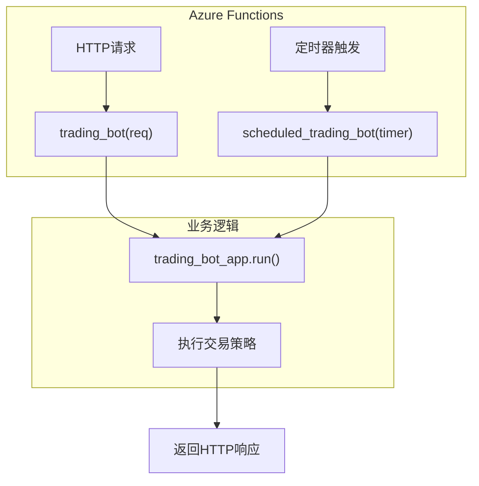

# 部署

<cite>
**本文档中引用的文件**  
- [deploy_to_aws_lambda.py](file://investing_algorithm_framework/cli/deploy_to_aws_lambda.py)
- [deploy_to_azure_function.py](file://investing_algorithm_framework/cli/deploy_to_azure_function.py)
- [app_aws_lambda_function.py.template](file://investing_algorithm_framework/cli/templates/app_aws_lambda_function.py.template)
- [app_azure_function.py.template](file://investing_algorithm_framework/cli/templates/app_azure_function.py.template)
- [aws_lambda_dockerfile.template](file://investing_algorithm_framework/cli/templates/aws_lambda_dockerfile.template)
- [azure_function_function_app.py.template](file://investing_algorithm_framework/cli/templates/azure_function_function_app.py.template)
- [aws_lambda_requirements.txt.template](file://investing_algorithm_framework/cli/templates/aws_lambda_requirements.txt.template)
- [azure_function_requirements.txt.template](file://investing_algorithm_framework/cli/templates/azure_function_requirements.txt.template)
- [env.example.template](file://investing_algorithm_framework/cli/templates/env.example.template)
- [env_azure_function.example.template](file://investing_algorithm_framework/cli/templates/env_azure_function.example.template)
- [config.py](file://investing_algorithm_framework/domain/config.py)
- [AWSS3StorageStateHandler.py](file://investing_algorithm_framework/infrastructure/services/aws/state_handler.py)
- [AzureBlobStorageStateHandler.py](file://investing_algorithm_framework/infrastructure/services/azure/state_handler.py)
</cite>

## 目录
1. [简介](#简介)
2. [部署选项和流程](#部署选项和流程)
3. [云函数模板结构](#云函数模板结构)
4. [从本地开发到生产部署的工作流程](#从本地开发到生产部署的工作流程)
5. [环境变量配置和密钥管理](#环境变量配置和密钥管理)
6. [部署模式的优缺点和适用场景](#部署模式的优缺点和适用场景)
7. [性能优化建议](#性能优化建议)
8. [故障排除指南](#故障排除指南)
9. [结论](#结论)

## 简介

本指南详细介绍了如何将使用投资算法框架开发的交易策略部署到无服务器平台，特别是AWS Lambda和Azure Functions。文档涵盖了部署流程、模板结构、配置要求、工作流程、环境管理、性能优化以及故障排除等内容，旨在为开发者提供完整的部署解决方案。

## 部署选项和流程

投资算法框架提供了两种主要的无服务器部署选项：AWS Lambda和Azure Functions。每种平台都有其特定的部署流程和工具支持。

### AWS Lambda 部署流程

AWS Lambda的部署流程通过`deploy_to_aws_lambda.py`脚本自动化。该流程包括以下关键步骤：

1.  **权限检查**：首先检查当前IAM用户/角色是否具有部署Lambda函数所需的权限。
2.  **创建S3存储桶**：为状态管理创建一个S3存储桶，用于在函数执行之间持久化数据。存储桶名称基于Lambda函数名称生成。
3.  **读取环境变量**：从项目根目录下的`.env`文件中读取环境变量，并将其与部署时提供的变量合并。
4.  **构建和推送Docker镜像**：
    *   创建一个ECR（Elastic Container Registry）仓库。
    *   使用项目中的`Dockerfile`构建Docker镜像。
    *   将镜像推送到ECR仓库。
5.  **创建IAM角色**：创建一个IAM角色，该角色允许Lambda函数执行，并具有对CloudWatch日志和S3存储桶的访问权限。
6.  **部署Lambda函数**：使用之前构建的Docker镜像创建或更新Lambda函数，配置内存、超时等参数。

此流程通过命令行工具`command`函数执行，简化了复杂的云资源管理。

### Azure Functions 部署流程

Azure Functions的部署流程由`deploy_to_azure_function.py`脚本处理，其流程如下：

1.  **登录验证**：确保用户已通过`az login`命令登录到Azure CLI。
2.  **检查依赖**：验证Azure Functions Core Tools是否已安装。
3.  **创建资源组**：检查或创建指定的Azure资源组。
4.  **创建存储账户**：创建或复用一个Azure存储账户，用于存放函数代码和状态数据。
5.  **创建函数应用**：在消费计划（Consumption Plan）下创建一个Python函数应用。
6.  **生成配置文件**：从模板生成`host.json`和`local.settings.json`等必要的配置文件。
7.  **发布函数应用**：使用`func`命令行工具将本地代码发布到Azure。
8.  **设置应用配置**：将环境变量（如存储连接字符串）设置到函数应用的配置中。

该流程利用Azure CLI和Azure Functions Core Tools，实现了从零开始的自动化部署。

**Section sources**
- [deploy_to_aws_lambda.py](file://investing_algorithm_framework/cli/deploy_to_aws_lambda.py#L433-L502)
- [deploy_to_azure_function.py](file://investing_algorithm_framework/cli/deploy_to_azure_function.py#L674-L719)

## 云函数模板结构

框架为每个云平台提供了预定义的模板，这些模板定义了函数的入口点和基本配置。

### AWS Lambda 模板结构

AWS Lambda的模板文件为`app_aws_lambda_function.py.template`，其核心结构如下：

*   **状态处理器**：使用`AWSS3StorageStateHandler`，通过`AWS_S3_STATE_BUCKET_NAME`环境变量指定S3存储桶，实现跨执行的状态持久化。
*   **资源目录**：将`RESOURCE_DIRECTORY`设置为`/tmp`，因为这是Lambda函数中唯一的可写目录。
*   **日志配置**：应用`AWS_LAMBDA_LOGGING_CONFIG`，该配置仅将日志输出到控制台，符合Lambda的最佳实践。
*   **入口函数**：`lambda_handler`是AWS Lambda的入口点。它捕获事件和上下文，运行交易策略，并返回一个包含状态码和消息的字典，符合AWS API Gateway的响应格式。

```mermaid
flowchart TD
A["lambda_handler(event, context)"] --> B["app.run(payload={\"ACTION\": \"RUN_STRATEGY\"})"]
B --> C{"成功?"}
C --> |是| D["返回 statusCode: 200"]
C --> |否| E["捕获异常并记录"]
E --> F["返回 statusCode: 500"]
```

**Diagram sources**
- [app_aws_lambda_function.py.template](file://investing_algorithm_framework/cli/templates/app_aws_lambda_function.py.template#L1-L49)
- [config.py](file://investing_algorithm_framework/domain/config.py#L86-L111)

### Azure Functions 模板结构

Azure Functions的模板结构由多个文件组成：

*   **主应用文件 (`app_azure_function.py.template`)**：定义了核心应用实例`app`，并添加市场和策略。它不直接处理HTTP请求，而是作为业务逻辑的容器。
*   **函数应用文件 (`azure_function_function_app.py.template`)**：这是Azure Functions的入口点。
    *   它导入主应用实例。
    *   使用`AzureBlobStorageStateHandler`进行状态管理。
    *   定义了多个HTTP触发器函数（如`trading_bot`和`run_trading_bot`）和一个定时触发器函数（`scheduled_trading_bot`），用于响应不同的事件。
*   **配置文件**：
    *   `host.json`：配置函数应用的全局设置，如扩展捆绑包版本。
    *   `local.settings.json`：定义本地开发时的应用设置，如运行时和存储连接。

这种分离结构将业务逻辑与云平台的触发机制解耦，提高了代码的可维护性。



**Diagram sources**
- [app_azure_function.py.template](file://investing_algorithm_framework/cli/templates/app_azure_function.py.template#L1-L15)
- [azure_function_function_app.py.template](file://investing_algorithm_framework/cli/templates/azure_function_function_app.py.template#L1-L66)
- [azure_function_host.json.template](file://investing_algorithm_framework/cli/templates/azure_function_host.json.template#L1-L15)

## 从本地开发到生产部署的工作流程

从本地开发到生产部署的完整工作流程可以分为以下几个阶段：

1.  **本地开发与测试**：
    *   在本地环境中使用`create_app()`初始化应用。
    *   使用`env.example.template`作为模板创建`.env`文件，并填入API密钥等凭证。
    *   开发和测试交易策略，确保其逻辑正确。

2.  **配置无服务器环境**：
    *   根据目标平台（AWS或Azure），选择相应的模板。
    *   对于AWS，确保项目根目录下有`Dockerfile`和`requirements.txt`。
    *   对于Azure，确保已安装Azure CLI和Azure Functions Core Tools。

3.  **准备部署配置**：
    *   填写平台特定的环境模板，如`env_azure_function.example.template`，填入Azure存储连接字符串等信息。
    *   确保所有依赖项都已正确列出在`requirements.txt`中。

4.  **执行自动化部署**：
    *   运行框架提供的CLI命令（如`deploy_to_aws_lambda`或`deploy_to_azure_function`）。
    *   这些命令会自动处理云资源的创建、代码打包、镜像构建和函数部署。

5.  **生产环境验证**：
    *   部署完成后，通过云平台的监控工具（如CloudWatch或Application Insights）验证函数是否正常运行。
    *   检查日志以确认没有错误，并验证状态是否已正确持久化到S3或Azure Blob Storage。

**Section sources**
- [env.example.template](file://investing_algorithm_framework/cli/templates/env.example.template#L1-L2)
- [env_azure_function.example.template](file://investing_algorithm_framework/cli/templates/env_azure_function.example.template#L1-L4)
- [deploy_to_aws_lambda.py](file://investing_algorithm_framework/cli/deploy_to_aws_lambda.py#L433-L502)
- [deploy_to_azure_function.py](file://investing_algorithm_framework/cli/deploy_to_azure_function.py#L674-L719)

## 环境变量配置和密钥管理

安全地管理环境变量和密钥是部署过程中的关键环节。

### 环境变量配置

框架通过`.env`文件和云平台的环境变量配置来管理设置。

*   **本地开发**：使用`env.example.template`作为模板创建`.env`文件，其中包含市场API密钥等信息。
*   **生产部署**：
    *   **AWS Lambda**：部署脚本会自动将`.env`文件中的变量和云资源信息（如S3存储桶名称）注入到Lambda函数的环境变量中。
    *   **Azure Functions**：`deploy_to_azure_function.py`脚本会读取`.env`文件，并使用`az` CLI命令将其设置为函数应用的应用设置。

### 密钥管理

直接在代码或`.env`文件中存储明文密钥存在安全风险。最佳实践是使用云平台提供的密钥管理服务。

*   **AWS**：应使用AWS Secrets Manager或Parameter Store来存储API密钥。在`app_aws_lambda_function.py`中，不应直接从环境变量读取密钥，而应通过AWS SDK从Secrets Manager获取。
*   **Azure**：应使用Azure Key Vault。在代码中，应使用Azure SDK从Key Vault检索密钥，而不是依赖环境变量。

虽然当前模板直接使用环境变量，但生产环境强烈建议升级为使用云原生的密钥管理服务，以实现更高级别的安全性和审计功能。

**Section sources**
- [env.example.template](file://investing_algorithm_framework/cli/templates/env.example.template#L1-L2)
- [env_azure_function.example.template](file://investing_algorithm_framework/cli/templates/env_azure_function.example.template#L1-L4)
- [app_aws_lambda_function.py.template](file://investing_algorithm_framework/cli/templates/app_aws_lambda_function.py.template#L5-L7)
- [app_azure_function.py.template](file://investing_algorithm_framework/cli/templates/app_azure_function.py.template#L1-L6)

## 部署模式的优缺点和适用场景

### AWS Lambda

**优点**：
*   **成熟度高**：AWS Lambda是市场上最成熟、文档最完善的无服务器平台。
*   **集成生态**：与S3、CloudWatch、IAM等AWS服务无缝集成，部署脚本可以轻松自动化整个流程。
*   **容器化支持**：支持通过Docker镜像部署，便于管理复杂依赖。

**缺点**：
*   **冷启动延迟**：对于需要快速响应的高频交易，冷启动延迟可能是一个问题。
*   **执行时间限制**：最长执行时间为15分钟，不适合长时间运行的批处理任务。

**适用场景**：
*   适用于执行周期性任务（如每小时运行一次的策略）的中低频交易系统。
*   适合需要与AWS生态系统（如S3、DynamoDB）深度集成的场景。

### Azure Functions

**优点**：
*   **多语言支持**：对Python的支持良好，并且与Azure生态（如Blob Storage、Event Hubs）集成紧密。
*   **灵活的触发器**：支持HTTP、定时器、队列等多种触发器，灵活性高。
*   **消费计划**：按执行次数和资源消耗计费，成本效益高。

**缺点**：
*   **工具链复杂性**：部署过程依赖Azure CLI和Functions Core Tools，本地开发环境配置相对复杂。
*   **社区规模**：相比AWS，其社区和第三方工具的规模较小。

**适用场景**：
*   适用于已经使用Azure云服务的企业环境。
*   适合需要复杂事件驱动架构（如基于消息队列触发）的交易系统。

**Section sources**
- [deploy_to_aws_lambda.py](file://investing_algorithm_framework/cli/deploy_to_aws_lambda.py#L126-L192)
- [deploy_to_azure_function.py](file://investing_algorithm_framework/cli/deploy_to_azure_function.py#L204-L297)

## 性能优化建议

### 冷启动缓解

冷启动是无服务器函数的主要性能瓶颈。

*   **预留并发 (Provisioned Concurrency)**：在AWS Lambda中，可以为函数配置预留并发，让函数实例保持“预热”状态，从而消除冷启动。这是最直接有效的解决方案，但会增加成本。
*   **定期调用 (Ping/Pong)**：设置一个CloudWatch Events规则或Azure Timer，每隔几分钟调用一次函数，以保持实例活跃。这是一种成本较低的替代方案。

### 资源分配

*   **内存配置**：在AWS Lambda中，内存大小直接影响CPU配额。对于计算密集型的策略（如复杂的指标计算），应适当增加内存（如3000MB），这不仅能提供足够的内存，还能获得更高的CPU性能。
*   **依赖项优化**：精简`requirements.txt`，移除不必要的包。对于大型包，考虑使用Lambda层（Lambda Layers）来共享，减少部署包的大小，从而缩短冷启动时间。

**Section sources**
- [deploy_to_aws_lambda.py](file://investing_algorithm_framework/cli/deploy_to_aws_lambda.py#L131-L132)
- [deploy_to_aws_lambda.py](file://investing_algorithm_framework/cli/deploy_to_aws_lambda.py#L499-L500)

## 故障排除指南

### 常见部署问题

*   **权限错误**：最常见的问题是IAM或Azure角色权限不足。确保部署用户具有创建S3/存储账户、ECR/ACR仓库、Lambda/函数应用和IAM角色的权限。
*   **Docker构建失败**：检查`Dockerfile`是否正确，以及`requirements.txt`中的包是否都能成功安装。网络问题可能导致pip安装失败。
*   **环境变量缺失**：确保`.env`文件存在且格式正确（`KEY=VALUE`），并且所有必需的环境变量（如`AWS_S3_STATE_BUCKET_NAME`）都已设置。

### 常见运行时错误

*   **状态处理失败**：
    *   **错误信息**：`AWS credentials are missing or incomplete.` 或 `Azure Blob Storage state handler requires a connection string...`
    *   **解决方案**：检查云平台的认证配置（如AWS CLI配置文件或Azure登录状态），并确保环境变量（如`AWS_S3_BUCKET_NAME`或`AZURE_STORAGE_CONNECTION_STRING`）已正确注入到函数中。
*   **文件系统权限错误**：在AWS Lambda中，尝试写入非`/tmp`目录会失败。确保所有文件操作都指向`/tmp`目录。
*   **包导入错误**：如果函数报告找不到模块，说明依赖项未正确安装。检查`requirements.txt`和Docker构建日志。

**Section sources**
- [AWSS3StorageStateHandler.py](file://investing_algorithm_framework/infrastructure/services/aws/state_handler.py#L104-L111)
- [AzureBlobStorageStateHandler.py](file://investing_algorithm_framework/infrastructure/services/azure/state_handler.py#L130-L132)
- [app_aws_lambda_function.py.template](file://investing_algorithm_framework/cli/templates/app_aws_lambda_function.py.template#L15)

## 结论

本指南详细阐述了将投资算法框架的策略部署到AWS Lambda和Azure Functions的完整流程。通过利用框架提供的CLI工具和模板，开发者可以自动化复杂的云资源管理和部署任务。关键在于理解每个平台的模板结构、状态管理机制和配置要求。在生产环境中，应优先考虑使用云原生的密钥管理服务，并通过预留并发或定期调用来优化冷启动性能。遵循本文档的实践，可以构建一个可靠、安全且可扩展的无服务器交易系统。