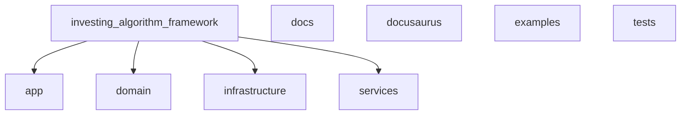
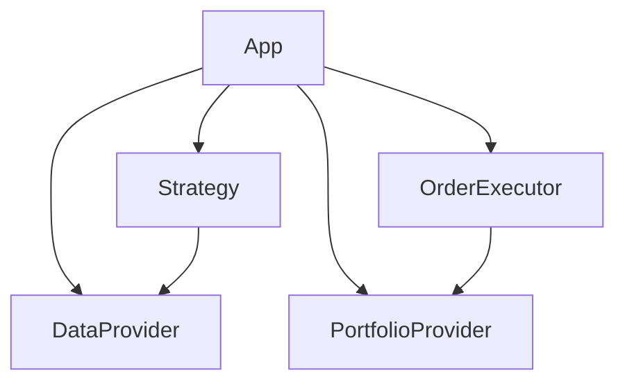
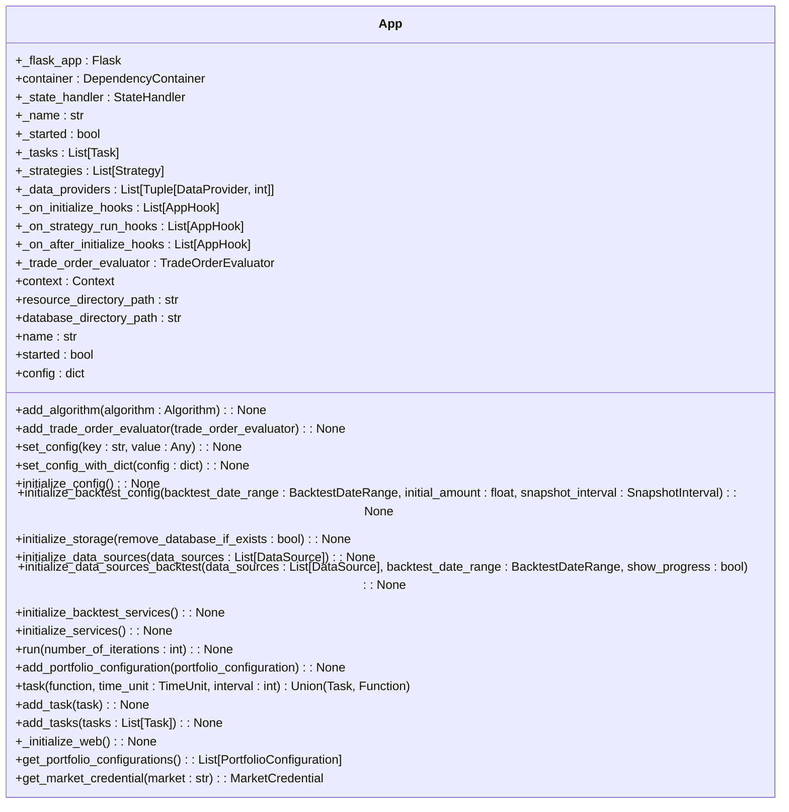
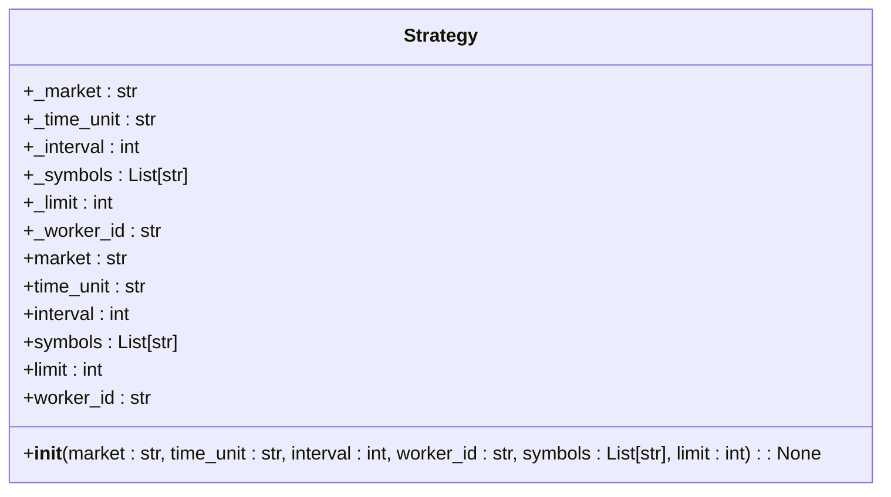
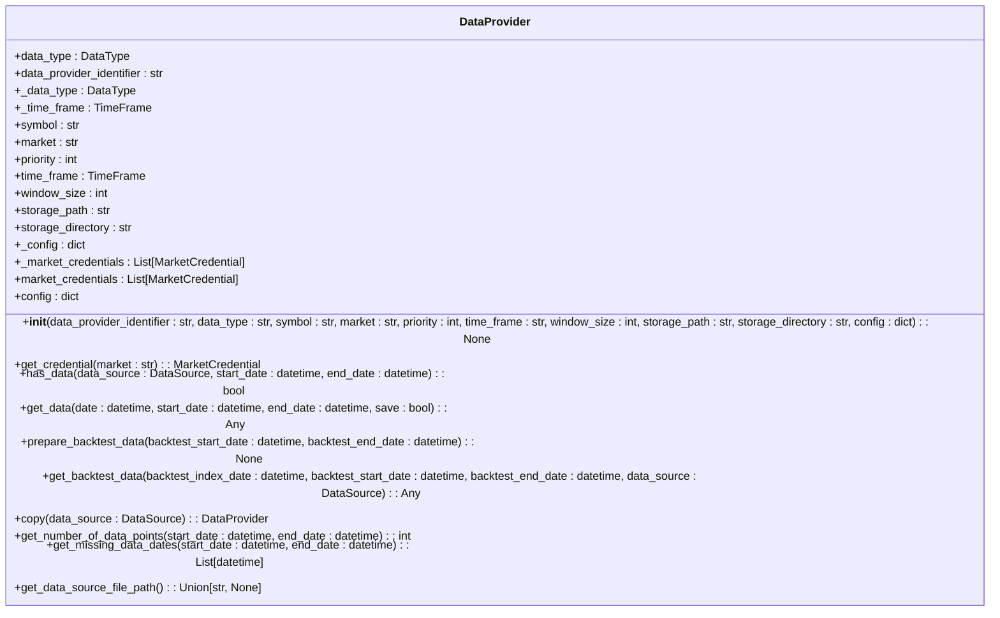
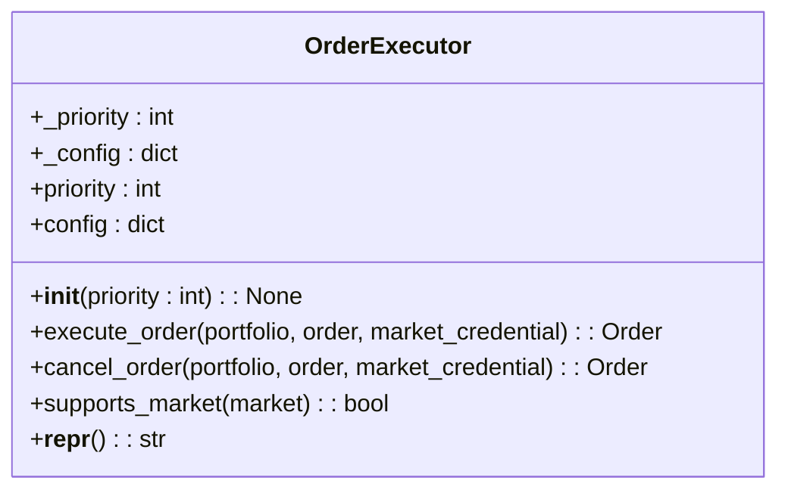
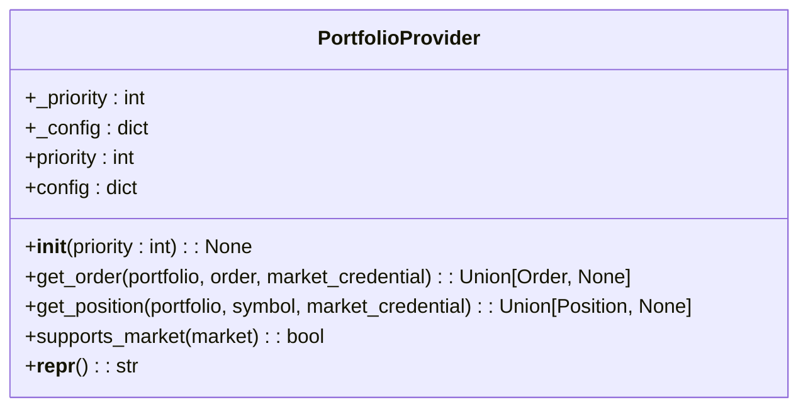

# 项目概述

<cite>
**本文档引用的文件**
- [__init__.py](file://investing_algorithm_framework/__init__.py)
- [create_app.py](file://investing_algorithm_framework/create_app.py)
- [dependency_container.py](file://investing_algorithm_framework/dependency_container.py)
- [app.py](file://investing_algorithm_framework/app/app.py)
- [algorithm.py](file://investing_algorithm_framework/app/algorithm/algorithm.py)
- [data_provider.py](file://investing_algorithm_framework/domain/data_provider.py)
- [order_executor.py](file://investing_algorithm_framework/domain/order_executor.py)
- [portfolio_provider.py](file://investing_algorithm_framework/domain/portfolio_provider.py)
- [ccxt.py](file://investing_algorithm_framework/infrastructure/data_providers/ccxt.py)
- [ccxt_order_executor.py](file://investing_algorithm_framework/infrastructure/order_executors/ccxt_order_executor.py)
- [ccxt_portfolio_provider.py](file://investing_algorithm_framework/infrastructure/portfolio_providers/ccxt_portfolio_provider.py)
- [configuration_service.py](file://investing_algorithm_framework/services/configuration_service.py)
- [base_model.py](file://investing_algorithm_framework/domain/models/base_model.py)
</cite>

## 目录
1. [引言](#引言)
2. [项目结构](#项目结构)
3. [核心组件](#核心组件)
4. [架构概述](#架构概述)
5. [详细组件分析](#详细组件分析)
6. [依赖分析](#依赖分析)
7. [性能考虑](#性能考虑)
8. [故障排除指南](#故障排除指南)
9. [结论](#结论)

## 引言
投资算法框架是一个为量化交易策略开发而设计的全面框架。它提供了一个完整的工具链，涵盖了从策略开发、回测到实盘交易和云部署的整个流程。该框架基于依赖注入的分层架构，包括应用层、领域层、基础设施层和服务层，确保了组件之间的松耦合和高内聚。通过使用如ccxt、Flask、SQLAlchemy和polars等关键技术栈，框架能够高效地处理市场数据、执行交易并生成详细的报告。

## 项目结构
该项目采用模块化设计，主要分为以下几个部分：`docs` 用于存放文档；`docusaurus` 是文档网站的构建工具；`examples` 包含了各种示例代码；`investing_algorithm_framework` 是核心库，包含了所有功能实现；`tests` 存放测试代码。核心库进一步细分为多个子模块，如 `app`、`domain`、`infrastructure` 和 `services`，每个子模块负责不同的职责。

**图表来源**
- [investing_algorithm_framework](file://investing_algorithm_framework)

**章节来源**
- [investing_algorithm_framework](file://investing_algorithm_framework)

## 核心组件
投资算法框架的核心组件包括 `App`、`Strategy`、`DataProvider`、`OrderExecutor` 和 `PortfolioProvider`。这些组件协同工作，实现了从数据获取到交易执行的完整流程。`App` 类是应用程序的入口点，负责初始化和运行整个系统。`Strategy` 定义了具体的交易策略逻辑。`DataProvider` 负责从不同来源获取市场数据。`OrderExecutor` 处理订单的创建和取消。`PortfolioProvider` 管理投资组合的状态。

**章节来源**
- [app.py](file://investing_algorithm_framework/app/app.py#L43-L800)
- [algorithm.py](file://investing_algorithm_framework/app/algorithm/algorithm.py#L14-L240)
- [data_provider.py](file://investing_algorithm_framework/domain/data_provider.py#L12-L335)
- [order_executor.py](file://investing_algorithm_framework/domain/order_executor.py#L6-L113)
- [portfolio_provider.py](file://investing_algorithm_framework/domain/portfolio_provider.py#L7-L119)

## 架构概述
该框架采用了分层架构设计，主要包括应用层、领域层、基础设施层和服务层。应用层通过 `App` 类暴露接口，协调各层之间的交互。领域层定义了业务逻辑和实体模型，如 `Order`、`Portfolio` 和 `Position`。基础设施层提供了与外部系统的集成，例如通过 `CCXTOHLCVDataProvider` 从交易所获取数据。服务层封装了复杂的业务操作，如订单服务和投资组合服务。

**图表来源**
- [app.py](file://investing_algorithm_framework/app/app.py#L43-L800)
- [algorithm.py](file://investing_algorithm_framework/app/algorithm/algorithm.py#L14-L240)
- [data_provider.py](file://investing_algorithm_framework/domain/data_provider.py#L12-L335)
- [order_executor.py](file://investing_algorithm_framework/domain/order_executor.py#L6-L113)
- [portfolio_provider.py](file://investing_algorithm_framework/domain/portfolio_provider.py#L7-L119)

## 详细组件分析

### App 分析
`App` 类是整个框架的核心，负责初始化配置、设置依赖容器以及启动事件循环服务。它通过 `create_app` 工厂方法创建实例，并支持 Web 模式运行。`App` 还管理了状态处理器，可以在应用启动和关闭时保存和加载状态。

#### 类图

**图表来源**
- [app.py](file://investing_algorithm_framework/app/app.py#L43-L800)

**章节来源**
- [app.py](file://investing_algorithm_framework/app/app.py#L43-L800)

### Strategy 分析
`Strategy` 类定义了交易策略的基本结构，包括市场、时间单位、间隔、工作ID、符号列表和限制等属性。策略可以通过装饰器或直接实例化的方式添加到算法中。每个策略都有一个唯一的 `worker_id`，用于区分不同的策略实例。

#### 类图

**图表来源**
- [strategy.py](file://investing_algorithm_framework/domain/strategy.py#L4-L45)

**章节来源**
- [strategy.py](file://investing_algorithm_framework/domain/strategy.py#L4-L45)

### DataProvider 分析
`DataProvider` 是一个抽象基类，定义了数据提供者的通用接口。具体实现如 `CCXTOHLCVDataProvider` 可以从 CCXT 库获取 OHLCV 数据。数据提供者支持多种数据类型，如 OHLCV、TICKER 和 CUSTOM_DATA，并可以根据优先级选择最合适的数据源。

#### 类图

**图表来源**
- [data_provider.py](file://investing_algorithm_framework/domain/data_provider.py#L12-L335)

**章节来源**
- [data_provider.py](file://investing_algorithm_framework/domain/data_provider.py#L12-L335)

### OrderExecutor 分析
`OrderExecutor` 是一个抽象基类，定义了订单执行器的通用接口。具体实现如 `CCXTOrderExecutor` 可以通过 CCXT 库在交易所上执行订单。订单执行器支持市场检查，确保只处理支持的市场。

#### 类图

**图表来源**
- [order_executor.py](file://investing_algorithm_framework/domain/order_executor.py#L6-L113)

**章节来源**
- [order_executor.py](file://investing_algorithm_framework/domain/order_executor.py#L6-L113)

### PortfolioProvider 分析
`PortfolioProvider` 是一个抽象基类，定义了投资组合提供者的通用接口。具体实现如 `CCXTPortfolioProvider` 可以通过 CCXT 库获取投资组合的状态。投资组合提供者支持市场检查，确保只处理支持的市场。

#### 类图

**图表来源**
- [portfolio_provider.py](file://investing_algorithm_framework/domain/portfolio_provider.py#L7-L119)

**章节来源**
- [portfolio_provider.py](file://investing_algorithm_framework/domain/portfolio_provider.py#L7-L119)

## 依赖分析
该框架通过依赖注入容器管理各个组件之间的依赖关系。`DependencyContainer` 类定义了所有服务和仓库的工厂方法，确保它们可以被正确地实例化和注入。例如，`OrderService` 依赖于 `OrderRepository` 和 `PortfolioRepository`，而 `PortfolioService` 又依赖于 `OrderService` 和 `PositionService`。这种设计使得组件之间保持松耦合，便于维护和扩展。

```mermaid
graph TD
DependencyContainer[DependencyContainer]
ConfigurationService[ConfigurationService]
MarketCredentialService[MarketCredentialService]
OrderRepository[OrderRepository]
OrderExecutorLookup[OrderExecutorLookup]
PositionRepository[PositionRepository]
PortfolioProviderLookup[PortfolioProviderLookup]
PortfolioRepository[PortfolioRepository]
PositionSnapshotRepository[PositionSnapshotRepository]
PortfolioSnapshotRepository[PortfolioSnapshotRepository]
TradeRepository[TradeRepository]
TradeTakeProfitRepository[TradeTakeProfitRepository]
TradeStopLossRepository[TradeStopLossRepository]
DataProviderService[DataProviderService]
PositionSnapshotService[PositionSnapshotService]
PortfolioSnapshotService[PortfolioSnapshotService]
PortfolioConfigurationService[PortfolioConfigurationService]
TradeService[TradeService]
TradeTakeProfitService[TradeTakeProfitService]
TradeStopLossService[TradeStopLossService]
PositionService[PositionService]
OrderService[OrderService]
PortfolioService[PortfolioService]
PortfolioSyncService[PortfolioSyncService]
BacktestService[BacktestService]
Context[Context]
AlgorithmFactory[AlgorithmFactory]
DependencyContainer --> ConfigurationService
DependencyContainer --> MarketCredentialService
DependencyContainer --> OrderRepository
DependencyContainer --> OrderExecutorLookup
DependencyContainer --> PositionRepository
DependencyContainer --> PortfolioProviderLookup
DependencyContainer --> PortfolioRepository
DependencyContainer --> PositionSnapshotRepository
DependencyContainer --> PortfolioSnapshotRepository
DependencyContainer --> TradeRepository
DependencyContainer --> TradeTakeProfitRepository
DependencyContainer --> TradeStopLossRepository
DependencyContainer --> DataProviderService
DependencyContainer --> PositionSnapshotService
DependencyContainer --> PortfolioSnapshotService
DependencyContainer --> PortfolioConfigurationService
DependencyContainer --> TradeService
DependencyContainer --> TradeTakeProfitService
DependencyContainer --> TradeStopLossService
DependencyContainer --> PositionService
DependencyContainer --> OrderService
DependencyContainer --> PortfolioService
DependencyContainer --> PortfolioSyncService
DependencyContainer --> BacktestService
DependencyContainer --> Context
DependencyContainer --> AlgorithmFactory
OrderService --> ConfigurationService
OrderService --> OrderRepository
OrderService --> PortfolioRepository
OrderService --> PositionService
OrderService --> MarketCredentialService
OrderService --> PortfolioConfigurationService
OrderService --> PortfolioSnapshotService
OrderService --> TradeService
OrderService --> OrderExecutorLookup
OrderService --> PortfolioProviderLookup
PortfolioService --> ConfigurationService
PortfolioService --> MarketCredentialService
PortfolioService --> OrderService
PortfolioService --> PositionService
PortfolioService --> PortfolioRepository
PortfolioService --> PortfolioConfigurationService
PortfolioService --> PortfolioSnapshotService
PortfolioService --> PortfolioProviderLookup
PortfolioSyncService --> TradeService
PortfolioSyncService --> ConfigurationService
PortfolioSyncService --> OrderService
PortfolioSyncService --> PositionRepository
PortfolioSyncService --> PortfolioRepository
PortfolioSyncService --> PortfolioConfigurationService
PortfolioSyncService --> MarketCredentialService
PortfolioSyncService --> PortfolioProviderLookup
BacktestService --> ConfigurationService
BacktestService --> OrderService
BacktestService --> TradeService
BacktestService --> PortfolioService
BacktestService --> PositionRepository
BacktestService --> PortfolioConfigurationService
BacktestService --> PortfolioSnapshotService
BacktestService --> DataProviderService
Context --> ConfigurationService
Context --> PortfolioConfigurationService
Context --> PortfolioService
Context --> PositionService
Context --> OrderService
Context --> MarketCredentialService
Context --> TradeService
Context --> DataProviderService
Context --> TradeStopLossService
Context --> TradeTakeProfitService
```

**图表来源**
- [dependency_container.py](file://investing_algorithm_framework/dependency_container.py#L24-L166)

**章节来源**
- [dependency_container.py](file://investing_algorithm_framework/dependency_container.py#L24-L166)

## 性能考虑
为了提高性能，框架在多个方面进行了优化。首先，数据提供者会缓存已获取的数据，避免重复请求。其次，订单执行器和投资组合提供者都支持异步操作，减少了等待时间。此外，框架还使用了高效的数据库查询和索引策略，确保数据访问速度。最后，通过合理配置日志级别和监控指标，可以及时发现和解决性能瓶颈。

## 故障排除指南
在使用该框架时，可能会遇到一些常见问题。例如，如果无法连接到交易所，可能是由于网络问题或API密钥配置错误。此时应检查网络连接和环境变量设置。如果回测结果不准确，可能是因为数据源不完整或时间范围设置不当。建议使用 `get_missing_data_dates` 方法检查数据完整性。对于复杂的错误，可以启用调试模式并查看详细的日志输出。

**章节来源**
- [app.py](file://investing_algorithm_framework/app/app.py#L37-L800)
- [data_provider.py](file://investing_algorithm_framework/domain/data_provider.py#L12-L335)
- [order_executor.py](file://investing_algorithm_framework/domain/order_executor.py#L6-L113)
- [portfolio_provider.py](file://investing_algorithm_framework/domain/portfolio_provider.py#L7-L119)

## 结论
投资算法框架提供了一套完整的解决方案，用于开发和部署量化交易策略。通过分层架构和依赖注入的设计，框架实现了高度的模块化和可扩展性。关键组件如 `App`、`Strategy`、`DataProvider`、`OrderExecutor` 和 `PortfolioProvider` 协同工作，确保了从数据获取到交易执行的流畅流程。结合 ccxt、Flask、SQLAlchemy 和 polars 等技术栈，框架能够高效地处理各种复杂的交易场景。无论是初学者还是高级开发者，都可以利用这个框架快速构建和测试自己的交易策略。