# Investing Algorithm Framework - AI 上下文文档

> 创建时间：2025-12-24 10:25:42
> 项目版本：v7.24.1
> 最后更新：2026-01-08 11:21:35
> 项目主页：https://coding-kitties.github.io/investing-algorithm-framework/

## 项目愿景

**Investing Algorithm Framework** 是一个 Python 量化交易框架，专注于从交易策略想法到生产环境交易机器人的快速开发。框架提供了完整的回测、实时交易、组合管理、数据处理和云部署能力。

### 核心价值主张

- **从想法到生产** - 编写一次策略，随处部署
- **精确回测** - 事件驱动和向量化引擎提供真实结果
- **闪电般快速** - 为速度和效率优化
- **可扩展** - 连接任何交易所、经纪商或数据源
- **生产就绪** - 为实盘交易构建

---

## 架构总览

### 技术栈

| 组件 | 技术 |
|------|------|
| 语言 | Python 3.10+ |
| 包管理 | Poetry |
| Web 框架 | Flask |
| ORM | SQLAlchemy 2.0+ |
| 数据处理 | Polars, Pandas |
| 交易所集成 | CCXT 4.2+ |
| 云部署 | AWS Lambda, Azure Functions |
| 数据库 | SQLite (默认), 可配置其他 |
| 可视化 | Plotly |

### 项目结构

```
investing-algorithm-framework/
├── investing_algorithm_framework/   # 核心框架代码
│   ├── app/                         # 应用层
│   ├── cli/                         # 命令行界面
│   ├── domain/                      # 领域模型
│   ├── infrastructure/              # 基础设施层
│   └── services/                    # 服务层
├── tests/                           # 测试套件
├── examples/                        # 示例代码
├── docs/                            # 文档
└── pyproject.toml                   # 项目配置
```

---

## 模块结构图

```mermaid
graph TD
    A["(根) Investing Algorithm Framework"] --> B["investing_algorithm_framework"];
    A --> C["tests"];
    A --> D["examples"];
    A --> E["docusaurus/docs"];

    B --> F["app"];
    B --> G["cli"];
    B --> H["domain"];
    B --> I["infrastructure"];
    B --> J["services"];

    F --> F1["algorithm"];
    F --> F2["analysis"];
    F --> F3["reporting"];
    F --> F4["web"];
    F --> F5["stateless"];

    H --> H1["backtesting"];
    H --> H2["models"];

    I --> I1["data_providers"];
    I --> I2["order_executors"];
    I --> I3["portfolio_providers"];
    I --> I4["repositories"];
    I --> I5["database"];
    I --> I6["services"];

    J --> J1["backtesting"];
    J --> J2["metrics"];
    J --> J3["order_service"];
    J --> J4["portfolios"];
    J --> J5["positions"];
    J --> J6["trade_service"];
    J --> J7["data_providers"];

    click F1 "./investing_algorithm_framework/app/algorithm/CLAUDE.md" "查看 algorithm 子模块文档"
    click F "./investing_algorithm_framework/app/CLAUDE.md" "查看 app 模块文档"
    click G "./investing_algorithm_framework/cli/CLAUDE.md" "查看 cli 模块文档"
    click H "./investing_algorithm_framework/domain/CLAUDE.md" "查看 domain 模块文档"
    click H1 "./investing_algorithm_framework/domain/backtesting/CLAUDE.md" "查看 backtesting 子模块文档"
    click H2 "./investing_algorithm_framework/domain/models/CLAUDE.md" "查看 models 子模块文档"
    click I "./investing_algorithm_framework/infrastructure/CLAUDE.md" "查看 infrastructure 模块文档"
    click I1 "./investing_algorithm_framework/infrastructure/data_providers/CLAUDE.md" "查看 data_providers 子模块文档"
    click I2 "./investing_algorithm_framework/infrastructure/order_executors/CLAUDE.md" "查看 order_executors 子模块文档"
    click I6 "./investing_algorithm_framework/infrastructure/services/backtesting/CLAUDE.md" "查看 backtesting 服务文档"
    click J "./investing_algorithm_framework/services/CLAUDE.md" "查看 services 模块文档"
    click J1 "./investing_algorithm_framework/services/backtesting/CLAUDE.md" "查看 backtesting 服务模块文档"
    click J2 "./investing_algorithm_framework/services/metrics/CLAUDE.md" "查看 metrics 子模块文档"
    click J4 "./investing_algorithm_framework/services/portfolios/CLAUDE.md" "查看 portfolios 子模块文档"
```



---

## 模块索引

### 顶层模块

| 模块路径 | 职责描述 | 主要语言 | 测试覆盖 | 子模块文档 |
|---------|---------|---------|---------|-----------|
| `investing_algorithm_framework/app` | 应用核心，包含算法、策略、回测和报告 | Python | 是 | ✅ algorithm |
| `investing_algorithm_framework/cli` | 命令行工具，支持项目初始化和云部署 | Python | 是 | - |
| `investing_algorithm_framework/domain` | 领域模型，定义核心业务实体 | Python | 是 | ✅ backtesting, models |
| `investing_algorithm_framework/infrastructure` | 基础设施，数据库、数据源、订单执行 | Python | 是 | ✅ data_providers, order_executors, services/backtesting |
| `investing_algorithm_framework/services` | 业务服务，组合管理、指标计算 | Python | 是 | ✅ backtesting, metrics, portfolios |
| `examples` | 示例代码和教程 | Python | 部分 | - |
| `tests` | 单元测试和集成测试 | Python | - | - |

### 子模块文档清单

| 子模块路径 | 文档位置 | 主要内容 |
|-----------|---------|---------|
| `app` | `investing_algorithm_framework/app/CLAUDE.md` | 应用层核心模块 |
| `app/algorithm` | `investing_algorithm_framework/app/algorithm/CLAUDE.md` | 算法执行引擎和策略运行逻辑 |
| `cli` | `investing_algorithm_framework/cli/CLAUDE.md` | 命令行界面工具 |
| `domain` | `investing_algorithm_framework/domain/CLAUDE.md` | 领域模型层 |
| `domain/backtesting` | `investing_algorithm_framework/domain/backtesting/CLAUDE.md` | 回测领域模型和核心实体 |
| `domain/models` | `investing_algorithm_framework/domain/models/CLAUDE.md` | 交易、订单、持仓等核心模型 |
| `infrastructure` | `investing_algorithm_framework/infrastructure/CLAUDE.md` | 基础设施层 |
| `infrastructure/data_providers` | `investing_algorithm_framework/infrastructure/data_providers/CLAUDE.md` | 数据提供者抽象和 CCXT 集成 |
| `infrastructure/order_executors` | `investing_algorithm_framework/infrastructure/order_executors/CLAUDE.md` | 订单执行器抽象和实现 |
| `infrastructure/services/backtesting` | `investing_algorithm_framework/infrastructure/services/backtesting/CLAUDE.md` | 回测服务基础设施层 |
| `services` | `investing_algorithm_framework/services/CLAUDE.md` | 业务服务层 |
| `services/backtesting` | `investing_algorithm_framework/services/backtesting/CLAUDE.md` | 回测服务业务逻辑层 |
| `services/metrics` | `investing_algorithm_framework/services/metrics/CLAUDE.md` | 性能指标计算服务 |
| `services/portfolios` | `investing_algorithm_framework/services/portfolios/CLAUDE.md` | 投资组合管理服务 |

---

## 运行与开发

### 安装

```bash
# 使用 Poetry 安装依赖
poetry install

# 或使用 pip
pip install investing-algorithm-framework
```

### 初始化项目

```bash
# 创建默认项目
investing-algorithm-framework init

# 创建 AWS Lambda 项目
investing-algorithm-framework init --type aws_lambda

# 创建 Azure Function 项目
investing-algorithm-framework init --type azure_function
```

### 运行测试

```bash
# 运行所有测试
python -m unittest discover -s tests

# 运行特定测试
python -m unittest tests.app.test_algorithm
```

### 代码质量检查

```bash
# Flake8 代码检查（排除 reporting 和特定文件）
flake8 ./investing_algorithm_framework
```

### 云部署

```bash
# 部署到 AWS Lambda
investing-algorithm-framework deploy-aws-lambda \
    --lambda_function_name my-bot \
    --region us-east-1

# 部署到 Azure Functions
investing-algorithm-framework deploy-azure-function \
    --resource_group my-rg \
    --deployment_name my-deployment \
    --region eastus
```

### 回测检查点验证

```bash
# 验证回测检查点数据完整性
investing-algorithm-framework validate-checkpoints \
    --backtest_test_directory /path/to/backtest
```

---

## 测试策略

### 测试组织

```
tests/
├── app/                    # 应用层测试
├── cli/                    # CLI 测试
├── domain/                 # 领域模型测试
├── infrastructure/         # 基础设施测试
├── services/               # 服务层测试
├── resources/              # 测试资源
└── scenarios/              # 集成测试场景
```

### CI/CD 配置

- **平台**: GitHub Actions
- **测试矩阵**: Ubuntu/macOS x Python 3.10/3.11
- **代码质量**: Flake8
- **覆盖率**: Coverage.py

---

## 编码规范

### Python 代码风格

- 使用 **PEP 8** 风格指南
- 通过 **Flake8** 进行代码检查
- 排除目录（见 `.flake8`）：
  - `investing_algorithm_framework/app/reporting/`
  - `investing_algorithm_framework/infrastructure/database/sql_alchemy.py`
  - `examples`
  - `investing_algorithm_framework/services/metrics`

### Git 工作流

- **主分支**: `main`
- **开发分支**: `develop`
- **PR 目标**: 所有 PR 应针对 `develop` 分支

---

## AI 使用指引

### 核心概念

#### 1. TradingStrategy（交易策略）

所有交易策略的基础类，需实现：
- `generate_buy_signals(data)` - 生成买入信号
- `generate_sell_signals(data)` - 生成卖出信号

#### 2. App（应用实例）

框架核心，用于：
- 添加策略 (`add_strategy`)
- 添加市场 (`add_market`)
- 运行回测 (`run_backtest`)
- 运行实时交易 (`run`)

#### 3. DataSource（数据源）

定义策略所需的数据：
```python
DataSource(
    identifier="btc_ohlcv",
    data_type=DataType.OHLCV,
    time_frame="1h",
    market="binance",
    symbol="BTC/USDT"
)
```

#### 4. Backtest（回测）

支持两种模式：
- **事件驱动回测**: 精确模拟真实交易
- **向量化回测**: 快速信号研究

### 常见任务

#### 创建简单策略

```python
from investing_algorithm_framework import TradingStrategy, create_app, TimeUnit

class MyStrategy(TradingStrategy):
    time_unit = TimeUnit.HOUR
    interval = 1
    symbols = ["BTC"]

    def generate_buy_signals(self, data):
        # 返回买入信号
        return {"BTC": pd.Series([True, False, ...])}

    def generate_sell_signals(self, data):
        # 返回卖出信号
        return {"BTC": pd.Series([False, True, ...])}

app = create_app()
app.add_strategy(MyStrategy())
app.run()
```

#### 运行回测

```python
from investing_algorithm_framework import BacktestDateRange, BacktestReport
from datetime import datetime, timezone

backtest_range = BacktestDateRange(
    start_date=datetime(2023, 1, 1, tzinfo=timezone.utc),
    end_date=datetime(2024, 1, 1, tzinfo=timezone.utc)
)

backtest = app.run_backtest(
    backtest_date_range=backtest_range,
    initial_amount=10000
)

report = BacktestReport(backtest)
report.show(backtest_date_range=backtest_range, browser=True)
```

### 风险管理

框架支持以下风险管理功能：
- **止损 (StopLoss)**: 固定或追踪止损
- **止盈 (TakeProfit)**: 固定或追踪止盈
- **仓位大小 (PositionSize)**: 按百分比分配仓位

### 云部署支持

- **AWS Lambda**: 通过 CLI 一键部署
- **Azure Functions**: 通过 CLI 一键部署
- **状态管理**: 支持 S3 和 Azure Blob Storage

---

## 变更记录 (Changelog)

### 2026-01-08 11:21:35 - AI 上下文文档更新
- **文档版本**: v7.24.0 → v7.24.1
- **文档系统完善**:
  - 更新根级文档版本号至 v7.24.1
  - 验证所有 13 个模块和子模块文档完整性
  - 完善模块结构图，新增更多导航链接
- **子模块文档状态**:
  - ✅ app/CLAUDE.md - 应用层核心模块文档
  - ✅ app/algorithm/CLAUDE.md - 算法执行引擎文档
  - ✅ cli/CLAUDE.md - 命令行界面文档
  - ✅ domain/CLAUDE.md - 领域模型层文档
  - ✅ domain/backtesting/CLAUDE.md - 回测领域模型文档
  - ✅ domain/models/CLAUDE.md - 核心模型文档
  - ✅ infrastructure/CLAUDE.md - 基础设施层文档
  - ✅ infrastructure/data_providers/CLAUDE.md - 数据提供者文档
  - ✅ infrastructure/order_executors/CLAUDE.md - 订单执行器文档
  - ✅ infrastructure/services/backtesting/CLAUDE.md - 回测服务基础设施文档
  - ✅ services/CLAUDE.md - 业务服务层文档
  - ✅ services/metrics/CLAUDE.md - 指标计算服务文档
  - ✅ services/portfolios/CLAUDE.md - 投资组合管理服务文档
- **覆盖率**: 模块级文档 100% (5/5)，子模块文档覆盖率 100% (8/8)

### 2026-01-05 16:30:00 - 同步上游 v7.24.0
- **版本升级**: v7.23.0 → v7.24.0
- **重大新功能**: 并行化支持
  - 支持多个回测任务并行执行
  - 提升大规模回测场景的执行效率
- **CLI 增强**:
  - 新增 `validate-checkpoints` 命令用于验证回测检查点数据完整性
  - 支持检查点数据的快速验证和调试
- **文档体系完善**:
  - 新增 8 个子模块 AI 上下文文档
  - 完善模块索引和导航结构
  - 子模块文档覆盖率提升至 80%+
- **测试增强**:
  - 新增并行化支持测试用例
  - 新增检查点验证测试
  - 新增向量化回测场景测试
- **架构优化**:
  - 完善服务层分离（services/ → infrastructure/services/）
  - 优化数据提供者服务接口
- **提交哈希**: `60225283` (合并提交)

### 2025-12-31 13:45:00 - 同步上游 v7.23.0
- **合并上游更新**: 从 `coding-kitties/investing-algorithm-framework` 同步最新代码
- **版本升级**: v7.21.0 → v7.23.0
- **新增功能**:
  - `final_filter_function` 支持 - 在回测结束后应用最终过滤函数
  - 修复 `window_filter_function` 参数引用问题
  - 修复 load backtests 功能 (#345)
- **架构重构**: `services/backtesting/` → `infrastructure/services/backtesting/`
- **新增测试**: 多个向量化回测场景测试用例
- **提交哈希**: `dff4dea2` (合并提交)

### 2025-12-24 10:25:42 - 初始化完成
- 创建根级 AI 上下文文档
- 分析项目结构和模块划分
- 识别核心组件和技术栈
- 建立模块索引和导航结构

---

## 相关资源

- **官方文档**: https://coding-kitties.github.io/investing-algorithm-framework/
- **GitHub**: https://github.com/coding-kitties/investing-algorithm-framework
- **PyPI**: https://pypi.org/project/investing-algorithm-framework/
- **Discord 社区**: https://discord.gg/dQsRmGZP
- **插件生态**:
  - [PyIndicators](https://github.com/coding-kitties/PyIndicators) - 技术指标库
  - [Finterion Plugin](https://github.com/Finterion/finterion-investing-algorithm-framework-plugin) - 策略分享平台
